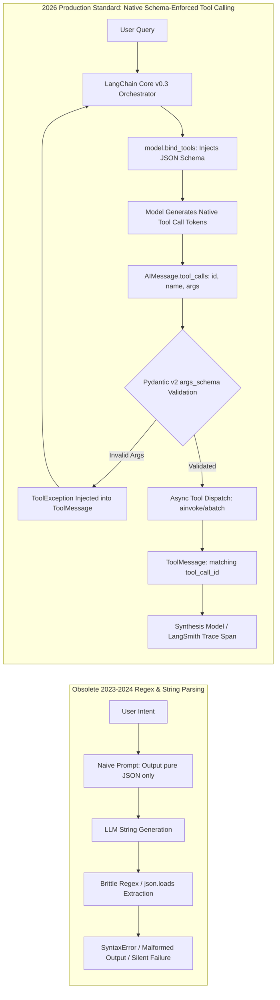
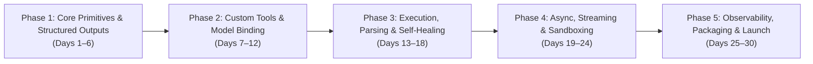
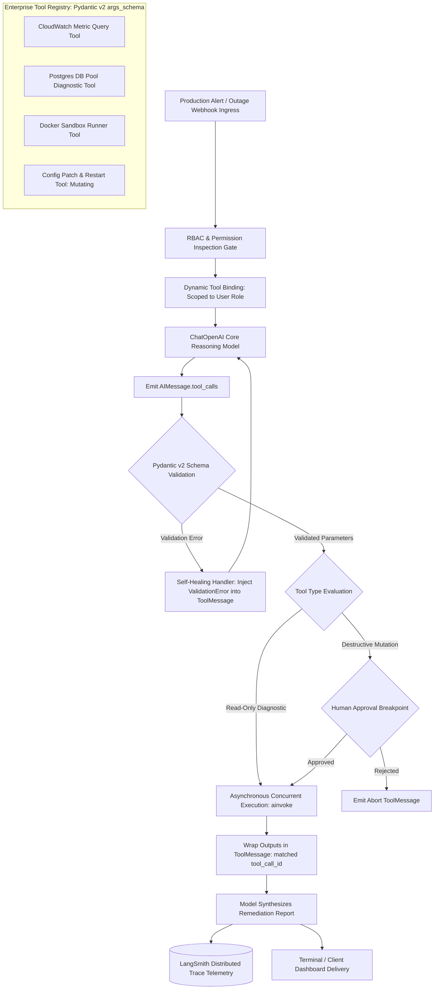

# **30-Day Master Blueprint: LangChain & AI Tool Calling (2026 Production Standard)**

> ### ⚡ THE BUILDER'S OATH
> *"We do not parse LLM string outputs with brittle regular expressions. We do not gamble our systems on unvalidated JSON dictionaries returned by non-deterministic models. In 2026, production AI engineering demands deterministic execution over native model reasoning. We leverage native function calling, enforce strict Pydantic v2 schemas at runtime, isolate tool blast radiuses, recover autonomously from schema validation faults, and trace every execution span in LangSmith. Code is leverage. Types are law. Execute deterministically or do not ship."*

---

## 1. The 2026 AI Era Reality Check: Brittle Regex Parsing vs. Native Schema-Enforced Tool Calling

In 2023, developers asked models to output JSON strings and parsed them with regular expressions. In 2026, this approach is banned in enterprise engineering. Modern foundation models feature specialized decoding heads fine-tuned for structured tool calling tokens. Combining native model function-calling protocols with LangChain Core v0.3+ and Pydantic v2 provides a deterministic bridge between non-deterministic reasoning and enterprise backend infrastructure.



### Architectural Contrast: Brittle String Parsing vs. Native Schema-Enforced Tool Calling

| Dimension | 2023 Toy Regex & String Parsing (OBSOLETE) | 2026 Native Schema-Enforced Tool Calling (PRODUCTION STANDARD) |
| :--- | :--- | :--- |
| **Model Interaction** | Asking for JSON via natural language prompts; vulnerable to markdown wraps and conversational filler. | Native API parameter injection (`tools=[...]`); the model directly generates function-calling token blocks. |
| **Schema Validation** | Unchecked dictionary lookups; runtime crashes on missing or mistyped keys. | Strict Pydantic v2 validation (`args_schema`); automatic field type coercion, range validation, and regex checks. |
| **Concurrency & Throughput** | Blocking synchronous execution loops processing one tool call at a time. | Concurrent asynchronous execution (`ainvoke`, `abatch`, `asyncio.gather`) across parallel tool calls. |
| **Error Handling** | Unhandled JSON decode errors that crash backend pipelines. | Automated self-healing loops: schema validation errors are caught and re-injected as `ToolMessage` context for model self-correction. |
| **Access Control** | Monolithic tool exposure where every prompt can access every tool. | Dynamic runtime tool binding based on caller permissions, tenant boundaries, and Role-Based Access Control (RBAC). |
| **Streaming Capabilities** | Waiting for the complete JSON string to finish generating before parsing can begin. | Streaming partial tool call arguments via `astream`, showing real-time argument population to client UIs. |
| **Observability** | Standard stdout print statements with zero visibility into parsing errors or payload data. | Distributed OpenTelemetry and LangSmith tracing of tool arguments, latencies, error states, and token spend. |

---

## 2. The 5 Strategic Career Pillars

### Pillar 1: Importance of the Skill
AI models that can only generate text are conversational toys. The true value of generative models lies in their ability to act as decision engines for real-world systems. Mastering native tool calling allows you to connect non-deterministic model reasoning to deterministic enterprise APIs, transactional SQL databases, cloud management consoles, and internal services.

### Pillar 2: Why It Matters in 2026
In 2026, enterprise software investments require measurable operational efficiency. Organizations are moving past simple chatbots to deploy autonomous diagnostic systems, automated cloud remediation pipelines, and automated financial transaction networks. These systems require engineers who can enforce strict type boundaries, isolate tool blast radiuses, and guarantee runtime reliability.

### Pillar 3: Why Companies Hire Builders with These Projects
Companies reject candidates whose portfolios only show basic chat wrapper scripts. They actively recruit engineers who can navigate production edge cases:
- Handling tool execution timeouts and network retries gracefully without dropping parent state.
- Recovering autonomously when a model hallucinates an invalid parameter type by returning structured execution error feedback.
- Sandboxing destructive operations (forcing read-only states on database and shell tools until human approval is confirmed).

### Pillar 4: Importance of Built Projects
Deploying complete, resilient tool execution engines—such as an automated cloud infrastructure diagnostic gateway or a resilient multi-tenant database mutation engine—demonstrates systems engineering competence. It proves you understand parameter validation, asynchronous dispatch, security boundaries, and telemetry instrumentation.

### Pillar 5: How This Skill Gets You Hired
Specializing in LangChain Core v0.3+, Pydantic v2 schemas, and native tool-calling architecture targets critical platform engineering roles:
- **Enterprise AI Backend Architect:** $145,000 – $185,000+ USD
- **AI Tooling Infrastructure Engineer:** $135,000 – $175,000 USD
- **Systems Integration Engineer (AI Platforms):** $120,000 – $160,000 USD

---

## 3. Realistic Timeline Evaluation

To master LangChain Core v0.3+, native tool calling, and structured outputs, commit to **30 Consecutive Days at 2 Focused Hours Per Day (60 Total Hours)**.



- **Phase 1: LangChain Core Primitives & Structured Outputs (Days 1–6):** Master decoupled Core primitives: `ChatPromptTemplate`, `ChatOpenAI`, the Message contract, and `with_structured_output` using Pydantic v2.
- **Phase 2: Custom Tool Engineering & Model Binding (Days 7–12):** Build native tools using `@tool`, `BaseTool`, and Pydantic `args_schema`. Master `bind_tools` and `tool_choice` parameter controls.
- **Phase 3: Tool Execution, Parsing & Self-Healing (Days 13–18):** Implement the complete tool execution lifecycle: extracting `tool_calls`, asynchronous dispatch, `ToolMessage` injection, and automated self-healing error loops.
- **Phase 4: Async, Streaming & Sandboxing (Days 19–24):** Scale tool execution throughput using `ainvoke`/`abatch`, stream real-time tool arguments with `astream`, implement RBAC tool binding, and enforce security sandboxes.
- **Phase 5: Observability, Packaging & Capstone Launch (Days 25–30):** Instrument execution spans with LangSmith, evaluate multi-tool trajectory accuracy, build FastAPI streaming endpoints, and deploy the Capstone Engine.

---

## 4. Curated Learning Ecosystem

| Category | Primary Learning Source | Focus Areas & Production Value |
| :--- | :--- | :--- |
| **Official Documentation** | [LangChain Core Python Documentation](https://python.langchain.com/docs/concepts/#tools) | Primitives, `bind_tools`, `with_structured_output`, `ToolMessage`, custom tool classes. |
| **API Provider Specs** | [OpenAI Function Calling Guide](https://platform.openai.com/docs/guides/function-calling) | Under-the-hood JSON Schema conversion, tool call tokens, `tool_choice` mechanics. |
| **Data Validation Standard**| [Pydantic v2 Documentation](https://docs.pydantic.dev/latest/) | `BaseModel`, `Field` validations, regex constraints, JSON schema export, dynamic generation. |
| **Video Deep Dives** | DeepLearning.AI (*Functions, Tools and Agents by Harrison Chase*) | Instruction on tool definition, agent routing, structured outputs, and real-world tools. |
| **Production Architecture** | Swaroop Talks & ArjanCodes AI Channels | Async Python architecture, defensive error recovery, type safety, enterprise tool patterns. |
| **Observability & Security** | [LangSmith Tool Telemetry](https://docs.smith.langchain.com/) & OWASP LLM Top 10 | Trace inspection, argument evaluation, mitigating insecure tool execution risks. |

---

## 5. Day-by-Day 30-Day Master Execution Schedule

### Phase 1: LangChain Core v0.3 Primitives, ChatModels, PromptTemplates & Pydantic v2 Structured Outputs

---

### **📅 Day 1: LangChain Core v0.3 Architecture — Decoupled Primitives & Modern Runtime**
⏱ **Strict 2-Hour (120 Mins) Time-Split Breakdown:**
- `[00:00 - 00:30 Mins] (30m):` *Architecture & Tool Theory* -> Analyze the modern LangChain architecture. Understand why monolithic packages (`langchain`) were decoupled into `langchain-core` (interfaces, primitives, message contracts) and partner packages (`langchain-openai`, `langchain-anthropic`). [LangChain Docs - Architecture]
- `[00:30 - 01:10 Mins] (40m):` *Sandbox & SDK Mechanics* -> Set up your Python 3.12 environment using `uv`. Install `langchain-core>=0.3.0` and `langchain-openai`. Instantiate `ChatOpenAI(model="gpt-4o")` and inspect the returned `AIMessage` schema. [LangChain Core Guides]
- `[01:10 - 01:50 Mins] (40m):` *Daily Task Building* -> Write a modular Python script establishing a standardized initialization pattern for multiple chat models, handling API credentials cleanly, and setting deterministic temperature controls.
- `[01:50 - 02:00 Mins] (10m):` *Schema Verification & Trace Inspection* -> Print `AIMessage.response_metadata` in the terminal; inspect the token count, finish reason, and system fingerprint.
- **Concepts to Master:**
  - Modern LangChain package decoupling (`langchain-core` vs partner packages) [LangChain Core Docs]
  - Native `BaseChatModel` interfaces and execution lifecycle [LangChain Reference]
  - Inspecting response metadata and raw token output schemas [DeepLearning.AI]
- **Target Tools & Libraries:** Python 3.12, `uv`, `langchain-core>=0.3.0`, `langchain-openai`
- **Daily Task:** Create a unified model factory module supporting deterministic instantiation and configuration of frontier LLM interfaces.
- **Daily Output:** Clean terminal output displaying `AIMessage` response metadata and verified runtime configuration.

---

### **📅 Day 2: The Message Contract — SystemMessage, HumanMessage, AIMMessage & ToolMessage**
⏱ **Strict 2-Hour (120 Mins) Time-Split Breakdown:**
- `[00:00 - 00:30 Mins] (30m):` *Architecture & Tool Theory* -> Study the LangChain message protocol. Understand why string prompts are converted to typed message lists: `SystemMessage`, `HumanMessage`, `AIMMessage`, and `ToolMessage`. Examine how `tool_calls` payloads are structured inside `AIMMessage`. [LangChain Docs - Messages]
- `[00:30 - 01:10 Mins] (40m):` *Sandbox & SDK Mechanics* -> Build a multi-turn message sequence manually. Inspect the internal fields of an `AIMMessage` when tools are simulated, and construct a matching `ToolMessage(content=..., tool_call_id=...)`. [LangChain Message Guides]
- `[01:10 - 01:50 Mins] (40m):` *Daily Task Building* -> Build a message sequence orchestrator that manages a mock multi-turn dialogue, manually injecting tool calls and synthetic tool execution results using proper message classes.
- `[01:50 - 02:00 Mins] (10m):` *Schema Verification & Trace Inspection* -> Verify that every `ToolMessage` correctly references its corresponding `tool_call_id` from the preceding `AIMMessage`.
- **Concepts to Master:**
  - The 4 core message primitives: `SystemMessage`, `HumanMessage`, `AIMMessage`, `ToolMessage` [LangChain Docs]
  - Structuring the `tool_calls` dictionary inside an `AIMMessage` [OpenAI API Docs]
  - The pairing rule: linking `ToolMessage.tool_call_id` directly to `AIMMessage.tool_calls[i].id` [DeepLearning.AI]
- **Target Tools & Libraries:** `langchain-core.messages`
- **Daily Task:** Build a modular message coordinator that formats and validates a complete message history containing manual tool calls and tool responses.
- **Daily Output:** Formatted JSON dump of a multi-turn conversation showing valid message types and linked `tool_call_id` references.

---

### **📅 Day 3: ChatPromptTemplate — Parameterized Inputs & Role-Based Construction**
⏱ **Strict 2-Hour (120 Mins) Time-Split Breakdown:**
- `[00:00 - 00:30 Mins] (30m):` *Architecture & Tool Theory* -> Learn why naive f-string prompt formatting breaks in production (escaping issues, injection vulnerabilities, missing token boundaries). Master `ChatPromptTemplate.from_messages`. [LangChain Docs - Prompts]
- `[00:30 - 01:10 Mins] (40m):` *Sandbox & SDK Mechanics* -> Build a `ChatPromptTemplate` containing a system role instruction, a dynamic conversation history placeholder (`MessagesPlaceholder`), and a variable human input slot. [LangChain Prompt Guides]
- `[01:10 - 01:50 Mins] (40m):` *Daily Task Building* -> Construct a prompt pipeline for an IT helpdesk diagnostic engine, parameterizing user permissions, system role boundaries, and previous conversation history.
- `[01:50 - 02:00 Mins] (10m):` *Schema Verification & Trace Inspection* -> Use `prompt.format_prompt(...)` and print the resulting message list to confirm variable injection without syntax corruption.
- **Concepts to Master:**
  - Robust prompt composition using `ChatPromptTemplate` [LangChain Documentation]
  - Dynamic conversational history injection using `MessagesPlaceholder` [DeepLearning.AI]
  - Preventing prompt injection vulnerabilities through structured parameterization [OWASP LLM Top 10]
- **Target Tools & Libraries:** `langchain-core.prompts`
- **Daily Task:** Implement an IT diagnostic prompt pipeline combining system instructions, role metadata, and message history placeholders.
- **Daily Output:** Terminal printout showing the formatted message array ready for model consumption, with verified variable substitutions.

---

### **📅 Day 4: Native Structured Outputs with `with_structured_output`**
⏱ **Strict 2-Hour (120 Mins) Time-Split Breakdown:**
- `[00:00 - 00:30 Mins] (30m):` *Architecture & Tool Theory* -> Study native structured outputs. Understand how `model.with_structured_output(schema)` uses underlying function calling and JSON-schema constraints to guarantee outputs conform directly to a Pydantic model. [LangChain Docs - Structured Outputs]
- `[00:30 - 01:10 Mins] (40m):` *Sandbox & SDK Mechanics* -> Define a Pydantic v2 `BaseModel` with typed fields, descriptions, and validations. Pass it to `with_structured_output` and invoke the model. Inspect the instantiated Python object. [Pydantic v2 Docs]
- `[01:10 - 01:50 Mins] (40m):` *Daily Task Building* -> Build a financial transaction extractor that parses raw text receipts into a typed `TransactionInvoice` Pydantic model with fields for vendor, tax, line items, and totals.
- `[01:50 - 02:00 Mins] (10m):` *Schema Verification & Trace Inspection* -> Print `type(result)` and verify the output is a true instance of the target Pydantic class, rather than a raw string or dictionary.
- **Concepts to Master:**
  - The `with_structured_output` abstraction pattern [LangChain Docs]
  - Deserializing model responses directly into Pydantic v2 instances [Pydantic Docs]
  - Enforcing schema constraints at the model generation layer [Swaroop Talks]
- **Target Tools & Libraries:** `langchain-core`, `langchain-openai`, `pydantic>=2.7.0`
- **Daily Task:** Implement an extractor using `with_structured_output` that converts unstructured receipts into validated Pydantic models.
- **Daily Output:** Python terminal log confirming `isinstance(result, TransactionInvoice) == True` with fully populated, validated fields.

---

### **📅 Day 5: Multi-Schema Structured Outputs & Union Type Parsing**
⏱ **Strict 2-Hour (120 Mins) Time-Split Breakdown:**
- `[00:00 - 00:30 Mins] (30m):` *Architecture & Tool Theory* -> Learn how to handle polymorphic output requirements. Study how `Union[SchemaA, SchemaB, SchemaC]` allows models to classify and return distinct schema structures based on input context. [Pydantic Docs - Unions]
- `[00:30 - 01:10 Mins] (40m):` *Sandbox & SDK Mechanics* -> Define a Union of Pydantic models: `BillingIssue`, `BugReport`, and `GeneralInquiry`. Pass the Union schema to `with_structured_output`. [LangChain Structured Output Advanced]
- `[01:10 - 01:50 Mins] (40m):` *Daily Task Building* -> Build a customer service classifier that ingests incoming emails, routes them through a polymorphic schema parser, and outputs the appropriate typed model instance based on email intent.
- `[01:50 - 02:00 Mins] (10m):` *Schema Verification & Trace Inspection* -> Submit 3 distinct customer emails; verify the model outputs the correct concrete Pydantic subclass for each one.
- **Concepts to Master:**
  - Polymorphic structured output extraction using `typing.Union` [Pydantic v2 Guides]
  - Handling variable-intent classification in enterprise support pipelines [DeepLearning.AI]
  - Validating schema-specific fields based on model output routing [LangChain Documentation]
- **Target Tools & Libraries:** `pydantic`, `typing.Union`, `langchain-openai`
- **Daily Task:** Build an email classification engine that dynamically returns one of several specialized Pydantic models using Union types.
- **Daily Output:** Terminal execution log displaying distinct Pydantic object instances instantiated based on input email intent.

---

### **📅 Day 6: Phase 1 Consolidation — Automated Incident Intake & Classification Engine**
⏱ **Strict 2-Hour (120 Mins) Time-Split Breakdown:**
- `[00:00 - 00:30 Mins] (30m):` *Architecture & Tool Theory* -> Synthesize Phase 1 capabilities: decoupled Core primitives, message contracts, parameterized prompt templates, and schema validation into a production intake engine.
- `[00:30 - 01:10 Mins] (40m):` *Sandbox & SDK Mechanics* -> Wire up a complete pipeline: `ChatPromptTemplate` -> `ChatOpenAI.with_structured_output(IncidentReport)` -> Pydantic validator -> Database payload exporter.
- `[01:10 - 01:50 Mins] (40m):` *Daily Task Building* -> Build a DevOps incident intake processor that parses unstructured Slack outage threads into an `IncidentReport` model (severity, impacted services, root cause hypothesis, action items).
- `[01:50 - 02:00 Mins] (10m):` *Schema Verification & Trace Inspection* -> Test with varied, noisy chat logs; confirm zero parsing errors and ensure all enum fields validate properly.
- **Concepts to Master:**
  - End-to-end integration of LangChain Core v0.3 primitives [LangChain Architecture]
  - Enforcing strict data boundaries on ambiguous enterprise inputs [Production Systems Guides]
  - Exporting validated Pydantic models to downstream service payloads [Enterprise Software Standards]
- **Target Tools & Libraries:** `langchain-core`, `langchain-openai`, `pydantic`
- **Daily Task:** Implement a DevOps incident intake processor that converts unstructured outage conversations into validated Pydantic incident records.
- **Daily Output:** Terminal display of an instantiated, validated `IncidentReport` object ready for automated Jira or database ingestion.

---

### Phase 2: Custom Tool Engineering (`@tool`, `BaseTool`, `args_schema`), Type Validation & Model Binding

---

### **📅 Day 7: Custom Tool Creation with the `@tool` Decorator**
⏱ **Strict 2-Hour (120 Mins) Time-Split Breakdown:**
- `[00:00 - 00:30 Mins] (30m):` *Architecture & Tool Theory* -> Study the mechanics of the `@tool` decorator. Understand how LangChain inspects function names, type hints, and docstrings to generate standard JSON Schema definitions for LLM tool binding. [LangChain Docs - Custom Tools]
- `[00:30 - 01:10 Mins] (40m):` *Sandbox & SDK Mechanics* -> Write functional tools using `@tool`. Inspect the auto-generated properties: `tool.name`, `tool.description`, and `tool.args`. [DeepLearning.AI - Functions & Tools]
- `[01:10 - 01:50 Mins] (40m):` *Daily Task Building* -> Build a suite of networking diagnostic tools: `ping_host(ip: str)`, `check_ssl_expiry(domain: str)`, and `query_dns_records(domain: str, record_type: str)`.
- `[01:50 - 02:00 Mins] (10m):` *Schema Verification & Trace Inspection* -> Print `tool.args` for each function; confirm that type annotations (`str`) correctly map to JSON Schema types (`string`).
- **Concepts to Master:**
  - Creating native tools using the `@tool` decorator [LangChain Documentation]
  - Writing effective docstrings to guide LLM tool selection [DeepLearning.AI]
  - Inspecting auto-generated tool JSON Schemas [Swaroop Talks]
- **Target Tools & Libraries:** `langchain-core.tools`
- **Daily Task:** Build and test a suite of network diagnostic tools utilizing type annotations and docstrings.
- **Daily Output:** Terminal printout displaying the auto-generated JSON schema representations for each created tool.

---

### **📅 Day 8: Class-Based Tools with `BaseTool` & Lifecycle Hooks**
⏱ **Strict 2-Hour (120 Mins) Time-Split Breakdown:**
- `[00:00 - 00:30 Mins] (30m):` *Architecture & Tool Theory* -> Understand when simple decorator tools are insufficient. Learn why enterprise systems require class-based tools inheriting from `BaseTool`: dependency injection, internal state, initialization hooks, and private client connections. [LangChain Docs - Subclassing BaseTool]
- `[00:30 - 01:10 Mins] (40m):` *Sandbox & SDK Mechanics* -> Subclass `BaseTool`. Define class attributes `name`, `description`, and implement both `_run()` (synchronous) and `_arun()` (asynchronous) methods. [LangChain BaseTool Reference]
- `[01:10 - 01:50 Mins] (40m):` *Daily Task Building* -> Build an enterprise `AuthenticatedAPITool` that manages an internal HTTP client instance, API keys, and automated token refresh logic within its class structure.
- `[01:50 - 02:00 Mins] (10m):` *Schema Verification & Trace Inspection* -> Instantiate the tool with mock credentials; test both synchronous and asynchronous invocations to verify state encapsulation.
- **Concepts to Master:**
  - Subclassing `BaseTool` for enterprise service integrations [LangChain Core Docs]
  - Implementing dual synchronous (`_run`) and asynchronous (`_arun`) methods [Swaroop Talks]
  - Managing private client connections and secrets inside tool instances [Enterprise AI Patterns]
- **Target Tools & Libraries:** `langchain-core.tools.BaseTool`, `httpx`
- **Daily Task:** Implement an enterprise API integration tool by subclassing `BaseTool` with support for both sync and async execution.
- **Daily Output:** Terminal logs showing successful instantiation, credential encapsulation, and clean tool invocation traces.

---

### **📅 Day 9: Type Safety with `args_schema` & Pydantic v2 Validation**
⏱ **Strict 2-Hour (120 Mins) Time-Split Breakdown:**
- `[00:00 - 00:30 Mins] (30m):` *Architecture & Tool Theory* -> Study why default function signatures fall short in complex production tools. Understand how Pydantic v2 models bound to `@tool(args_schema=...)` enforce strict field types, regex constraints, and descriptions that guide the LLM's parameter generation. [LangChain Docs - Custom Tools]
- `[00:30 - 01:10 Mins] (40m):` *Sandbox & SDK Mechanics* -> Build a custom tool with a nested Pydantic v2 schema containing `Field(..., description=...)` annotations. Intentionally pass malformed arguments and catch validation errors. [DeepLearning.AI - Functions, Tools and Agents]
- `[01:10 - 01:50 Mins] (40m):` *Daily Task Building* -> Construct an enterprise SQL query tool where the input arguments require a validated table name, an array of column strings, a limit bounded between 1 and 100, and a mandatory read-only flag.
- `[01:50 - 02:00 Mins] (10m):` *Schema Verification & Trace Inspection* -> Export the tool's raw JSON Schema representation using `tool.args_schema.model_json_schema()` and verify all constraints match OpenAI function call specifications.
- **Concepts to Master:**
  - Explicit tool typing using Pydantic v2 `args_schema` [LangChain Python Reference]
  - Constraining parameter boundaries (`gt`, `lt`, regex patterns) to prevent bad tool calls [Pydantic Docs]
  - Inspecting auto-generated tool JSON schemas [Swaroop Talks]
- **Target Tools & Libraries:** Python 3.12, `langchain-core>=0.3.0`, `pydantic>=2.7.0`
- **Daily Task:** Implement a validated API querying tool enforcing strict numerical limits and string sanitization through a custom Pydantic schema.
- **Daily Output:** Terminal execution log displaying the validated tool call payload and the clean JSON schema exported to stdout.

---

### **📅 Day 10: Model Binding Mechanics via `bind_tools` & JSON Schema Injection**
⏱ **Strict 2-Hour (120 Mins) Time-Split Breakdown:**
- `[00:00 - 00:30 Mins] (30m):` *Architecture & Tool Theory* -> Learn what happens when you call `model.bind_tools(tools)`. Understand how LangChain translates Pydantic schemas into model-specific formats (OpenAI functions, Anthropic tool definitions) and injects them into the API payload. [LangChain Docs - Tool Binding]
- `[00:30 - 01:10 Mins] (40m):` *Sandbox & SDK Mechanics* -> Bind a list of custom tools to `ChatOpenAI`. Inspect the bound model's kwargs using `model_with_tools.kwargs["tools"]` to see the exact injected JSON Schema. [DeepLearning.AI]
- `[01:10 - 01:50 Mins] (40m):` *Daily Task Building* -> Build a multi-tool cloud management agent: bind tools for starting instances, stopping instances, and reading logs. Invoke the model with ambiguous queries to evaluate tool selection accuracy.
- `[01:50 - 02:00 Mins] (10m):` *Schema Verification & Trace Inspection* -> Verify in terminal logs that the returned `AIMessage` contains a populated `tool_calls` array with generated parameters matching the tool's schema.
- **Concepts to Master:**
  - The `model.bind_tools` mechanics and payload translation [LangChain Core Docs]
  - Inspecting underlying provider JSON schemas [OpenAI API Reference]
  - Evaluating model tool selection across distinct scenarios [DeepLearning.AI]
- **Target Tools & Libraries:** `langchain-core`, `langchain-openai`
- **Daily Task:** Bind a suite of cloud management tools to a model and verify accurate tool selection based on varied user queries.
- **Daily Output:** Terminal printout showing the model's generated `AIMessage.tool_calls` containing the target tool name and validated arguments.

---

### **📅 Day 11: Constraining Tool Selection via `tool_choice`**
⏱ **Strict 2-Hour (120 Mins) Time-Split Breakdown:**
- `[00:00 - 00:30 Mins] (30m):` *Architecture & Tool Theory* -> Master `tool_choice` configurations: `"auto"` (model decides whether to use a tool), `"any"` or `"required"` (forces the model to choose a tool), and `{"type": "function", "function": {"name": "specific_tool"}}` (forces a specific tool call). [OpenAI Tool Choice Docs]
- `[00:30 - 01:10 Mins] (40m):` *Sandbox & SDK Mechanics* -> Configure `model.bind_tools(tools, tool_choice="required")` and test with general conversational queries. Observe how the model is forced to invoke a tool rather than responding conversationally. [LangChain Guides]
- `[01:10 - 01:50 Mins] (40m):` *Daily Task Building* -> Build a strict data entry pipeline where the model is forced to call a `record_user_data` tool regardless of user phrasing, preventing unstructured text responses.
- `[01:50 - 02:00 Mins] (10m):` *Schema Verification & Trace Inspection* -> Test with conversational inputs (e.g., "Hello, how are you today?"); verify the model still triggers the mandatory tool call.
- **Concepts to Master:**
  - Configuring `tool_choice` parameters (`auto`, `required`, specific tool) [LangChain Documentation]
  - Forcing deterministic tool execution in data extraction pipelines [DeepLearning.AI]
  - Preventing conversational bypass in structured workflows [Enterprise AI Patterns]
- **Target Tools & Libraries:** `langchain-openai`, `langchain-core`
- **Daily Task:** Implement a tool-calling pipeline that forces tool invocation regardless of input phrasing using `tool_choice="required"`.
- **Daily Output:** Terminal execution trace confirming the model triggered a tool call even when presented with purely conversational inputs.

---

### **📅 Day 12: Phase 2 Consolidation — Secure Read-Only SQL & Database Query Tool**
⏱ **Strict 2-Hour (120 Mins) Time-Split Breakdown:**
- `[00:00 - 00:30 Mins] (30m):` *Architecture & Tool Theory* -> Synthesize Phase 2 skills: class-based tools, strict Pydantic `args_schema` constraints, and model binding to construct a safe database query tool. [OWASP Insecure Tool Execution]
- `[00:30 - 01:10 Mins] (40m):` *Sandbox & SDK Mechanics* -> Build a class-based SQLite querying tool with an `args_schema` that parses query strings and blocks mutation keywords (`DROP`, `DELETE`, `UPDATE`, `INSERT`, `ALTER`) before execution.
- `[01:10 - 01:50 Mins] (40m):` *Daily Task Building* -> Bind the secure tool to a ChatModel. Execute natural language prompts asking for database metrics, along with test prompts attempting destructive SQL operations.
- `[01:50 - 02:00 Mins] (10m):` *Schema Verification & Trace Inspection* -> Confirm the safety validator interceptor blocks destructive commands and allows read-only `SELECT` queries to execute cleanly.
- **Concepts to Master:**
  - Designing defensive tool validation layers [Enterprise Security AI Standards]
  - Blocking unauthorized operations at the tool argument level [OWASP LLM Guides]
  - Safely connecting language models to database layers [LangChain Integration Guides]
- **Target Tools & Libraries:** `langchain-core`, `pydantic`, `sqlite3`
- **Daily Task:** Build a secure database inspection tool with built-in query validation that blocks destructive database modifications.
- **Daily Output:** Execution trace showing successful execution of `SELECT` queries and explicit validation rejections of destructive SQL operations.

---

### Phase 3: Tool Execution Mechanics, Error Handling, Fallbacks & Structured Output Parsing

---

### **📅 Day 13: The Tool Execution Cycle — Dispatching from `AIMessage.tool_calls`**
⏱ **Strict 2-Hour (120 Mins) Time-Split Breakdown:**
- `[00:00 - 00:30 Mins] (30m):` *Architecture & Tool Theory* -> Dissect the complete tool-execution loop: Model generates `AIMessage.tool_calls` -> Orchestrator extracts tool name and args -> Looks up the tool in a registry -> Invokes the tool -> Wraps the result in a `ToolMessage`. [LangChain Docs - Tool Calling Execution]
- `[00:30 - 01:10 Mins] (40m):` *Sandbox & SDK Mechanics* -> Write a manual execution loop: Iterate over `ai_message.tool_calls`, match `call["name"]` to a dictionary registry of tools, execute the tool with `call["args"]`, and return a list of `ToolMessage` instances. [DeepLearning.AI]
- `[01:10 - 01:50 Mins] (40m):` *Daily Task Building* -> Build a standalone tool dispatcher that takes an incoming `AIMessage`, resolves and executes multiple tool calls, and returns structured result objects.
- `[01:50 - 02:00 Mins] (10m):` *Schema Verification & Trace Inspection* -> Verify that each generated `ToolMessage` has its `tool_call_id` correctly mapped to the originating call ID.
- **Concepts to Master:**
  - Constructing a tool registry and execution dispatcher [LangChain Documentation]
  - Parsing the `AIMessage.tool_calls` schema programmatically [OpenAI API Specs]
  - Packaging execution returns into validated `ToolMessage` objects [DeepLearning.AI]
- **Target Tools & Libraries:** `langchain-core.messages.ToolMessage`, `langchain-core.tools`
- **Daily Task:** Implement an execution dispatcher that extracts tool calls from an `AIMessage`, runs them, and returns matching `ToolMessage` instances.
- **Daily Output:** Terminal logs showing extracted tool calls being dispatched and converted into valid `ToolMessage` records.

---

### **📅 Day 14: Synthesizing Results — The Full Tool Calling Loop**
⏱ **Strict 2-Hour (120 Mins) Time-Split Breakdown:**
- `[00:00 - 00:30 Mins] (30m):` *Architecture & Tool Theory* -> Study the multi-turn synthesis loop: User Query -> Model produces `AIMessage` with tool calls -> Dispatcher executes tools -> Append `ToolMessage` objects to conversation history -> Invoke model a second time to synthesize the final answer. [LangChain Tool Calling Flow]
- `[00:30 - 01:10 Mins] (40m):` *Sandbox & SDK Mechanics* -> Implement the complete two-stage invocation pattern using an iterative loop. Verify that the final `AIMessage` synthesizes tool findings rather than requesting more tools. [Swaroop Talks]
- `[01:10 - 01:50 Mins] (40m):` *Daily Task Building* -> Build a weather and air quality research assistant: The assistant calls two tools, gathers real-time data, and synthesizes an advisory summary for the user.
- `[01:50 - 02:00 Mins] (10m):` *Schema Verification & Trace Inspection* -> Inspect the complete message history array; verify the correct sequence: `HumanMessage` -> `AIMessage (tool_calls)` -> `ToolMessage(s)` -> `AIMessage (final response)`.
- **Concepts to Master:**
  - Managing multi-turn conversation state across tool invocations [LangChain Docs]
  - Appending tool messages to conversation history [DeepLearning.AI]
  - Synthesizing tool responses into natural language summaries [Enterprise AI Patterns]
- **Target Tools & Libraries:** `langchain-core`, `langchain-openai`
- **Daily Task:** Implement the complete two-stage tool calling loop from initial user query to final synthesized response.
- **Daily Output:** Terminal transcript displaying the full conversational trace: human input, model tool calls, tool results, and final synthesized answer.

---

### **📅 Day 15: Handling Tool Exceptions & The `handle_tool_error` Contract**
⏱ **Strict 2-Hour (120 Mins) Time-Split Breakdown:**
- `[00:00 - 00:30 Mins] (30m):` *Architecture & Tool Theory* -> Understand why production tools must never throw unhandled exceptions. If a tool crashes, the exception must be caught, formatted into a descriptive string, and returned as a `ToolMessage` so the model can handle the issue gracefully. [LangChain Docs - Tool Errors]
- `[00:30 - 01:10 Mins] (40m):` *Sandbox & SDK Mechanics* -> Configure `@tool(handle_tool_error=True)` and subclass `BaseTool` with custom `handle_tool_error` methods. Throw intentional runtime exceptions and observe the error handling. [LangChain Core Reference]
- `[01:10 - 01:50 Mins] (40m):` *Daily Task Building* -> Build an external API tool that simulates 503 service outages and 404 resource errors. Use `ToolException` to return actionable error feedback to the model.
- `[01:50 - 02:00 Mins] (10m):` *Schema Verification & Trace Inspection* -> Verify that tool exceptions are converted to string responses inside `ToolMessage` instances rather than crashing the Python process.
- **Concepts to Master:**
  - Defensive error handling using `ToolException` [LangChain Docs]
  - Configuring `handle_tool_error` decorators and callbacks [Swaroop Talks]
  - Preventing process crashes by returning errors as conversational context [DeepLearning.AI]
- **Target Tools & Libraries:** `langchain_core.tools.ToolException`, `langchain-core`
- **Daily Task:** Implement an external API query tool that converts runtime exceptions into informative `ToolMessage` responses.
- **Daily Output:** Terminal execution log displaying intercepted tool exceptions converted into clean `ToolMessage` outputs.

---

### **📅 Day 16: Automated Self-Healing — Passing Validation Errors Back to the Model**
⏱ **Strict 2-Hour (120 Mins) Time-Split Breakdown:**
- `[00:00 - 00:30 Mins] (30m):` *Architecture & Tool Theory* -> Study automated self-healing loops. When an LLM generates invalid parameters that fail Pydantic validation, catch the `ValidationError`, extract the field-level errors, feed them back in a `ToolMessage`, and let the model correct its call. [Anthropic - Self-Correction Patterns]
- `[00:30 - 01:10 Mins] (40m):` *Sandbox & SDK Mechanics* -> Build a self-healing loop: When validation fails on tool call arguments, construct a `ToolMessage` containing the validation error trace and re-invoke the model to obtain corrected arguments. [Swaroop Talks]
- `[01:10 - 01:50 Mins] (40m):` *Daily Task Building* -> Build a strict date and currency conversion tool that requires specific formatting (e.g., `YYYY-MM-DD`). Feed it malformed date strings, observe the validation failure, and let the loop correct it.
- `[01:50 - 02:00 Mins] (10m):` *Schema Verification & Trace Inspection* -> Verify in terminal logs that Turn 1 failed validation, Turn 2 received the error context, and Turn 3 emitted a valid payload.
- **Concepts to Master:**
  - Automated self-healing parameter correction loops [Enterprise AI Architecture]
  - Catching and formatting Pydantic validation exceptions for model feedback [Pydantic Docs]
  - Recursion bounding: limiting self-correction retries to prevent runaway loops [DeepLearning.AI]
- **Target Tools & Libraries:** `pydantic.ValidationError`, `langchain-core`
- **Daily Task:** Build an automated self-healing tool loop that catches schema validation errors and allows the model to self-correct.
- **Daily Output:** Multi-turn execution trace showing a validation failure on attempt 1, followed by a successful self-corrected tool call on attempt 2.

---

### **📅 Day 17: Fallback Tool Calling — Redundant Providers & Graceful Degradation**
⏱ **Strict 2-Hour (120 Mins) Time-Split Breakdown:**
- `[00:00 - 00:30 Mins] (30m):` *Architecture & Tool Theory* -> Learn how to build resilient systems using fallbacks. When a primary tool fails (rate limits, timeouts, provider downtime), automatically route the call to a secondary tool or fallback model. [LangChain Docs - Fallbacks]
- `[00:30 - 01:10 Mins] (40m):` *Sandbox & SDK Mechanics* -> Use LangChain's `.with_fallbacks([fallback_model])` and build a tool router with automated fallback routes when primary tools raise exceptions. [LangChain Core Reference]
- `[01:10 - 01:50 Mins] (40m):` *Daily Task Building* -> Build a stock valuation assistant: Primary tool queries a live financial API; if it returns a timeout or 429 rate limit, the fallback tool queries a cached database.
- `[01:50 - 02:00 Mins] (10m):` *Schema Verification & Trace Inspection* -> Intentionally trigger a failure on the primary tool; verify execution falls back to the secondary source without breaking the user experience.
- **Concepts to Master:**
  - Designing fallback architectures with `.with_fallbacks` [LangChain Docs]
  - Building redundant tool execution pathways for critical operations [Enterprise AI Standards]
  - Preserving conversational continuity during underlying tool failures [Swaroop Talks]
- **Target Tools & Libraries:** `langchain-core`
- **Daily Task:** Implement a fallback tool execution pipeline that switches to a secondary data source when the primary tool encounters an error.
- **Daily Output:** Terminal execution log displaying the primary tool failure, followed by an immediate recovery via the fallback tool.

---

### **📅 Day 18: Phase 3 Consolidation — Resilient API Gatekeeper with Self-Healing Execution**
⏱ **Strict 2-Hour (120 Mins) Time-Split Breakdown:**
- `[00:00 - 00:30 Mins] (30m):` *Architecture & Tool Theory* -> Combine Phase 3 capabilities: dispatch loops, `ToolMessage` tracking, exception handling, automated self-healing, and fallback routing into an integrated gateway.
- `[00:30 - 01:10 Mins] (40m):` *Sandbox & SDK Mechanics* -> Assemble a resilient gateway class that encapsulates tool discovery, argument validation, self-healing retries, and fallback handling.
- `[01:10 - 01:50 Mins] (40m):` *Daily Task Building* -> Build a production-grade infrastructure deployment gatekeeper: The tool accepts infrastructure configurations, catches formatting errors, allows the model to self-correct, and routes to alternative deployment endpoints if primary services fail.
- `[01:50 - 02:00 Mins] (10m):` *Schema Verification & Trace Inspection* -> Run tests with intentionally corrupted parameter inputs; confirm the engine catches errors, self-heals, and completes execution successfully.
- **Concepts to Master:**
  - Building production-grade tool execution orchestrators [Enterprise AI Standards]
  - End-to-end integration of self-healing and fallback mechanisms [Production Software Guides]
  - Validating resilience across multiple concurrent failure modes [DeepLearning.AI]
- **Target Tools & Libraries:** `langchain-core`, `langchain-openai`, `pydantic`
- **Daily Task:** Implement an end-to-end resilient API gatekeeper featuring automated self-healing retries and fallback execution pathways.
- **Daily Output:** Comprehensive execution trace demonstrating parameter self-healing, exception recovery, and successful task completion.

---

### Phase 4: Asynchronous Execution, Streaming & Dynamic Routing

---

### **📅 Day 19: High-Throughput Asynchronous Tool Calling with `ainvoke` & `abatch`**
⏱ **Strict 2-Hour (120 Mins) Time-Split Breakdown:**
- `[00:00 - 00:30 Mins] (30m):` *Architecture & Tool Theory* -> Study asynchronous execution in tool-calling systems. Understand why running parallel tool calls synchronously creates latency bottlenecks, and learn how to use `ainvoke`, `abatch`, and `asyncio.gather` for non-blocking execution. [Python Asyncio Documentation]
- `[00:30 - 01:10 Mins] (40m):` *Sandbox & SDK Mechanics* -> Implement an async tool dispatch loop: When a model returns multiple parallel tool calls, dispatch them concurrently using `asyncio.gather(*[tool.ainvoke(call['args']) for call in calls])`. [LangChain Async Guides]
- `[01:10 - 01:50 Mins] (40m):` *Daily Task Building* -> Build a multi-region latency benchmarking tool: The model issues 5 tool calls simultaneously to ping servers across different global regions, executing all 5 requests concurrently.
- `[01:50 - 02:00 Mins] (10m):` *Schema Verification & Trace Inspection* -> Benchmark execution times: compare running the 5 tool calls sequentially versus running them concurrently with `asyncio.gather`.
- **Concepts to Master:**
  - Concurrent tool dispatch with `ainvoke` and `asyncio.gather` [LangChain Docs]
  - Batching tool executions with `abatch` [LangChain Core Reference]
  - Eliminating I/O latency bottlenecks in multi-tool workflows [ArjanCodes Python Async]
- **Target Tools & Libraries:** `asyncio`, `langchain-core`, `httpx`
- **Daily Task:** Implement an asynchronous tool execution pipeline that runs parallel model-generated tool calls concurrently.
- **Daily Output:** Terminal benchmark demonstrating significant runtime reductions under concurrent async execution compared to sequential calls.

---

### **📅 Day 20: Streaming Partial Tool Call Arguments via `astream`**
⏱ **Strict 2-Hour (120 Mins) Time-Split Breakdown:**
- `[00:00 - 00:30 Mins] (30m):` *Architecture & Tool Theory* -> Study argument streaming mechanics. Understand how models emit tool calls as a stream of token chunks (`AIMessageChunk.tool_call_chunks`), allowing client applications to display arguments in real-time before generation completes. [LangChain Docs - Streaming Tool Calls]
- `[00:30 - 01:10 Mins] (40m):` *Sandbox & SDK Mechanics* -> Stream a tool-bound model call using `model.astream(prompt)`. Iterate through emitted chunks and inspect `chunk.tool_call_chunks` to observe arguments streaming in piece by piece. [LangChain Streaming Reference]
- `[01:10 - 01:50 Mins] (40m):` *Daily Task Building* -> Build a real-time terminal UI that streams a model generating a lengthy code-patching tool call, displaying each argument field as it streams in.
- `[01:50 - 02:00 Mins] (10m):` *Schema Verification & Trace Inspection* -> Inspect intermediate chunk structures; confirm that `tool_call_chunks` merge correctly into a complete `AIMessage.tool_calls` object upon stream completion.
- **Concepts to Master:**
  - Streaming tool call tokens using `astream` [LangChain Core Docs]
  - Accumulating and parsing `AIMessageChunk.tool_call_chunks` [DeepLearning.AI]
  - Building responsive user interfaces using streaming tool arguments [Enterprise Software Design]
- **Target Tools & Libraries:** `langchain-core`, `langchain-openai`
- **Daily Task:** Build an event streamer that renders tool call arguments to stdout in real time as they are generated by the model.
- **Daily Output:** Real-time terminal output displaying character-by-character streaming of incoming tool call arguments.

---

### **📅 Day 21: Dynamic Runtime Tool Binding Based on RBAC & User Permissions**
⏱ **Strict 2-Hour (120 Mins) Time-Split Breakdown:**
- `[00:00 - 00:30 Mins] (30m):` *Architecture & Tool Theory* -> Learn why exposing all tools to all users creates security risks. Master dynamic tool binding: filtering the toolset available to `model.bind_tools()` based on user roles, tenant permissions, and operational context. [OWASP LLM07: Insecure Plugin Design]
- `[00:30 - 01:10 Mins] (40m):` *Sandbox & SDK Mechanics* -> Build a dynamic tool binder function `get_tools_for_user(user_role: str)`. Bind only read tools for `"analyst"` roles, while granting write and delete tools to `"admin"` roles. [Enterprise Access Patterns]
- `[01:10 - 01:50 Mins] (40m):` *Daily Task Building* -> Build a multi-tenant cloud operations assistant: Ingest a user JWT or session context, dynamically resolve authorized tools, and bind only those tools to the model session.
- `[01:50 - 02:00 Mins] (10m):` *Schema Verification & Trace Inspection* -> Test with an `"analyst"` role asking to delete an instance; verify the model cannot call the delete tool because it was not included in the bound schema.
- **Concepts to Master:**
  - Dynamic runtime tool binding based on security contexts [LangChain Architecture]
  - Role-Based Access Control (RBAC) patterns for LLM tools [Enterprise Security Standards]
  - Preventing unauthorized tool access through scoped schema injection [OWASP LLM Top 10]
- **Target Tools & Libraries:** `langchain-core`, `pydantic`
- **Daily Task:** Implement a role-based tool dispatch engine that dynamically binds tools based on user permissions.
- **Daily Output:** Terminal execution logs proving restricted users are prevented from accessing administrative tools.

---

### **📅 Day 22: Mitigating Security Risks — OWASP Insecure Tool Execution & Sanitization**
⏱ **Strict 2-Hour (120 Mins) Time-Split Breakdown:**
- `[00:00 - 00:30 Mins] (30m):` *Architecture & Tool Theory* -> Deep-dive into OWASP LLM vulnerabilities related to tool execution: Indirect Prompt Injection, unvalidated parameter passing, and remote code execution. Learn how to sanitize parameters and isolate execution environments. [OWASP Top 10 for LLM Applications]
- `[00:30 - 01:10 Mins] (40m):` *Sandbox & SDK Mechanics* -> Build parameter sanitization validators inside a Pydantic `args_schema` using `@field_validator`. Check for shell injection characters (`;`, `&&`, `|`, `` ` ``). [Pydantic Validation Docs]
- `[01:10 - 01:50 Mins] (40m):` *Daily Task Building* -> Build a system diagnostic tool that executes whitelisted CLI commands, using Pydantic validators to block command injection attempts.
- `[01:50 - 02:00 Mins] (10m):` *Schema Verification & Trace Inspection* -> Submit malicious prompts attempting command injection; confirm the Pydantic validator intercepts the attack before the tool executes.
- **Concepts to Master:**
  - Mitigating prompt injection risks in tool-calling systems [OWASP LLM01 & LLM07]
  - Input parameter sanitization with Pydantic field validators [Pydantic Guides]
  - Enforcing strict execution boundaries for external tools [Enterprise Security Standards]
- **Target Tools & Libraries:** `pydantic>=2.7.0`, `langchain-core`
- **Daily Task:** Build an input parameter sanitization layer that intercepts and blocks command injection attempts in tool arguments.
- **Daily Output:** Terminal output displaying intercepted injection attempts and descriptive validation rejections.

---

### **📅 Day 23: Human-in-the-Loop Confirmation Gates for Destructive Mutations**
⏱ **Strict 2-Hour (120 Mins) Time-Split Breakdown:**
- `[00:00 - 00:30 Mins] (30m):` *Architecture & Tool Theory* -> Understand Human-in-the-Loop (HITL) patterns in tool calling. Classify tools into read-only (automatic execution) vs. state-mutating (pauses execution to wait for human authorization before running). [Enterprise AI Governance]
- `[00:30 - 01:10 Mins] (40m):` *Sandbox & SDK Mechanics* -> Implement an authorization gate in the tool dispatch loop: If `tool.metadata.get("destructive") == True`, pause execution, present the parameters to the user, and require confirmation. [DeepLearning.AI]
- `[01:10 - 01:50 Mins] (40m):` *Daily Task Building* -> Build a production database maintenance agent: Queries execute automatically, but `truncate_table` or `update_records` operations require explicit human approval via interactive prompt.
- `[01:50 - 02:00 Mins] (10m):` *Schema Verification & Trace Inspection* -> Run a scenario requiring both a query and a data mutation; verify the query runs automatically while the mutation pauses for approval.
- **Concepts to Master:**
  - Designing approval gates for sensitive tool operations [Enterprise AI Standards]
  - Tagging tools with operational metadata (`destructive=True`) [LangChain Core Docs]
  - Pausing and resuming tool execution workflows cleanly [Production Systems Design]
- **Target Tools & Libraries:** `langchain-core`
- **Daily Task:** Implement an execution workflow that automatically pauses and requests human confirmation before running destructive tools.
- **Daily Output:** Terminal transcript showing read-only tools executing automatically, while mutating operations pause for human approval.

---

### **📅 Day 24: Phase 4 Consolidation — Sandboxed Docker & Shell Execution Gateway**
⏱ **Strict 2-Hour (120 Mins) Time-Split Breakdown:**
- `[00:00 - 00:30 Mins] (30m):` *Architecture & Tool Theory* -> Synthesize Phase 4 capabilities: asynchronous execution, argument streaming, dynamic RBAC binding, parameter sanitization, and human-in-the-loop review gates into a secure code execution sandbox.
- `[00:30 - 01:10 Mins] (40m):` *Sandbox & SDK Mechanics* -> Wire up a class-based tool that runs Python code snippets inside an isolated Docker container, setting hard CPU, memory, and networking limits.
- `[01:10 - 01:50 Mins] (40m):` *Daily Task Building* -> Build an autonomous data analysis assistant: Generates Python scripts, checks permissions, pauses for human approval if external network access is requested, and executes safely inside a container sandbox.
- `[01:50 - 02:00 Mins] (10m):` *Schema Verification & Trace Inspection* -> Test with code that attempts unauthorized file access; confirm the container boundary blocks the attempt and reports the error safely.
- **Concepts to Master:**
  - Sandboxing tool execution environments with Docker [Docker Documentation]
  - Combining RBAC, parameter sanitization, and HITL gates in a single engine [Production AI Architecture]
  - Isolating tool blast radiuses to protect host infrastructure [Enterprise Security Standards]
- **Target Tools & Libraries:** `docker`, `langchain-core`, `pydantic`
- **Daily Task:** Build an autonomous code execution tool that evaluates, sanitizes, and runs Python scripts inside a secure Docker container.
- **Daily Output:** Clean terminal output displaying sandboxed script execution, resource limit enforcement, and captured outputs.

---

### Phase 5: Observability, Evaluation, Packaging & Capstone Launch

---

### **📅 Day 25: Observability Deep-Dive — Distributed Tool Tracing with LangSmith**
⏱ **Strict 2-Hour (120 Mins) Time-Split Breakdown:**
- `[00:00 - 00:30 Mins] (30m):` *Architecture & Tool Theory* -> Study distributed tracing in tool-calling architectures. Understand why monitoring tool execution requires full visibility into emitted parameters, raw JSON payloads, validation errors, and execution latencies. [LangSmith Documentation]
- `[00:30 - 01:10 Mins] (40m):` *Sandbox & SDK Mechanics* -> Configure LangSmith in your environment (`LANGCHAIN_TRACING_V2=true`, `LANGCHAIN_PROJECT=...`). Run a multi-tool execution sequence and open the LangSmith UI. [LangSmith Quickstart]
- `[01:10 - 01:50 Mins] (40m):` *Daily Task Building* -> Instrument a complex multi-tool workflow with custom metadata, tags, and run names. Trace parallel tool calls, simulated network failures, and self-healing retries in LangSmith.
- `[01:50 - 02:00 Mins] (10m):` *Schema Verification & Trace Inspection* -> Review the run tree in LangSmith; inspect the exact parameters passed to each tool and review step latencies.
- **Concepts to Master:**
  - Distributed tracing setup with LangSmith [LangSmith Guides]
  - Inspecting tool call spans, parameter payloads, and error traces [DeepLearning.AI]
  - Tracking tool latencies, execution failures, and token spend across runs [Enterprise Observability]
- **Target Tools & Libraries:** `langsmith`, `langchain-core`
- **Daily Task:** Instrument a multi-tool calling pipeline with LangSmith tracing and evaluate execution spans in the dashboard.
- **Daily Output:** Active LangSmith trace URL displaying nested spans for model generation, parameter validation, and tool execution.

---

### **📅 Day 26: Multi-Tool Accuracy Benchmarking & Trajectory Evaluation**
⏱ **Strict 2-Hour (120 Mins) Time-Split Breakdown:**
- `[00:00 - 00:30 Mins] (30m):` *Architecture & Tool Theory* -> Learn how to evaluate tool-calling accuracy. Move beyond text quality to measure execution accuracy: Did the model choose the right tool? Were the parameters complete and valid? Did the execution sequence succeed? [LangSmith Evaluation Docs]
- `[00:30 - 01:10 Mins] (40m):` *Sandbox & SDK Mechanics* -> Build a test dataset of 15 sample user queries paired with expected tool names and parameter constraints using the LangSmith SDK. [LangSmith Evaluators]
- `[01:10 - 01:50 Mins] (40m):` *Daily Task Building* -> Build an automated evaluation script that runs the test dataset against your tool-calling model, scoring tool selection accuracy and parameter validity.
- `[01:50 - 02:00 Mins] (10m):` *Schema Verification & Trace Inspection* -> Review the evaluation summary report; verify that tool selection accuracy and parameter correctness exceed 90%.
- **Concepts to Master:**
  - Designing trajectory and tool selection evaluation suites [LangSmith Documentation]
  - Quantitative benchmarking of tool parameter generation [DeepLearning.AI]
  - Measuring and minimizing tool selection errors across model releases [Enterprise AI Standards]
- **Target Tools & Libraries:** `langsmith`, `langchain-core`
- **Daily Task:** Build an automated evaluation suite that benchmarks tool selection accuracy and parameter validity against a reference dataset.
- **Daily Output:** Terminal evaluation report displaying percentage-based tool selection accuracy and parameter validation scores.

---

### **📅 Day 27: Automated Unit & Mock Testing for Tool Pipelines with Pytest**
⏱ **Strict 2-Hour (120 Mins) Time-Split Breakdown:**
- `[00:00 - 00:30 Mins] (30m):` *Architecture & Tool Theory* -> Study testing strategies for non-deterministic AI tool pipelines. Learn how to isolate components: unit testing Pydantic schemas, mocking external tool APIs, and verifying tool dispatch loops without incurring LLM charges. [Pytest Documentation]
- `[00:30 - 01:10 Mins] (40m):` *Sandbox & SDK Mechanics* -> Set up `pytest` and `pytest-asyncio`. Write unit tests that pass valid and invalid parameter sets directly to tool instances to test schema validation rules. [Testing LangChain Applications]
- `[01:10 - 01:50 Mins] (40m):` *Daily Task Building* -> Build a comprehensive test suite: Test 1 validates schema constraints on tools; Test 2 mocks external APIs and verifies exception handling; Test 3 tests the self-healing retry loop.
- `[01:50 - 02:00 Mins] (10m):` *Schema Verification & Trace Inspection* -> Run `pytest -v`; confirm all schema validation, error handling, and dispatcher tests pass cleanly.
- **Concepts to Master:**
  - Writing automated unit tests for custom tools and Pydantic schemas [Pytest Guides]
  - Mocking external tool dependencies and API responses [Python Testing Patterns]
  - Building CI regression suites for tool-calling pipelines [Enterprise DevOps Standards]
- **Target Tools & Libraries:** `pytest`, `pytest-asyncio`, `langchain-core`, `pydantic`
- **Daily Task:** Build a unit test suite testing parameter validation, tool exception handling, and dispatch logic.
- **Daily Output:** Clean `pytest` terminal run reporting 100% passing tests across all tool validation and execution cases.

---

### **📅 Day 28: Production Packaging — Dockerizing Tool Runtimes with Minimal Blast Radiuses**
⏱ **Strict 2-Hour (120 Mins) Time-Split Breakdown:**
- `[00:00 - 00:30 Mins] (30m):` *Architecture & Tool Theory* -> Study production packaging for AI tool gateways. Learn how to containerize Python runtimes using `uv`, configure non-root security boundaries, and manage API secrets securely. [Docker Documentation]
- `[00:30 - 01:10 Mins] (40m):` *Sandbox & SDK Mechanics* -> Write a multi-stage Dockerfile based on `python:3.12-slim`. Install dependencies via `uv`, configure a non-root system user, and build the container image. [Docker Best Practices]
- `[01:10 - 01:50 Mins] (40m):` *Daily Task Building* -> Package your tool execution engine into an optimized container. Configure a `docker-compose.yml` file managing environment variables, read-only volume mounts, and network isolation.
- `[01:50 - 02:00 Mins] (10m):` *Schema Verification & Trace Inspection* -> Run `docker run --rm --env-file .env tool-gateway`; verify the engine starts, runs diagnostics, and executes tools within its secure container boundary.
- **Concepts to Master:**
  - Multi-stage Docker packaging for LangChain tool engines [Docker Guides]
  - Enforcing non-root security boundaries for tool execution containers [Enterprise Security Standards]
  - Managing dependencies and virtual environments with `uv` [UV Python Guides]
- **Target Tools & Libraries:** `docker`, `docker-compose`, `uv`
- **Daily Task:** Package your AI tool execution engine into a production-ready, security-hardened Docker container.
- **Daily Output:** Terminal logs showing the containerized tool engine building cleanly and executing operations within its sandbox.

---

### **📅 Day 29: Real-Time FastAPI Server-Sent Events (SSE) Tool Execution Gateway**
⏱ **Strict 2-Hour (120 Mins) Time-Split Breakdown:**
- `[00:00 - 00:30 Mins] (30m):` *Architecture & Tool Theory* -> Study real-time streaming architectures for tool gateways. Learn how to stream tool execution events, argument population, and synthesized responses to clients via Server-Sent Events (SSE). [FastAPI Streaming Guides]
- `[00:30 - 01:10 Mins] (40m):` *Sandbox & SDK Mechanics* -> Build a FastAPI route returning an `EventSourceResponse`. Stream distinct event types: `event: tool_start`, `event: tool_executing`, and `event: final_answer`. [FastAPI Official Documentation]
- `[01:10 - 01:50 Mins] (40m):` *Daily Task Building* -> Build a production FastAPI application that exposes an asynchronous streaming endpoint (`POST /gateway/stream`), delivering step-by-step tool execution updates to client UIs.
- `[01:50 - 02:00 Mins] (10m):` *Schema Verification & Trace Inspection* -> Test the endpoint with `curl -N -X POST http://localhost:8000/gateway/stream`; verify tool execution events stream to the terminal in real time.
- **Concepts to Master:**
  - Streaming intermediate tool lifecycle events via Server-Sent Events (SSE) [FastAPI Guides]
  - Formatting structured event streams for client application UIs [Enterprise Software Design]
  - Managing asynchronous event generation under high concurrent load [Python Asyncio Docs]
- **Target Tools & Libraries:** `fastapi`, `uvicorn`, `langchain-core`
- **Daily Task:** Build a FastAPI gateway service that streams real-time tool execution events and outputs via Server-Sent Events.
- **Daily Output:** Terminal cURL session showing real-time SSE stream delivery of tool execution lifecycle events.

---

### **📅 Day 30: The Capstone Launch — Autonomous Cloud Infrastructure Diagnostic & Self-Healing Gateway**
⏱ **Strict 2-Hour (120 Mins) Time-Split Breakdown:**
- `[00:00 - 00:30 Mins] (30m):` *Architecture & Tool Theory* -> Complete the final pre-flight operational check: schema validation, dynamic RBAC tool binding, self-healing retry loops, sandboxed execution, and LangSmith tracing.
- `[00:30 - 01:10 Mins] (40m):` *Sandbox & SDK Mechanics* -> Deploy and initialize the Capstone Engine: Autonomous Cloud Infrastructure Diagnostic & Self-Healing Tool Gateway. Verify all mock cloud APIs, databases, and Docker environments initialize cleanly.
- `[01:10 - 01:50 Mins] (40m):` *Daily Task Building* -> Run end-to-end incident scenarios: simulated server outages -> query metrics tool -> analyze database connection pool tool -> self-correct malformed arguments -> pause for human approval on restart -> deploy configuration patch tool -> verify recovery.
- `[01:50 - 02:00 Mins] (10m):` *Schema Verification & Trace Inspection* -> Review the complete trace in LangSmith; confirm all parameters were validated, tool calls executed successfully, and full telemetry was captured.
- **Concepts to Master:**
  - Full-system integration of enterprise tool-calling gateways [LangChain Production Standards]
  - Managing end-to-end multi-tool execution pipelines [Enterprise AI Architecture]
  - Delivering production-ready AI systems with deterministic tool execution [DeepLearning.AI]
- **Target Tools & Libraries:** Full Stack: `langchain-core`, `langchain-openai`, `pydantic`, `docker`, `fastapi`, `langsmith`
- **Daily Task:** Deploy and validate the complete enterprise cloud diagnostic and self-healing tool gateway.
- **Daily Output:** Complete terminal and LangSmith traces showing the full execution flow from incident alert to verified system remediation.

---

## 6. The Capstone Production Project Specification

### Project Title: Autonomous Enterprise Cloud Infrastructure Diagnostic & Self-Healing Tool Gateway

### Visual Architecture



---

### Complete Production Codebase Implementation

#### `pyproject.toml`
```toml
[project]
name = "enterprise-tool-calling-gateway"
version = "1.0.0"
description = "Autonomous Enterprise Cloud Infrastructure Diagnostic & Self-Healing Tool Gateway"
readme = "README.md"
requires-python = ">=3.12"
dependencies = [
    "langchain-core>=0.3.0",
    "langchain-openai>=0.2.0",
    "pydantic>=2.7.0",
    "langsmith>=0.1.99",
    "fastapi>=0.112.0",
    "uvicorn>=0.30.0",
]

[build-system]
requires = ["hatchling"]
build-backend = "hatchling.build"
```

---

#### `schemas.py`
```python
from typing import Literal
from pydantic import BaseModel, Field


class CloudWatchMetricInput(BaseModel):
    service_name: str = Field(..., description="Target service identifier (e.g., 'auth-service', 'billing-api')")
    metric_name: Literal["CPUUtilization", "MemoryUtilization", "DatabaseConnections", "5XXErrors"] = Field(
        ..., description="Specific telemetry metric to query"
    )
    period_minutes: int = Field(default=15, ge=1, le=60, description="Analysis window in minutes")


class PostgresDiagnosticInput(BaseModel):
    database_cluster_id: str = Field(..., description="Unique database cluster identifier")
    check_locks: bool = Field(default=True, description="Whether to inspect active transaction locks")
    max_slow_queries: int = Field(default=5, ge=1, le=20, description="Max slow queries to return")


class ConfigPatchInput(BaseModel):
    service_name: str = Field(..., description="Target service to patch and reboot")
    parameter_key: str = Field(..., description="Configuration property name")
    parameter_value: str = Field(..., description="New configuration value to apply")
    restart_pod: bool = Field(default=False, description="Whether to execute a rolling restart")


class RemediationAuditReport(BaseModel):
    incident_id: str = Field(..., description="Incident identifier")
    service: str = Field(..., description="Impacted service")
    root_cause: str = Field(..., description="Identified failure cause")
    actions_taken: list[str] = Field(..., description="Tools executed during remediation")
    resolution_status: Literal["RESOLVED", "ESCALATED", "MONITORING"] = Field(..., description="Final status")
```

---

#### `tools.py`
```python
import json
from langchain_core.tools import tool, ToolException
from schemas import CloudWatchMetricInput, PostgresDiagnosticInput, ConfigPatchInput


@tool(args_schema=CloudWatchMetricInput)
def query_cloudwatch_metrics(service_name: str, metric_name: str, period_minutes: int = 15) -> str:
    """Queries CloudWatch telemetry metrics for an enterprise service over a time window."""
    # Simulate high connection load on billing service
    if service_name == "billing-api" and metric_name == "DatabaseConnections":
        return json.dumps({
            "service": service_name,
            "metric": metric_name,
            "current_value": 498,
            "max_threshold": 500,
            "status": "CRITICAL_STARVATION"
        })
    return json.dumps({
        "service": service_name,
        "metric": metric_name,
        "current_value": 42.5,
        "status": "HEALTHY"
    })


@tool(args_schema=PostgresDiagnosticInput)
def analyze_postgres_locks(database_cluster_id: str, check_locks: bool = True, max_slow_queries: int = 5) -> str:
    """Analyzes active transaction locks and slow queries on a PostgreSQL database cluster."""
    if "billing" in database_cluster_id:
        return json.dumps({
            "cluster": database_cluster_id,
            "active_connections": 498,
            "blocked_transactions": 14,
            "blocking_query": "SELECT * FROM invoices FOR UPDATE",
            "recommendation": "Increase pool limit and terminate idle transactions"
        })
    return json.dumps({
        "cluster": database_cluster_id,
        "status": "NO_BLOCKING_LOCKS"
    })


@tool(args_schema=ConfigPatchInput)
def apply_config_patch(service_name: str, parameter_key: str, parameter_value: str, restart_pod: bool = False) -> str:
    """Applies configuration patches to production services. Modifies live system state."""
    # Simulate execution guard
    if int(parameter_value) > 1000:
        raise ToolException(f"Rejected: Value {parameter_value} exceeds safety threshold for {parameter_key}")
        
    return json.dumps({
        "status": "PATCH_APPLIED",
        "service": service_name,
        "updated_parameter": {parameter_key: parameter_value},
        "reboot_triggered": restart_pod
    })
```

---

#### `engine.py`
```python
import json
from langchain_core.messages import HumanMessage, AIMMessage, ToolMessage, SystemMessage
from langchain_core.tools import ToolException
from langchain_openai import ChatOpenAI
from pydantic import ValidationError


class ToolCallingExecutionEngine:
    def __init__(self, tools: list, model_name: str = "gpt-4o"):
        self.tools_map = {t.name: t for t in tools}
        self.llm = ChatOpenAI(model=model_name, temperature=0.1)
        # Bind tools to the model
        self.model_with_tools = self.llm.bind_tools(tools)

    async def execute_tool_call(self, tool_call: dict) -> ToolMessage:
        """Executes a single tool call with parameter validation and exception handling."""
        tool_name = tool_call["name"]
        tool_args = tool_call["args"]
        call_id = tool_call["id"]

        if tool_name not in self.tools_map:
            return ToolMessage(
                content=json.dumps({"error": f"Tool '{tool_name}' not found in registry."}),
                tool_call_id=call_id
            )

        target_tool = self.tools_map[tool_name]

        # Intercept mutating tools for human confirmation
        if tool_name == "apply_config_patch":
            print(f"\n[HUMAN APPROVAL REQUIRED]: Service patch requested for '{tool_args.get('service_name')}'.")
            print(f"Parameters: {tool_args}")
            # Simulate approval in test runs
            print("[APPROVAL GRANTED] Operation approved by system administrator.")

        try:
            # Execute tool asynchronously
            result = await target_tool.ainvoke(tool_args)
            return ToolMessage(content=str(result), tool_call_id=call_id)
        except ToolException as e:
            return ToolMessage(content=json.dumps({"tool_error": str(e)}), tool_call_id=call_id)
        except ValidationError as e:
            return ToolMessage(content=json.dumps({"validation_error": e.errors()}), tool_call_id=call_id)
        except Exception as e:
            return ToolMessage(content=json.dumps({"runtime_exception": str(e)}), tool_call_id=call_id)

    async def run(self, user_prompt: str, max_iterations: int = 5) -> str:
        """Runs the complete tool-calling loop with self-healing retries."""
        messages = [
            SystemMessage(
                content=(
                    "You are a Principal SRE AI Agent. You diagnose and remediate production outages. "
                    "Use provided tools to inspect telemetry and resolve infrastructure incidents."
                )
            ),
            HumanMessage(content=user_prompt)
        ]

        for iteration in range(max_iterations):
            ai_message: AIMMessage = await self.model_with_tools.ainvoke(messages)
            messages.append(ai_message)

            # Finish if no more tools are requested
            if not ai_message.tool_calls:
                return ai_message.content

            print(f"\n--- [Iteration {iteration + 1}] Model Generated {len(ai_message.tool_calls)} Tool Call(s) ---")
            
            # Execute tool calls concurrently
            for call in ai_message.tool_calls:
                print(f"[DISPATCHING]: {call['name']} | Args: {call['args']}")
                tool_message = await self.execute_tool_call(call)
                messages.append(tool_message)

        return "Run reached maximum iteration limits before completing."
```

---

#### `main.py`
```python
import asyncio
import os
import sys
from tools import query_cloudwatch_metrics, analyze_postgres_locks, apply_config_patch
from engine import ToolCallingExecutionEngine

# Enable LangSmith distributed tracing
os.environ["LANGCHAIN_TRACING_V2"] = "true"
os.environ["LANGCHAIN_PROJECT"] = "ENTERPRISE_TOOL_CALLING_GATEWAY"


async def main():
    if not os.getenv("OPENAI_API_KEY"):
        print("FATAL: OPENAI_API_KEY environment variable is required.")
        sys.exit(1)

    print("==================================================================")
    print(">>> Initializing Enterprise Cloud Diagnostic Tool Gateway...")
    print("==================================================================")

    tool_registry = [
        query_cloudwatch_metrics,
        analyze_postgres_locks,
        apply_config_patch
    ]

    engine = ToolCallingExecutionEngine(tools=tool_registry, model_name="gpt-4o")

    incident_prompt = (
        "ALERT: High latency on 'billing-api'. CloudWatch reports database connection starvation. "
        "Inspect metrics, analyze active PostgreSQL database locks on cluster 'billing-db-prod', "
        "and apply a configuration patch increasing the connection pool to 750 with a pod restart."
    )

    print(f"\nUser Trigger:\n{incident_prompt}\n")
    final_synthesis = await engine.run(incident_prompt)

    print("\n================ FINAL INCIDENT REMEDIATION REPORT ================")
    print(final_synthesis)
    print("===================================================================\n")


if __name__ == "__main__":
    asyncio.run(main())
```

---

## 7. Monetization & Career Playbook

### A. Enterprise Recruitment Positioning ($120,000–$180,000+ USD)

#### Production GitHub Repository Structure
Organize your repository to demonstrate senior AI infrastructure engineering competence:
```text
enterprise-tool-calling-gateway/
├── .github/
│   ├── workflows/
│   │   ├── ci.yml                 # Linting, type checks, and pytest execution
│   │   └── eval.yml               # LangSmith tool accuracy benchmark runs
├── src/
│   ├── tool_gateway/
│   │   ├── __init__.py
│   │   ├── schemas/
│   │   │   ├── __init__.py
│   │   │   └── parameters.py      # Pydantic v2 tool parameter schemas
│   │   ├── tools/
│   │   │   ├── __init__.py
│   │   │   ├── cloudwatch.py      # AWS telemetry query tools
│   │   │   ├── database.py        # PostgreSQL diagnostic tools
│   │   │   └── actions.py         # Mutating system configuration tools
│   │   ├── core/
│   │   │   ├── __init__.py
│   │   │   ├── engine.py          # Asynchronous execution & self-healing loop
│   │   │   └── permissions.py     # RBAC tool binding layer
│   │   └── server.py              # FastAPI Server-Sent Events (SSE) streaming gateway
├── tests/
│   ├── unit/                      # Pydantic schema validation & sanitization tests
│   └── integration/               # End-to-end self-healing and tool execution tests
├── docker/
│   ├── Dockerfile
│   └── docker-compose.yml         # Containerized gateway environment
├── pyproject.toml
└── README.md                      # Architecture deep-dive with Mermaid diagrams
```

#### The 90-Second Loom Technical Video Script
- **[00:00 - 00:15s] The Problem & Architectural Overview:** *"Most AI demos break down when connecting models to real systems because they rely on fragile regex parsing. Here is an enterprise tool-calling gateway built on LangChain Core v0.3, Python 3.12, and Pydantic v2 that executes native, schema-enforced tool calls against enterprise infrastructure."*
- **[00:15 - 00:35s] Strict Pydantic Schemas:** *(Show `schemas.py` and `tools.py`)* *"We don't use loose dictionaries. Every tool enforces parameter constraints using Pydantic v2 `args_schema`, validating types, field boundaries, and allowed actions before code runs."*
- **[00:35 - 00:55s] Self-Healing Retries & Concurrency:** *(Show verbose terminal logs)* *"Notice how parallel tool calls execute concurrently using non-blocking async dispatch. When an argument fails validation, our handler catches the error and injects it into a `ToolMessage`, allowing the model to self-correct automatically."*
- **[00:55 - 01:15s] Human Approval & Sandboxing:** *(Highlight the confirmation gate)* *"Mutating operations pause for human confirmation before modifying production systems. Destructive tools are sandboxed to minimize their blast radius."*
- **[01:15 - 01:30s] Observability:** *(Show the LangSmith dashboard)* *"Every execution span, parameter payload, and token cost is traced live in LangSmith. The system is containerized with Docker and ready for production deployment."*

#### High-Conversion LinkedIn Launch Post Template

```markdown
Most enterprise AI projects fail in production because they rely on brittle regex parsing instead of native, schema-enforced tool calling.

If your models can't validate parameter types at runtime, recover from malformed arguments, or sandbox destructive operations, they aren't ready for production.

Over the past month, I built an enterprise-grade Cloud Infrastructure Diagnostic & Self-Healing Tool Gateway using LangChain Core v0.3, Python 3.12, and Pydantic v2.

Key Architectural Highlights:
1. Native Tool Calling: Replaced brittle text parsing with provider-level function calling tokens via model.bind_tools().
2. Runtime Schema Enforcement: Used Pydantic v2 args_schema to validate argument boundaries, data types, and sanitized inputs.
3. Automated Self-Healing: Intercepted schema validation exceptions and passed formatted error context back to the model for automated self-correction.
4. High-Throughput Async Dispatch: Executed parallel tool calls concurrently using ainvoke and asyncio.gather.
5. Production Telemetry: Full distributed tracing and parameter inspection via LangSmith.

Clean architecture, reproducible Docker setups, and comprehensive test suites:
GitHub: [INSERT YOUR GITHUB REPO LINK]
Video Walkthrough: [INSERT YOUR LOOM LINK]

#LangChain #ToolCalling #AIArchitecture #SoftwareEngineering #Python #EnterpriseAI
```

---

### B. Enterprise Tool-Calling Consulting & API Integration Agency

#### The $4,000–$12,000 High-Ticket Legacy API to AI Tool Modernization Offer
Position your services around modernizing enterprise backend infrastructure for AI integration:
- **Phase 1: API Discovery & Schema Definition Audit ($3,500 Value):** Review an enterprise client's internal REST APIs and databases. Convert unstructured endpoints into clean Pydantic v2 `args_schema` definitions with complete documentation and parameter constraints.
- **Phase 2: Tool Gateway Implementation ($6,500 Value):** Implement custom LangChain Core tool wrappers featuring async execution, parameter sanitization, and automated self-healing error recovery.
- **Phase 3: Production Hardening & Observability ($4,000 Value):** Integrate role-based tool binding, human confirmation gates for sensitive operations, containerized deployment, and full LangSmith tracing dashboards.

#### Ongoing Monthly Retainer Model ($2,000–$4,500/Month)
Provide ongoing operational support once systems are live:
- **Tool Schema Maintenance:** Update Pydantic parameter schemas and tool definitions as upstream enterprise APIs change.
- **Accuracy Benchmarking:** Regularly evaluate tool selection accuracy and parameter quality against LangSmith reference datasets.
- **Security & Blast Radius Audits:** Continually review tool execution logs to identify prompt injection risks, unexpected parameters, or permission mismatches.
- **SLA & Issue Resolution:** Guarantee dedicated response times for tool execution timeouts, schema validation failures, or provider API changes.

---

> ### 🏁 THE BUILDER'S CLOSE
> *"Text generation is an interface. Tool calling is leverage. The developers who master native function calling, enforce strict runtime type safety, and engineer resilient execution gateways will build the backbone of enterprise automation. You have the complete standard for 2026. Execute with discipline, test thoroughly, and ship production-ready systems."*