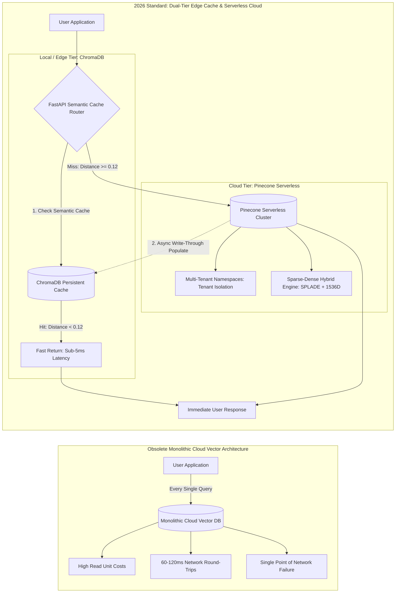
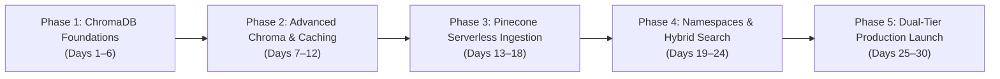
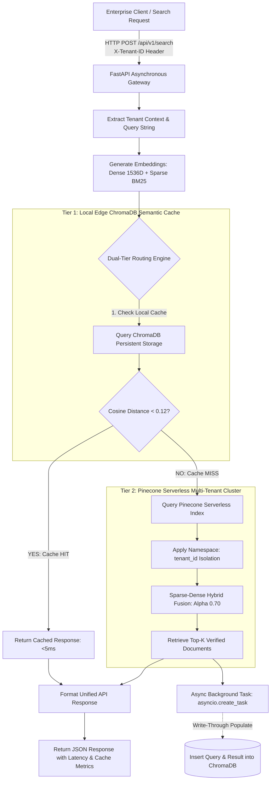

# **30-Day Master Blueprint: Pinecone & ChromaDB for Enterprise AI (2026 Production Standard)**

> ### ⚡ THE BUILDER'S OATH
> *"We do not route repetitive, identical LLM queries across high-latency cloud networks. We refuse to burn enterprise budgets on cloud vector compute when local edge memory can resolve queries in sub-5ms. In 2026, production vector architecture demands a dual-tier paradigm: pairing the speed and zero-cost persistence of local ChromaDB instances with the multi-tenant scale, namespace isolation, and sparse-dense hybrid search of Pinecone Serverless. Cache locally, scale globally, measure latencies in single digits, and eliminate unnecessary cloud spend."*

---

## 1. The 2026 AI Era Reality Check: Single-Tier Cloud Waste vs. Dual-Tier Hybrid Vector Architecture

Between 2023 and 2025, engineering teams routed every single RAG retrieval query directly to centralized cloud-hosted vector databases. In enterprise production, this created severe inefficiencies: **repetitive customer queries generated thousands of redundant network round-trips**, adding 60–120ms of network overhead and inflating cloud API bills.

The 2026 production standard is the **Dual-Tier Vector Architecture**: a local/edge **ChromaDB** layer functioning as an ultra-low-latency semantic cache, backed by **Pinecone Serverless** for multi-tenant data isolation, deep cloud persistence, and hybrid keyword-vector search.



### Architectural Contrast: Monolithic Cloud vs. Dual-Tier Vector Engine

| Architectural Dimension | Monolithic Cloud Vector DBs (OBSOLETE) | Dual-Tier Chroma + Pinecone Hybrid (2026 STANDARD) |
| :--- | :--- | :--- |
| **System Latency** | 60–120ms per query due to recurring cloud HTTP network round-trips. | **Sub-5ms** local SSD cache hits via ChromaDB; fallback to ~45ms for cold Pinecone queries. |
| **Operational Cost (TCO)** | Billed on every read operation; high recurring cloud costs on repetitive queries. | **60–80% cost reduction**; frequent queries resolve locally on zero-cost edge ChromaDB storage. |
| **Multi-Tenancy** | Complex application-level filters or high cluster management overhead. | Native logical **Pinecone Namespaces** partitioning multi-tenant customer data within a single index. |
| **Search Precision** | Dense-only vector similarity; misses exact SKU numbers, error codes, and technical jargon. | **Sparse-Dense Hybrid Search** combining SPLADE/BM25 with dense vectors via alpha weighting. |
| **Network Resilience** | System breaks completely during cloud outages or network degradation. | Edge-cached queries continue resolving locally during transient cloud disconnects. |
| **Data Synchronization** | Manual cache invalidation scripts running in separate worker queues. | **Write-through semantic caching** with automatic TTL and similarity-threshold invalidation. |

---

## 2. The 5 Strategic Career Pillars

### Pillar 1: Importance of the Skill
Managing vector search at enterprise scale requires balancing computational cost, latency budgets, and retrieval precision. Mastering both embedded local vector stores (ChromaDB) and distributed cloud-native databases (Pinecone Serverless) allows you to architect tiered data systems that keep cloud bills low while delivering sub-10ms response times to client applications.

### Pillar 2: Why It Matters in 2026
In 2026, enterprise software engineering is focused on optimizing AI operational expenses. Indiscriminately querying cloud-hosted vector indexes for every prompt interaction wastes money. Engineers who can design semantic caching layers and configure sparse-dense hybrid retrieval algorithms are critical to maintaining sustainable production margins.

### Pillar 3: Why Companies Hire Builders with These Projects
Companies reject developers who have only built simple single-file vector search demos. They hire engineers who can solve production retrieval challenges:
- Implementing dynamic batching algorithms to prevent HTTP 413 "Payload Too Large" errors during massive ingestions.
- Calibrating cosine similarity thresholds to avoid false-positive semantic cache hits.
- Tuning the hybrid search alpha parameter ($\alpha$) to balance exact keyword matches against semantic context.
- Implementing zero-trust multi-tenancy using isolated Pinecone namespaces to eliminate cross-tenant data leakage.

### Pillar 4: Importance of Built Projects
Deploying a production dual-tier vector router—packaged with Docker, managed via FastAPI, featuring local Chroma cache hits and Pinecone Serverless hybrid fallbacks—proves systems integration competence. It demonstrates mastery over storage protocols, serialization formats, network latency profiles, and cost governance.

### Pillar 5: How This Skill Gets You Hired
Specializing in dual-tier vector infrastructure targets key platform and AI engineering roles:
- **Vector Infrastructure Architect:** $145,000 – $185,000+ USD
- **AI Data Platform Engineer:** $130,000 – $175,000 USD
- **Retrieval Systems Backend Developer:** $120,000 – $165,000 USD

---

## 3. Realistic Timeline Evaluation

To master ChromaDB, Pinecone Serverless, and dual-tier vector routing, commit to **30 Consecutive Days at 2 Focused Hours Per Day (60 Total Hours)**.



- **Phase 1: ChromaDB Foundations & Storage Internals (Days 1–6):** Master embedded vector storage, the difference between ephemeral and persistent clients, HNSW distance spaces, custom embedding functions, and SQLite metadata mechanics.
- **Phase 2: Advanced ChromaDB Operations & Semantic Caching (Days 7–12):** Implement safe chunked upserts, complex logical metadata filtering (`$and`, `$or`, `$in`), framework adapters (LangChain/LlamaIndex), and sub-5ms local semantic caching logic.
- **Phase 3: Pinecone Serverless Architecture & Batch Ingestion (Days 13–18):** Set up Pinecone Serverless, configure `ServerlessSpec`, align vector dimensions and metrics, handle HTTP payload limits, and build parallel ingestion pipelines.
- **Phase 4: Advanced Enterprise Pinecone: Namespaces & Hybrid Search (Days 19–24):** Implement multi-tenant data isolation using Namespaces, pre-filtering with MongoDB-style operators, sparse-dense hybrid search with SPLADE/BM25, and alpha parameter tuning.
- **Phase 5: Dual-Tier Production Integration, Docker & Capstone Launch (Days 25–30):** Build the unified dual-engine semantic cache router, integrate write-through cache population, containerize with Docker volumes, expose FastAPI endpoints, and deploy the Capstone project.

---

## 4. Curated Learning Ecosystem

| Category | Primary Learning Source | Focus Areas & Production Value |
| :--- | :--- | :--- |
| **Official Documentation** | [Pinecone Official Documentation](https://docs.pinecone.io/) | Serverless index lifecycle, Namespaces, metadata filtering, API payload specs. |
| **Official Documentation** | [ChromaDB Official Documentation](https://docs.trychroma.com/) | PersistentClient mechanics, HNSW parameters, custom embeddings, collection querying. |
| **Specialized Libraries** | [Pinecone-Text GitHub & Guides](https://github.com/pinecone-io/pinecone-text) | BM25 vector generation, SPLADE sparse representations, reciprocal rank fusion. |
| **Video Deep Dives** | Swaroop Talks & Pinecone Official Channels | Serverless architecture deep dives, enterprise RAG cost optimization, hybrid routing. |
| **Systems Engineering** | Hussein Nasser Database Architecture Series | Storage engines, SQLite B-Tree indexing, network latency profiles, connection pooling. |
| **Evaluation & Metrics** | DeepLearning.AI (*Vector Databases: from Embeddings to Applications*) | HNSW graph navigation, Recall@K evaluation, cosine similarity thresholds. |

---

## 5. Day-by-Day 30-Day Master Execution Schedule

### Phase 1: ChromaDB Foundations — Embedded Storage, HNSW Distances & Internal Architecture

---

### **📅 Day 1: Architecture of Embedded Vector DBs — Ephemeral vs. Persistent ChromaDB**
⏱ **Strict 2-Hour (120 Mins) Time-Split Breakdown:**
- `[00:00 - 00:30 Mins] (30m):` *Architecture & Vector Theory* -> Understand embedded vector database architectures. Contrast in-memory ephemeral prototyping (`chromadb.Client()`) with on-disk database persistence (`chromadb.PersistentClient(path="...")`). Learn how embedded databases run inside the application process to eliminate network overhead. [Resource: ChromaDB Architecture Documentation]
- `[00:30 - 01:10 Mins] (40m):` *Sandbox & SDK Mechanics* -> Set up your Python 3.12 environment using `uv`. Install `chromadb>=0.5.0`. Instantiate both ephemeral and persistent clients; write records, restart the process, and confirm data persistence in the storage path. [Resource: ChromaDB Quickstart Guide]
- `[01:10 - 01:50 Mins] (40m):` *Daily Task Building* -> Write a modular Python database manager that initializes a persistent ChromaDB instance, creates an `enterprise_knowledge` collection, inserts sample vectors, and handles process restarts cleanly.
- `[01:50 - 02:00 Mins] (10m):` *Latency Benchmark & Integrity Audit* -> Query the persistent collection; confirm that retrieval latency stays under 4ms on local NVMe/SSD storage.
- **Concepts to Master:**
  - Embedded vector databases vs. client-server database models [ChromaDB Core Docs]
  - Process memory boundaries and disk persistence with `PersistentClient` [Systems Engineering]
  - Cold startup and initialization times in local vector storage [Database Performance]
- **Target Tools & Libraries:** Python 3.12, `uv`, `chromadb>=0.5.0`
- **Daily Task:** Build an embedded storage module using `PersistentClient` that persists vector embeddings across process restarts.
- **Daily Output:** Terminal execution log confirming persistent data reloads: `Loaded Collection: enterprise_knowledge | Total Records: 100 | Disk Path: ./chroma_db`.

---

### **📅 Day 2: HNSW Distance Spaces in ChromaDB — `cosine`, `l2`, and `ip`**
⏱ **Strict 2-Hour (120 Mins) Time-Split Breakdown:**
- `[00:00 - 00:30 Mins] (30m):` *Architecture & Vector Theory* -> Study the distance spaces supported by ChromaDB's underlying HNSW implementation (`hnswlib`): Squared L2 (`l2`), Cosine Distance (`cosine`), and Inner Product (`ip`). Understand their mathematical boundaries, how to configure them via collection metadata, and how distance maps to similarity. [Resource: HNSW Distance Spaces Documentation]
- `[00:30 - 01:10 Mins] (40m):` *Sandbox & SDK Mechanics* -> Initialize three distinct collections using metadata configurations: `{"hnsw:space": "cosine"}`, `{"hnsw:space": "l2"}`, and `{"hnsw:space": "ip"}`. Insert identical vector pairs and inspect returned distance metrics. [Resource: ChromaDB Collections Guide]
- `[01:10 - 01:50 Mins] (40m):` *Daily Task Building* -> Build a distance comparison script that inserts 100 normalized and unnormalized vectors into all three collections, querying them with an identical vector to evaluate score variations.
- `[01:50 - 02:00 Mins] (10m):` *Latency Benchmark & Integrity Audit* -> Verify that cosine distances fall within $[0.0, 2.0]$ and inner product scores reflect negated dot products for proper index sorting.
- **Concepts to Master:**
  - Configuring distance metrics using `{"hnsw:space": "cosine"}` [ChromaDB API Reference]
  - Mathematical differences between Squared L2, Cosine, and Inner Product [Vector Math Guides]
  - Converting raw distance outputs to normalized similarity percentages [Information Retrieval]
- **Target Tools & Libraries:** `chromadb`, `numpy`
- **Daily Task:** Build a multi-metric benchmarking script in ChromaDB that evaluates retrieval outputs across all three distance spaces.
- **Daily Output:** Terminal report displaying calculated distance values across Cosine, L2, and IP spaces for identical input vectors.

---

### **📅 Day 3: Custom Embedding Functions — SentenceTransformers, OpenAI & FastEmbed**
⏱ **Strict 2-Hour (120 Mins) Time-Split Breakdown:**
- `[00:00 - 00:30 Mins] (30m):` *Architecture & Vector Theory* -> Learn how ChromaDB handles embedding generation. Contrast the default MiniLM-L6-v2 model with custom embedding classes. Study why decoupling embedding generation from vector storage allows you to swap model providers without re-architecting data pipelines. [Resource: ChromaDB Embedding Functions Docs]
- `[00:30 - 01:10 Mins] (40m):` *Sandbox & SDK Mechanics* -> Implement custom embedding functions using `chromadb.utils.embedding_functions.OpenAIEmbeddingFunction` and a local ONNX-accelerated `FastEmbed` function. Bind them directly to collections. [Resource: FastEmbed GitHub]
- `[01:10 - 01:50 Mins] (40m):` *Daily Task Building* -> Build a document ingestion module that accepts raw text strings, embeds them using FastEmbed locally, and stores them in ChromaDB alongside their original text payloads.
- `[01:50 - 02:00 Mins] (10m):` *Latency Benchmark & Integrity Audit* -> Query using text prompts (e.g., `collection.query(query_texts=["Cloud deployment"])`); verify that embedding generation and retrieval complete in under 15ms.
- **Concepts to Master:**
  - Writing custom embedding classes inheriting from `EmbeddingFunction` [ChromaDB Docs]
  - Local model execution using FastEmbed to eliminate third-party API dependencies [NLP Engineering]
  - Text-in, vector-out abstraction layers for embedded storage [Software Architecture]
- **Target Tools & Libraries:** `chromadb`, `fastembed`
- **Daily Task:** Implement a local embedding pipeline using FastEmbed within ChromaDB that indexes documents without external API calls.
- **Daily Output:** Clean terminal logs showing raw text inputs converted into 384-dimensional vectors and retrieved successfully via text queries.

---

### **📅 Day 4: Storage Internals — Inspecting ChromaDB's SQLite Metadata & Segment Index Files**
⏱ **Strict 2-Hour (120 Mins) Time-Split Breakdown:**
- `[00:00 - 00:30 Mins] (30m):` *Architecture & Vector Theory* -> Examine ChromaDB's underlying physical storage layout. Learn how ChromaDB combines an embedded SQLite database (for storing metadata, documents, and collection schemas) with binary segment files (`.bin`) managed by `hnswlib` for vector index graphs. [Resource: ChromaDB Architecture Internals]
- `[00:30 - 01:10 Mins] (40m):` *Sandbox & SDK Mechanics* -> Navigate to the `./chroma_db` directory. Inspect the SQLite schema using the `sqlite3` CLI: examine tables (`collections`, `segments`, `embeddings`). Inspect the companion segment index files. [Resource: SQLite CLI Guides]
- `[01:10 - 01:50 Mins] (40m):` *Daily Task Building* -> Write a Python audit script that reads the SQLite metadata file directly using `sqlite3`, counts total embedded records, inspects collection UUIDs, and reports total disk usage across all segment files.
- `[01:50 - 02:00 Mins] (10m):` *Latency Benchmark & Integrity Audit* -> Confirm that the number of rows in the SQLite database matches the count returned by `collection.count()`.
- **Concepts to Master:**
  - ChromaDB physical file layout: SQLite database paired with binary HNSW segments [Systems Engineering]
  - Inspecting internal database tables (`collections`, `segments`) [Database Internals]
  - Auditing vector storage growth and calculating disk consumption [Storage Administration]
- **Target Tools & Libraries:** `sqlite3`, `chromadb`, Python standard library: `os`, `pathlib`
- **Daily Task:** Build an audit utility that inspects ChromaDB's internal SQLite database and reports physical storage usage metrics.
- **Daily Output:** Terminal printout displaying internal collection UUIDs, record counts from SQLite, and physical index file sizes on disk.

---

### **📅 Day 5: Collection Lifecycle Management — Partitioning, Deletions & Metadata Tagging**
⏱ **Strict 2-Hour (120 Mins) Time-Split Breakdown:**
- `[00:00 - 00:30 Mins] (30m):` *Architecture & Vector Theory* -> Study collection lifecycle patterns. Learn why partitioning data into separate collections (e.g., by document type or customer domain) improves query performance by keeping HNSW graphs smaller and more focused than a single monolithic collection. [Resource: ChromaDB Collection Management]
- `[00:30 - 01:10 Mins] (40m):` *Sandbox & SDK Mechanics* -> Practice collection lifecycle operations: `client.create_collection()`, `client.get_or_create_collection()`, `collection.modify()`, `collection.delete()`, and `client.delete_collection()`. [Resource: ChromaDB API Docs]
- `[01:10 - 01:50 Mins] (40m):` *Daily Task Building* -> Build a multi-department knowledge manager: Dynamically provisions collections (`kb_engineering`, `kb_legal`, `kb_marketing`), routes documents to appropriate collections, and prunes expired records.
- `[01:50 - 02:00 Mins] (10m):` *Latency Benchmark & Integrity Audit* -> Verify that deleting records updates `collection.count()` immediately and reclaims space in the underlying storage files.
- **Concepts to Master:**
  - Collection lifecycle workflows and operational patterns [ChromaDB Guides]
  - Graph partition design: separate collections vs. metadata filtering [Database Architecture]
  - Clean deletion mechanics and index integrity [Storage Management]
- **Target Tools & Libraries:** `chromadb`
- **Daily Task:** Implement an automated collection manager that partitions document indexes by department and manages retention policies.
- **Daily Output:** Terminal logs showing dynamic collection provisioning, targeted record insertion, and verified collection deletions.

---

### **📅 Day 6: Phase 1 Consolidation — Resilient Local Embedded Knowledge Retriever**
⏱ **Strict 2-Hour (120 Mins) Time-Split Breakdown:**
- `[00:00 - 00:30 Mins] (30m):` *Architecture & Vector Theory* -> Review Phase 1 skills: persistent disk storage, HNSW distance configuration, local embedding pipelines, SQLite inspection, and collection partitioning.
- `[00:30 - 01:10 Mins] (40m):` *Sandbox & SDK Mechanics* -> Wire these components into an integrated local vector retriever class that encapsulates client initialization, embedding models, and query execution.
- `[01:10 - 01:50 Mins] (40m):` *Daily Task Building* -> Build an embedded technical documentation search engine: Ingests 500 local Markdown technical runbooks, embeds them using local FastEmbed, and exposes an interactive CLI for sub-5ms semantic retrieval.
- `[01:50 - 02:00 Mins] (10m):` *Latency Benchmark & Integrity Audit* -> Run 100 test queries; verify that p95 retrieval latency remains under 6ms with zero external network requests.
- **Concepts to Master:**
  - Packaging ChromaDB into a production-ready retrieval class [Enterprise Python Design]
  - Eliminating third-party API dependencies for local search [DevOps Engineering]
  - Profiling local vector retrieval latencies [Performance Engineering]
- **Target Tools & Libraries:** `chromadb`, `fastembed`, Python 3.12
- **Daily Task:** Build an embedded technical documentation retriever that operates entirely on local disk with sub-6ms search performance.
- **Daily Output:** Terminal transcript showing fast semantic retrieval across local technical runbooks, complete with latency metrics.

---

### Phase 2: Advanced ChromaDB Operations, Dynamic Filtering & Local Semantic Caching

---

### **📅 Day 7: Safe Chunked Batch Upserts & Preventing SQLite In-Memory Spills**
⏱ **Strict 2-Hour (120 Mins) Time-Split Breakdown:**
- `[00:00 - 00:30 Mins] (30m):` *Architecture & Vector Theory* -> Understand batch size limits in ChromaDB. Passing 50,000 vectors in a single `collection.add()` call causes SQLite parameter overflow errors (`too many SQL variables`) and high memory consumption. Learn how to write generator-based chunking pipelines. [Resource: SQLite Parameter Limits & ChromaDB Batching]
- `[00:30 - 01:10 Mins] (40m):` *Sandbox & SDK Mechanics* -> Write a chunking utility: Splits an incoming list of 10,000 vectors into safe batches (e.g., batches of 500), upserting each batch sequentially while monitoring memory consumption. [Resource: Python Itertools Guides]
- `[01:10 - 01:50 Mins] (40m):` *Daily Task Building* -> Build an ingestion pipeline that handles large datasets: Reads raw records, batches them into safe chunks, shows a progress indicator, and catches transient errors without crashing the run.
- `[01:50 - 02:00 Mins] (10m):` *Latency Benchmark & Integrity Audit* -> Ingest 15,000 synthetic records; confirm the pipeline completes without hitting SQLite variable limit exceptions.
- **Concepts to Master:**
  - SQLite variable limits and batch size trade-offs [Database Systems]
  - Writing memory-efficient generator chunkers in Python [Python Architecture]
  - Safe, resumable batch upsert strategies [Data Engineering]
- **Target Tools & Libraries:** `chromadb`, `tqdm`
- **Daily Task:** Implement a batch ingestion pipeline that streams large vector datasets into ChromaDB without memory spikes.
- **Daily Output:** Terminal output displaying smooth progress bar updates across 30 sequential batches of 500 records with zero SQLite errors.

---

### **📅 Day 8: Complex Logical Metadata Filtering — `$and`, `$or`, and `$in` Operators**
⏱ **Strict 2-Hour (120 Mins) Time-Split Breakdown:**
- `[00:00 - 00:30 Mins] (30m):` *Architecture & Vector Theory* -> Study ChromaDB's metadata filtering syntax. Learn how ChromaDB evaluates `where` filter dictionaries using MongoDB-style operators: `$eq`, `$ne`, `$gt`, `$gte`, `$lt`, `$lte`, `$in`, `$nin`, `$and`, and `$or`. Understand why pre-filtering narrows HNSW graph search space. [Resource: ChromaDB Metadata Filtering Specs]
- `[00:30 - 01:10 Mins] (40m):` *Sandbox & SDK Mechanics* -> Populate a test collection with varied metadata (department, security clearance level, document year, tags). Execute queries with complex nested logical filters. [Resource: ChromaDB Where Queries]
- `[01:10 - 01:50 Mins] (40m):` *Daily Task Building* -> Build an enterprise role-based search function: Accepts a user clearance level and department, constructing a dynamic `where={"$and": [{"dept": {"$in": [...]}}, {"clearance": {"$lte": level}}]}` filter to restrict results.
- `[01:50 - 02:00 Mins] (10m):` *Latency Benchmark & Integrity Audit* -> Query the system using low-clearance permissions; verify that confidential documents are excluded from the returned results.
- **Concepts to Master:**
  - Constructing nested boolean filters with `$and` and `$or` [ChromaDB Docs]
  - Array inclusion filtering using `$in` and `$nin` [Information Retrieval]
  - Enforcing document permission boundaries via metadata filtering [Application Security]
- **Target Tools & Libraries:** `chromadb`, `pydantic`
- **Daily Task:** Build an access-controlled retrieval module that enforces user permission filters using ChromaDB logical operators.
- **Daily Output:** Execution trace showing query results filtered to match authorized user permissions and department tags.

---

### **📅 Day 9: ChromaDB as a Framework Backend — LangChain & LlamaIndex Vector Stores**
⏱ **Strict 2-Hour (120 Mins) Time-Split Breakdown:**
- `[00:00 - 00:30 Mins] (30m):` *Architecture & Vector Theory* -> Examine how higher-level AI orchestration frameworks interface with ChromaDB. Study the Chroma vector store implementations in LangChain (`langchain-chroma`) and LlamaIndex (`llama-index-vector-stores-chroma`), focusing on document mapping, ID generation, and metadata preservation. [Resource: LangChain Chroma Integration Docs]
- `[00:30 - 01:10 Mins] (40m):` *Sandbox & SDK Mechanics* -> Install `langchain-chroma`. Initialize a `Chroma` vector store backed by your existing `PersistentClient`. Add documents using `store.add_documents()` and run similarity searches. [Resource: LlamaIndex Chroma Guides]
- `[01:10 - 01:50 Mins] (40m):` *Daily Task Building* -> Build a complete RAG chain using LangChain Core and your local ChromaDB persistent store, incorporating a retriever with metadata filter arguments.
- `[01:50 - 02:00 Mins] (10m):` *Latency Benchmark & Integrity Audit* -> Confirm that framework-generated documents are stored with clean IDs and metadata in the underlying SQLite database.
- **Concepts to Master:**
  - Integrating ChromaDB with LangChain and LlamaIndex adapters [Framework Architecture]
  - Exposing local ChromaDB collections as standard framework retrievers [Modern RAG Design]
  - Auditing framework-generated schemas inside ChromaDB storage [Database Engineering]
- **Target Tools & Libraries:** `langchain-chroma`, `langchain-core`, `chromadb`
- **Daily Task:** Configure a local persistent ChromaDB collection as the vector store backend for a LangChain RAG pipeline.
- **Daily Output:** Terminal execution log showing LangChain successfully querying the local ChromaDB store and generating answers.

---

### **📅 Day 10: Local Semantic Caching Theory — Cosine Distance Thresholds & Cache Invalidation**
⏱ **Strict 2-Hour (120 Mins) Time-Split Breakdown:**
- `[00:00 - 00:30 Mins] (30m):` *Architecture & Vector Theory* -> Study the mechanics of semantic caching. Unlike traditional key-value caches (Redis) that require exact string matches, a **Semantic Cache** embeds incoming queries and searches a local vector cache. If the nearest historical query has a cosine distance below a strict threshold (e.g., $d < 0.12$), return the cached response immediately. [Resource: Semantic Caching Architecture Guides]
- `[00:30 - 01:10 Mins] (40m):` *Sandbox & SDK Mechanics* -> Build a dedicated cache collection: Stores `query_embedding`, `query_text`, `cached_response`, and `timestamp`. Test variations of identical questions (e.g., "What is our travel policy?" vs. "Can you explain our travel reimbursement rules?"). [Resource: Swaroop Talks Semantic Caching]
- `[01:10 - 01:50 Mins] (40m):` *Daily Task Building* -> Build a standalone `SemanticCache` class: Implements `get(query_vector)` returning cached text on hits, and `set(query_vector, response_text)` to record new query-response pairs.
- `[01:50 - 02:00 Mins] (10m):` *Latency Benchmark & Integrity Audit* -> Benchmark cache hit latency; verify that queries resolving through the semantic cache return in under 3ms.
- **Concepts to Master:**
  - Semantic caching theory and cosine distance threshold calibration [AI Infrastructure Design]
  - Cache hit vs. cache miss decision boundaries [Database Performance]
  - Measuring latency savings from local semantic caching [Systems Benchmarking]
- **Target Tools & Libraries:** `chromadb`, `numpy`
- **Daily Task:** Implement a standalone semantic cache using ChromaDB that resolves semantically equivalent queries from local disk.
- **Daily Output:** Terminal log showing: Query 1 (Cold Miss: 65ms) -> Stored in Cache -> Query 2 (Semantic Hit: 2.8ms, Distance: 0.08).

---

### **📅 Day 11: Write-Through & Write-Around Cache Patterns for Local Embedding Stores**
⏱ **Strict 2-Hour (120 Mins) Time-Split Breakdown:**
- `[00:00 - 00:30 Mins] (30m):` *Architecture & Vector Theory* -> Study caching write patterns in AI systems. Contrast **Write-Through** (updating the local cache simultaneously whenever a new response is generated) with **Write-Around** (caching only after verifying response quality). Learn how to implement Time-To-Live (TTL) expiration using metadata timestamps. [Resource: Distributed Systems Caching Patterns]
- `[00:30 - 01:10 Mins] (40m):` *Sandbox & SDK Mechanics* -> Add TTL logic to your `SemanticCache`: Store an `expires_at` epoch timestamp in metadata. Query using `where={"expires_at": {"$gt": current_epoch}}` to ignore expired entries. [Resource: ChromaDB Metadata Filtering]
- `[01:10 - 01:50 Mins] (40m):` *Daily Task Building* -> Build a cache eviction and cleanup routine: Checks the cache collection, identifies expired entries, and deletes them using `collection.delete()`.
- `[01:50 - 02:00 Mins] (10m):` *Latency Benchmark & Integrity Audit* -> Insert an entry with a short 2-second TTL; verify it produces a cache hit immediately, then produces a cache miss after expiration.
- **Concepts to Master:**
  - Implementing TTL expiration in vector collections via metadata filtering [Cache Architecture]
  - Writing background cleanup routines for embedded storage [Systems Engineering]
  - Balancing cache hit rates against data freshness in semantic caches [Performance Design]
- **Target Tools & Libraries:** `chromadb`, Python standard library: `time`
- **Daily Task:** Implement TTL-based cache expiration and automated cleanup inside a ChromaDB semantic cache.
- **Daily Output:** Terminal verification logs showing a cache hit prior to expiration, followed by a clean cache miss and eviction after TTL expiry.

---

### **📅 Day 12: Phase 2 Consolidation — Local Semantic Cache Gateway with Sub-5ms Retrieval**
⏱ **Strict 2-Hour (120 Mins) Time-Split Breakdown:**
- `[00:00 - 00:30 Mins] (30m):` *Architecture & Vector Theory* -> Synthesize Phase 2 skills: chunked batch upserts, logical metadata filters, framework integration, semantic caching thresholds, and TTL eviction into a unified caching engine.
- `[00:30 - 01:10 Mins] (40m):` *Sandbox & SDK Mechanics* -> Assemble an integrated local cache gateway class that intercepts incoming query strings, checks semantic similarity, returns cached entries on hits, and logs cache performance.
- `[01:10 - 01:50 Mins] (40m):` *Daily Task Building* -> Deploy the cache gateway against a simulated enterprise workload of 200 queries (with 40% semantic duplication). Record overall latency reductions and calculate simulated cloud API cost savings.
- `[01:50 - 02:00 Mins] (10m):` *Latency Benchmark & Integrity Audit* -> Generate a performance report: Verify a 40% cache hit rate with average hit latencies under 3.5ms.
- **Concepts to Master:**
  - Production architecture of local semantic caching gateways [Enterprise AI Standards]
  - Calculating quantitative latency and API cost improvements [Infrastructure Metrics]
  - Tuning distance thresholds to avoid false-positive semantic matches [Information Retrieval]
- **Target Tools & Libraries:** `chromadb`, `fastembed`, Python 3.12
- **Daily Task:** Build and evaluate an enterprise semantic cache gateway, measuring latency improvements and cache hit rates.
- **Daily Output:** Formatted terminal report displaying: `Total Queries: 200 | Cache Hits: 82 (41%) | Avg Hit Latency: 3.2ms | Simulated Cost Saved: $4.10`.

---

### Phase 3: Pinecone Serverless Architecture, Cloud Ingestion & Batch Optimization

---

### **📅 Day 13: Pinecone Serverless Architecture — Decoupled Compute & Storage Economics**
⏱ **Strict 2-Hour (120 Mins) Time-Split Breakdown:**
- `[00:00 - 00:30 Mins] (30m):` *Architecture & Vector Theory* -> Study the cloud architecture of Pinecone Serverless. Contrast traditional pod-based clusters (paying continuously for dedicated compute and memory) with serverless vector engines: compute is decoupled from storage, storage persists in low-cost object stores (S3), and read/write units are billed on demand. [Resource: Pinecone Serverless Architecture Whitepaper]
- `[00:30 - 01:10 Mins] (40m):` *Sandbox & SDK Mechanics* -> Set up your Pinecone account. Install `pinecone-client>=5.0.0`. Initialize the client: `pc = Pinecone(api_key="...")`. Inspect account details, active indexes, and billing tiers. [Resource: Pinecone Python SDK v5 Docs]
- `[01:10 - 01:50 Mins] (40m):` *Daily Task Building* -> Write a Python management script that connects to Pinecone, checks for existing indexes, describes index status, and reports index readiness.
- `[01:50 - 02:00 Mins] (10m):` *Latency Benchmark & Integrity Audit* -> Query `pc.list_indexes()`; confirm successful authentication and API connectivity over HTTPS.
- **Concepts to Master:**
  - Decoupled storage and compute in serverless vector engines [Cloud Database Systems]
  - Pinecone Serverless billing models: Read Units (RUs), Write Units (WUs), and Storage GB [Cloud Economics]
  - Initializing and configuring the modern Pinecone v5+ SDK [Pinecone Official Docs]
- **Target Tools & Libraries:** Python 3.12, `pinecone-client>=5.0.0`
- **Daily Task:** Configure and verify programmatic connectivity to Pinecone Serverless using the v5+ SDK.
- **Daily Output:** Terminal printout displaying authenticated Pinecone connection status and active serverless index lists.

---

### **📅 Day 14: Creating & Configuring Serverless Indexes — `ServerlessSpec`, Clouds & Regions**
⏱ **Strict 2-Hour (120 Mins) Time-Split Breakdown:**
- `[00:00 - 00:30 Mins] (30m):` *Architecture & Vector Theory* -> Study serverless index configuration parameters. Understand `ServerlessSpec(cloud="aws", region="us-east-1")`. Learn why locating your serverless index in the same cloud region as your application workloads minimizes cross-region latency and eliminates data egress charges. [Resource: Pinecone ServerlessSpec Guides]
- `[00:30 - 01:10 Mins] (40m):` *Sandbox & SDK Mechanics* -> Create a serverless index programmatically: `pc.create_index(name="enterprise-kb", dimension=1536, metric="cosine", spec=ServerlessSpec(cloud="aws", region="us-east-1"))`. [Resource: Pinecone API Reference]
- `[01:10 - 01:50 Mins] (40m):` *Daily Task Building* -> Build an automated index provisioning utility: Checks if a target index exists; if not, provisions it with matching specs, waits for `index.status['ready'] == True`, and returns an active index handle.
- `[01:50 - 02:00 Mins] (10m):` *Latency Benchmark & Integrity Audit* -> Use `pc.describe_index("enterprise-kb")`; verify the index shows status `Ready` with the correct dimension, metric, and cloud region.
- **Concepts to Master:**
  - Programmatic index provisioning with `ServerlessSpec` [Pinecone Docs]
  - Selecting cloud providers (AWS, GCP, Azure) and co-locating compute regions [Cloud Architecture]
  - Managing asynchronous index provisioning states in automation scripts [DevOps Engineering]
- **Target Tools & Libraries:** `pinecone-client>=5.0.0`
- **Daily Task:** Build an automated index provisioning module that deploys an enterprise serverless index and waits for readiness.
- **Daily Output:** Terminal logs displaying: `Creating index 'enterprise-kb'... Waiting for readiness... Index is READY (Host: enterprise-kb-xxxx.pinecone.io)`.

---

### **📅 Day 15: Vector Dimension Alignment & Metric Strictness (`cosine`, `dotproduct`, `euclidean`)**
⏱ **Strict 2-Hour (120 Mins) Time-Split Breakdown:**
- `[00:00 - 00:30 Mins] (30m):` *Architecture & Vector Theory* -> Study metric alignment in Pinecone. Understand why changing the distance metric requires recreating the index. Contrast `cosine`, `dotproduct`, and `euclidean` performance characteristics in cloud storage, and verify embedding dimension alignment (e.g., 1536 for OpenAI `text-embedding-3-small`, 3072 for `3-large`). [Resource: Pinecone Distance Metrics Explained]
- `[00:30 - 01:10 Mins] (40m):` *Sandbox & SDK Mechanics* -> Connect to your serverless index handle: `index = pc.Index("enterprise-kb")`. Upsert sample vectors with metadata. Attempt to upsert a vector with mismatched dimensions to observe the API validation error. [Resource: Pinecone Upsert Guides]
- `[01:10 - 01:50 Mins] (40m):` *Daily Task Building* -> Build a validation wrapper using Pydantic v2: Enforces vector dimension constraints and metadata field requirements before sending API requests to Pinecone.
- `[01:50 - 02:00 Mins] (10m):` *Latency Benchmark & Integrity Audit* -> Query the index with top-k similarity; confirm that returned matches contain IDs, similarity scores, and metadata fields.
- **Concepts to Master:**
  - Metric selection and dimensional alignment in Pinecone Serverless [Pinecone Documentation]
  - Client-side schema validation using Pydantic before network dispatch [Defensive Engineering]
  - Structure of Pinecone query response objects (`matches`, `score`, `metadata`) [API Standards]
- **Target Tools & Libraries:** `pinecone-client`, `pydantic>=2.7.0`
- **Daily Task:** Implement a Pydantic-validated ingestion wrapper that verifies vector dimensions before dispatching to Pinecone.
- **Daily Output:** Execution trace showing valid 1536-dimensional vectors accepted and invalid dimensions rejected locally before making network calls.

---

### **📅 Day 16: Handling HTTP 413 Payload Limits — Dynamic Batch Sizing & Serialization**
⏱ **Strict 2-Hour (120 Mins) Time-Split Breakdown:**
- `[00:00 - 00:30 Mins] (30m):` *Architecture & Vector Theory* -> Understand API payload constraints. Pinecone enforces a strict **2MB request size limit** per upsert call (HTTP 413 "Request Entity Too Large"). Large metadata dictionaries or large batches of 1536-dimensional vectors quickly exceed this limit. Learn how to dynamically calculate batch byte footprints. [Resource: Pinecone Limits & Quotas Documentation]
- `[00:30 - 01:10 Mins] (40m):` *Sandbox & SDK Mechanics* -> Write a dynamic batching function: Measures JSON payload byte size using `len(json.dumps(batch).encode('utf-8'))` and dynamically caps batch sizes to stay safely under 1.5MB. [Resource: Swaroop Talks Pinecone Optimization]
- `[01:10 - 01:50 Mins] (40m):` *Daily Task Building* -> Build a resilient bulk uploader: Ingests 5,000 vectors with detailed metadata, dynamically chunks payloads based on byte size, and dispatches them with retry logic.
- `[01:50 - 02:00 Mins] (10m):` *Latency Benchmark & Integrity Audit* -> Ingest the entire batch; verify zero HTTP 413 errors and check total record counts using `index.describe_index_stats()`.
- **Concepts to Master:**
  - Mitigating HTTP 413 payload overflow errors in cloud APIs [Cloud Systems Engineering]
  - Dynamic byte-size batching algorithms in Python [Data Engineering]
  - Monitoring index capacity and record distribution via `describe_index_stats` [Database Administration]
- **Target Tools & Libraries:** `pinecone-client`, Python standard library: `json`, `sys`
- **Daily Task:** Implement an adaptive, size-aware batch uploader for Pinecone that prevents payload overflow errors.
- **Daily Output:** Terminal execution logs showing adaptive batch sizing (e.g., 200 records, 1.4MB payload per batch) completing with zero HTTP 413 failures.

---

### **📅 Day 17: Parallel Ingestion Pipelines — ThreadPoolExecutor & Async Cloud Upserts**
⏱ **Strict 2-Hour (120 Mins) Time-Split Breakdown:**
- `[00:00 - 00:30 Mins] (30m):` *Architecture & Vector Theory* -> Study network concurrency in cloud vector ingestion. Upserting batches sequentially leaves network bandwidth underutilized and increases total load time. Learn how to use Python's `ThreadPoolExecutor` to pipeline multiple upsert requests concurrently while respecting Pinecone rate limits. [Resource: Python Concurrent Futures Guide]
- `[00:30 - 01:10 Mins] (40m):` *Sandbox & SDK Mechanics* -> Implement concurrent batching with `concurrent.futures.ThreadPoolExecutor(max_workers=5)`. Dispatch parallel batches and handle worker futures. [Resource: High-Performance Python Ingestion]
- `[01:10 - 01:50 Mins] (40m):` *Daily Task Building* -> Build a multi-threaded cloud ingestion engine: Reads large document corpora, batches records into 1MB chunks, and uploads batches across 4 concurrent worker threads.
- `[01:50 - 02:00 Mins] (10m):` *Latency Benchmark & Integrity Audit* -> Compare ingestion times: Benchmark single-threaded sequential uploads against 4-worker concurrent uploads on 10,000 vectors.
- **Concepts to Master:**
  - Parallelizing network-bound cloud uploads using `ThreadPoolExecutor` [Systems Concurrency]
  - Rate-limit mitigation and exponential backoff retry strategies [Enterprise Cloud Architecture]
  - Benchmarking upload throughput and optimizing network pipelines [Data Engineering]
- **Target Tools & Libraries:** `concurrent.futures`, `pinecone-client`
- **Daily Task:** Implement a multi-threaded batch ingestion pipeline for Pinecone Serverless and measure throughput improvements.
- **Daily Output:** Benchmark logs demonstrating a 3x throughput improvement using parallel thread workers over sequential ingestion.

---

### **📅 Day 18: Phase 3 Consolidation — Enterprise Cloud Ingestion Engine with Retry Backoff**
⏱ **Strict 2-Hour (120 Mins) Time-Split Breakdown:**
- `[00:00 - 00:30 Mins] (30m):` *Architecture & Vector Theory* -> Synthesize Phase 3 capabilities: Serverless index provisioning, dimension validation, dynamic 2MB payload chunking, parallel worker dispatch, and exponential backoff retries.
- `[00:30 - 01:10 Mins] (40m):` *Sandbox & SDK Mechanics* -> Package these components into a production-grade `PineconeIngestionEngine` class with configurable retry policies and Pydantic validation.
- `[01:10 - 01:50 Mins] (40m):` *Daily Task Building* -> Run an end-to-end ingestion job loading 20,000 synthetic technical articles into Pinecone Serverless. Handle network retries gracefully and log throughput metrics.
- `[01:50 - 02:00 Mins] (10m):` *Latency Benchmark & Integrity Audit* -> Verify index stats: Check vector counts across the index and confirm zero dropped records.
- **Concepts to Master:**
  - Building resilient cloud ingestion engines [Enterprise Software Standards]
  - Implementing exponential backoff with jitter for cloud APIs [Distributed Systems]
  - Verifying data integrity in remote serverless indexes [Quality Assurance]
  - Monitoring index capacity via `describe_index_stats` [Database Operations]
- **Target Tools & Libraries:** `pinecone-client`, `pydantic`, `tenacity`
- **Daily Task:** Build and execute an enterprise-grade cloud ingestion engine that loads 20,000 vectors into Pinecone Serverless with automated retries.
- **Daily Output:** Terminal transcript showing: `20,000 Vectors Ingested | Batches Dispatched: 100 | Retries: 2 | Total Ingestion Time: 48s | Index Status: Synced`.

---

### Phase 4: Advanced Enterprise Pinecone — Multi-Tenancy Namespaces, Hybrid Search & Metadata

---

### **📅 Day 19: SaaS Multi-Tenancy & Logical Data Isolation with Pinecone Namespaces**
⏱ **Strict 2-Hour (120 Mins) Time-Split Breakdown:**
- `[00:00 - 00:30 Mins] (30m):` *Architecture & Vector Theory* -> Study SaaS multi-tenancy models in vector databases. Creating a separate index for every tenant is expensive and hits cloud quota limits. Learn how Pinecone **Namespaces** provide logical, isolated partitions within a single index, ensuring queries in Tenant A's namespace can never return Tenant B's data. [Resource: Pinecone Documentation - Namespaces]
- `[00:30 - 01:10 Mins] (40m):` *Sandbox & SDK Mechanics* -> Upsert vectors under two isolated namespaces: `namespace="tenant_alpha"` and `namespace="tenant_beta"`. Query `tenant_alpha` and confirm `tenant_beta` records are excluded. [Resource: Swaroop Talks Enterprise Multi-Tenancy]
- `[01:10 - 01:50 Mins] (40m):` *Daily Task Building* -> Build a multi-tenant retrieval module: Requires a validated tenant identifier, maps it to a namespace, and executes isolated upserts and queries.
- `[01:50 - 02:00 Mins] (10m):` *Latency Benchmark & Integrity Audit* -> Query `tenant_alpha` with top-k similarity; verify that results contain zero cross-tenant leakage.
- **Concepts to Master:**
  - Multi-tenant data isolation using Pinecone Namespaces [Pinecone Docs]
  - Cost advantages of shared-index multi-tenancy [Cloud Economics]
  - Preventing cross-tenant data leakage in enterprise AI systems [Application Security]
- **Target Tools & Libraries:** `pinecone-client`, `pydantic`
- **Daily Task:** Implement an enterprise multi-tenant ingestion and retrieval module in Pinecone with strict namespace segregation.
- **Daily Output:** Terminal execution log displaying: `[QUERY] Tenant: ACME | Matches: 5 | Cross-Tenant Leakage: 0.00%` alongside isolated vector IDs.

---

### **📅 Day 20: Pre-Filtering with MongoDB-Style Query Operators (`$eq`, `$in`, `$gt`, `$and`)**
⏱ **Strict 2-Hour (120 Mins) Time-Split Breakdown:**
- `[00:00 - 00:30 Mins] (30m):` *Architecture & Vector Theory* -> Study Pinecone's metadata filtering engine. Learn how Pinecone evaluates metadata filters **prior** to vector scoring (pre-filtering), ensuring that low-relevance results don't push authorized documents out of the top-k window. [Resource: Pinecone Metadata Filtering Documentation]
- `[00:30 - 01:10 Mins] (40m):` *Sandbox & SDK Mechanics* -> Upsert vectors with structured metadata (category, publish_date, access_tier). Query using complex filter dictionaries: `filter={"$and": [{"category": {"$eq": "finance"}}, {"access_tier": {"$in": ["public", "internal"]}}]}`. [Resource: Pinecone API Reference]
- `[01:10 - 01:50 Mins] (40m):` *Daily Task Building* -> Build a corporate search engine that combines vector similarity with metadata filters (date ranges, departments, confidentiality levels) to scope query results.
- `[01:50 - 02:00 Mins] (10m):` *Latency Benchmark & Integrity Audit* -> Inspect query response latency; verify that pre-filtered queries add negligible latency compared to unfiltered queries.
- **Concepts to Master:**
  - Pinecone metadata pre-filtering mechanics [Pinecone Guides]
  - Constructing filter expressions with `$eq`, `$ne`, `$gt`, `$in`, and `$and` [Search Systems]
  - Balancing metadata cardinality with search performance [Database Engineering]
- **Target Tools & Libraries:** `pinecone-client`
- **Daily Task:** Implement pre-filtered vector queries in Pinecone using structured metadata conditions.
- **Daily Output:** Terminal logs showing returned search results strictly matching all specified metadata criteria.

---

### **📅 Day 21: Sparse-Dense Hybrid Search Theory — Combining BM25/SPLADE with Dense Vectors**
⏱ **Strict 2-Hour (120 Mins) Time-Split Breakdown:**
- `[00:00 - 00:30 Mins] (30m):` *Architecture & Vector Theory* -> Study the limitations of dense-only vector search: dense models capture semantic intent but struggle with exact keywords, part numbers, and acronyms. Learn how sparse-dense hybrid search pairs dense embeddings (semantic meaning) with sparse vectors (BM25 or SPLADE lexical weights) in a single query. [Resource: Pinecone Hybrid Search Whitepaper]
- `[00:30 - 01:10 Mins] (40m):` *Sandbox & SDK Mechanics* -> Install `pinecone-text`. Generate BM25 sparse vectors using `BM25Encoder`. Inspect the generated dictionary structure: `{"indices": [102, 4096, ...], "values": [0.42, 1.12, ...]}`. [Resource: Pinecone-Text Documentation]
- `[01:10 - 01:50 Mins] (40m):` *Daily Task Building* -> Build an indexing script that generates both dense embeddings and BM25 sparse vectors for a dataset of technical documents, storing both representations in Pinecone.
- `[01:50 - 02:00 Mins] (10m):` *Latency Benchmark & Integrity Audit* -> Query the index with an exact serial number string; verify that the sparse vector retrieves the exact match where dense-only search failed.
- **Concepts to Master:**
  - Sparse vector representations (indices and values) [Information Retrieval]
  - BM25 and SPLADE lexical encoding with `pinecone-text` [NLP Systems]
  - Architecture of hybrid sparse-dense indexes in Pinecone [Pinecone Guides]
- **Target Tools & Libraries:** `pinecone-client`, `pinecone-text`
- **Daily Task:** Implement an ingestion pipeline that generates and stores dual dense and sparse vector representations in Pinecone.
- **Daily Output:** Log output displaying both dense (1536 float array) and sparse (indices and values) structures stored for each record.

---

### **📅 Day 22: Implementing Hybrid Retrieval with `pinecone-text` & Reciprocal Weighting**
⏱ **Strict 2-Hour (120 Mins) Time-Split Breakdown:**
- `[00:00 - 00:30 Mins] (30m):` *Architecture & Vector Theory* -> Learn how Pinecone computes hybrid search scores. Understand the hybrid scoring equation: $Score = \alpha \cdot DenseScore + (1 - \alpha) \cdot SparseScore$. Master the convex combination formula used to weight dense and sparse inputs before sending the query. [Resource: Pinecone Hybrid Scoring Documentation]
- `[00:30 - 01:10 Mins] (40m):` *Sandbox & SDK Mechanics* -> Implement the hybrid scaling function: Scale the dense vector by $\alpha$ and the sparse vector by $(1 - \alpha)$. Query Pinecone using both `vector` and `sparse_vector` parameters in a single call. [Resource: Swaroop Talks Hybrid Search]
- `[01:10 - 01:50 Mins] (40m):` *Daily Task Building* -> Build a hybrid query utility that accepts a query string, generates dense and sparse representations, scales them by an alpha weight, and returns fused results.
- `[01:50 - 02:00 Mins] (10m):` *Latency Benchmark & Integrity Audit* -> Compare hybrid query latency with dense-only queries; confirm that hybrid search adds minimal overhead (typically <10ms).
- **Concepts to Master:**
  - Convex combination scaling for hybrid vector queries [Vector Mathematics]
  - Executing unified hybrid queries in the Pinecone SDK [Pinecone Docs]
  - Measuring latency and recall differences between hybrid and dense-only retrieval [Performance Engineering]
- **Target Tools & Libraries:** `pinecone-client`, `pinecone-text`
- **Daily Task:** Build a hybrid search execution function that scales dense and sparse vectors and queries Pinecone.
- **Daily Output:** Terminal execution log displaying unified hybrid search results with combined scoring across dense and sparse inputs.

---

### **📅 Day 23: Tuning the Hybrid Search Alpha Parameter ($0.0$ Lexical to $1.0$ Dense)**
⏱ **Strict 2-Hour (120 Mins) Time-Split Breakdown:**
- `[00:00 - 00:30 Mins] (30m):` *Architecture & Vector Theory* -> Study alpha ($\alpha$) parameter tuning. Understand the spectrum: $\alpha = 1.0$ is pure dense vector search (semantic); $\alpha = 0.0$ is pure sparse keyword search (lexical); $\alpha = 0.5$ balances both equally. Learn how to tune alpha based on query type (keyword lookups vs. conceptual questions). [Resource: Tuning Hybrid Search in Enterprise RAG]
- `[00:30 - 01:10 Mins] (40m):` *Sandbox & SDK Mechanics* -> Run identical test queries across varying alpha levels: $\alpha \in [0.0, 0.2, 0.5, 0.8, 1.0]$. Observe rank order changes in the returned matches. [Resource: Pinecone Benchmarking Guides]
- `[01:10 - 01:50 Mins] (40m):` *Daily Task Building* -> Build an automated evaluation script that measures search recall across alpha values on a test dataset containing both conceptual questions and exact keyword searches.
- `[01:50 - 02:00 Mins] (10m):` *Latency Benchmark & Integrity Audit* -> Identify the optimal alpha setting (typically $\alpha \approx 0.65$–$0.75$) that balances keyword precision with semantic recall across mixed enterprise queries.
- **Concepts to Master:**
  - The behavior of the hybrid alpha parameter across the $[0.0, 1.0]$ spectrum [Search Architecture]
  - Quantitative evaluation of alpha settings on mixed query workloads [Information Retrieval]
  - Building adaptive alpha routing based on query characteristics [Enterprise AI Design]
- **Target Tools & Libraries:** `pinecone-client`, `pinecone-text`, `tabulate`
- **Daily Task:** Evaluate and benchmark retrieval accuracy across different hybrid alpha parameters.
- **Daily Output:** Formatted terminal report displaying search result rankings across alpha levels from 0.0 to 1.0.

---

### **📅 Day 24: Phase 4 Consolidation — Multi-Tenant Enterprise Hybrid Search Pipeline**
⏱ **Strict 2-Hour (120 Mins) Time-Split Breakdown:**
- `[00:00 - 00:30 Mins] (30m):` *Architecture & Vector Theory* -> Synthesize Phase 4 capabilities: Multi-tenant namespace isolation, metadata pre-filtering, BM25 sparse encoding, dense vector generation, and alpha-tuned hybrid querying.
- `[00:30 - 01:10 Mins] (40m):` *Sandbox & SDK Mechanics* -> Wire these components into a unified enterprise search pipeline class that validates tenants, applies metadata filters, and runs hybrid search.
- `[01:10 - 01:50 Mins] (40m):` *Daily Task Building* -> Deploy the search pipeline against an enterprise dataset: Query with user credentials, route to the correct namespace, apply department metadata filters, and execute hybrid search.
- `[01:50 - 02:00 Mins] (10m):` *Latency Benchmark & Integrity Audit* -> Confirm that tenant isolation, metadata filtering, and hybrid search execute in a single round-trip with response times under 50ms.
- **Concepts to Master:**
  - Building production-grade multi-tenant hybrid search engines [Enterprise Architecture]
  - Combining namespace isolation with metadata pre-filtering [Security Engineering]
  - Delivering sub-50ms cloud retrieval across complex query criteria [Performance Standards]
- **Target Tools & Libraries:** `pinecone-client`, `pinecone-text`, `pydantic`
- **Daily Task:** Build an enterprise hybrid retrieval pipeline with namespace isolation and metadata pre-filtering.
- **Daily Output:** Clean terminal output displaying isolated multi-tenant hybrid search results with sub-50ms execution times.

---

### Phase 5: Dual-Tier Production Capstone — Semantic Cache Router, Docker & Launch

---

### **📅 Day 25: Designing the Dual-Tier Router — Cache-First Semantic Lookup with Cloud Failover**
⏱ **Strict 2-Hour (120 Mins) Time-Split Breakdown:**
- `[00:00 - 00:30 Mins] (30m):` *Architecture & Vector Theory* -> Deep-dive into the Dual-Tier Router architecture. When an enterprise search query arrives: 1. Generate query embedding; 2. Check local ChromaDB semantic cache; 3. If cosine distance $< 0.12$, return cached result immediately (<5ms); 4. If cache miss, query Pinecone Serverless (~45ms); 5. Asynchronously populate ChromaDB with the new result. [Resource: Dual-Tier Edge-Cloud Architecture Design]
- `[00:30 - 01:10 Mins] (40m):` *Sandbox & SDK Mechanics* -> Build a prototype routing function that takes a query embedding and coordinates lookups between a local Chroma client and a remote Pinecone client. [Resource: Distributed Systems Patterns]
- `[01:10 - 01:50 Mins] (40m):` *Daily Task Building* -> Implement the core `DualTierVectorRouter` class: Manages connection pools, evaluates distance thresholds, routes queries, and tracks cache hits and misses.
- `[01:50 - 02:00 Mins] (10m):` *Latency Benchmark & Integrity Audit* -> Test the routing logic: Verify that cold queries route to Pinecone, while duplicate and semantically similar queries resolve from ChromaDB.
- **Concepts to Master:**
  - Tiered storage hierarchies for vector search workloads [Systems Architecture]
  - Semantic cache hit/miss routing logic and threshold calibration [Performance Engineering]
  - Error handling and fallback behavior during cloud service disruptions [Reliability Engineering]
- **Target Tools & Libraries:** `chromadb`, `pinecone-client`, `pydantic>=2.7.0`
- **Daily Task:** Implement the core Dual-Tier Router coordinating local ChromaDB cache lookups with Pinecone Serverless fallbacks.
- **Daily Output:** Terminal logs demonstrating: Query 1 (Pinecone Cloud: 46ms, Cache Miss) -> Query 2 (ChromaDB Local: 2.9ms, Cache Hit).

---

### **📅 Day 26: Asynchronous Write-Through Invalidation & Chroma-Pinecone Sync**
⏱ **Strict 2-Hour (120 Mins) Time-Split Breakdown:**
- `[00:00 - 00:30 Mins] (30m):` *Architecture & Vector Theory* -> Study asynchronous write patterns. When Pinecone returns a cache-miss result, writing it to the local ChromaDB cache synchronously adds latency to the user response. Learn how to use non-blocking background tasks (`asyncio.create_task`) for write-through cache population. [Resource: Python Asyncio Background Tasks]
- `[00:30 - 01:10 Mins] (40m):` *Sandbox & SDK Mechanics* -> Implement an asynchronous background cache population task. Ensure cache insertion errors are logged without interrupting the user response. [Resource: FastAPI Background Tasks Docs]
- `[01:10 - 01:50 Mins] (40m):` *Daily Task Building* -> Build a write-through caching module that asynchronously updates the local ChromaDB cache while returning Pinecone query results to the user immediately.
- `[01:50 - 02:00 Mins] (10m):` *Latency Benchmark & Integrity Audit* -> Verify that background cache writes do not add latency to user response times.
- **Concepts to Master:**
  - Non-blocking background caching patterns with `asyncio` [Async Python Engineering]
  - Cache write-through strategies for multi-tier data systems [Systems Architecture]
  - Error isolation: ensuring cache write failures do not impact query responses [Reliability Standards]
- **Target Tools & Libraries:** `asyncio`, `chromadb`, `pinecone-client`
- **Daily Task:** Implement non-blocking background cache population for the dual-tier vector router.
- **Daily Output:** Execution trace showing Pinecone results returned immediately, with background tasks updating the ChromaDB cache asynchronously.

---

### **📅 Day 27: Benchmarking Cloud Latency vs. Local Cache — Percentile Profiling (p50, p95, p99)**
⏱ **Strict 2-Hour (120 Mins) Time-Split Breakdown:**
- `[00:00 - 00:30 Mins] (30m):` *Architecture & Vector Theory* -> Study performance profiling methodologies for tiered storage systems. Learn how to calculate and interpret p50, p95, and p99 latency percentiles to evaluate the performance impact of local caching. [Resource: Systems Performance & Latency Metrics]
- `[00:30 - 01:10 Mins] (40m):` *Sandbox & SDK Mechanics* -> Build a benchmarking harness: Simulates 500 queries with a realistic 35% duplication rate, tracking individual query latencies and cache states. [Resource: Performance Testing Guides]
- `[01:10 - 01:50 Mins] (40m):` *Daily Task Building* -> Run the benchmark against: 1. Pure Pinecone Serverless (single-tier baseline) vs. 2. The Dual-Tier Router (Chroma + Pinecone). Compare latency distributions and compute overall time savings.
- `[01:50 - 02:00 Mins] (10m):` *Latency Benchmark & Integrity Audit* -> Confirm that local cache hits reduce p50 query latency from ~48ms down to under 4ms.
- **Concepts to Master:**
  - Benchmarking tiered vector retrieval systems [Performance Engineering]
  - Calculating p50, p95, and p99 latency percentiles [Production SRE Metrics]
  - Quantifying performance gains and infrastructure cost reductions [Enterprise AI Standards]
- **Target Tools & Libraries:** `numpy`, `tabulate`, `matplotlib`
- **Daily Task:** Benchmark the Dual-Tier Router against a pure cloud baseline, measuring latency percentiles and throughput gains.
- **Daily Output:** Formatted terminal comparison table displaying p50, p95, and p99 latencies for both single-tier and dual-tier configurations.

---

### **📅 Day 28: Containerization — Multi-Stage Dockerfile with Persistent Chroma Volumes**
⏱ **Strict 2-Hour (120 Mins) Time-Split Breakdown:**
- `[00:00 - 00:30 Mins] (30m):` *Architecture & Vector Theory* -> Study container deployment patterns for hybrid vector systems. Learn how to package Python runtimes into minimal multi-stage Docker containers while using persistent volume mounts (`./chroma_db`) to preserve local cache data across container rebuilds. [Resource: Docker Storage & Volumes Best Practices]
- `[00:30 - 01:10 Mins] (40m):` *Sandbox & SDK Mechanics* -> Write a multi-stage `Dockerfile` based on `python:3.12-slim`. Configure non-root users, install dependencies with `uv`, and write a `docker-compose.yml` file configuring volume mounts for `./chroma_db`. [Resource: UV Containerization Guides]
- `[01:10 - 01:50 Mins] (40m):` *Daily Task Building* -> Build and run the containerized service: Verify the application starts, connects to Pinecone over HTTPS, mounts the local Chroma volume, and persists cached entries across container restarts.
- `[01:50 - 02:00 Mins] (10m):` *Latency Benchmark & Integrity Audit* -> Restart the container (`docker compose restart`); confirm that previously cached records remain available on startup.
- **Concepts to Master:**
  - Multi-stage Docker packaging for vector retrieval applications [DevOps Engineering]
  - Persistent volume management for embedded vector databases [Container Storage]
  - Secure credential injection for cloud vector database APIs [Application Security]
- **Target Tools & Libraries:** `docker`, `docker-compose`, `uv`
- **Daily Task:** Containerize the dual-tier vector router with Docker Compose and persistent ChromaDB storage volumes.
- **Daily Output:** Running container cluster verified with `docker compose ps` and confirmed data persistence across restarts.

---

### **📅 Day 29: Production API Engineering — FastAPI Asynchronous Gateway with Telemetry**
⏱ **Strict 2-Hour (120 Mins) Time-Split Breakdown:**
- `[00:00 - 00:30 Mins] (30m):` *Architecture & Vector Theory* -> Design production API interfaces for vector search gateways: Non-blocking asynchronous endpoints, Pydantic v2 request/response validation, tenant header extraction, and real-time cache telemetry logging. [Resource: FastAPI Production Architecture]
- `[00:30 - 01:10 Mins] (40m):` *Sandbox & SDK Mechanics* -> Build a FastAPI service exposing `POST /api/v1/search`. Extract the `X-Tenant-ID` header, call the Dual-Tier Router, and return search results alongside execution latency and cache hit status. [Resource: FastAPI Official Documentation]
- `[01:10 - 01:50 Mins] (40m):` *Daily Task Building* -> Add observability features to the API: Log cache hit/miss distributions, export Prometheus metrics at `/metrics`, and add `/healthz` readiness probes.
- `[01:50 - 02:00 Mins] (10m):` *Latency Benchmark & Integrity Audit* -> Test the endpoint with `curl`; verify that responses include clean metadata, execution latency, and cache tier attribution (`CHROMA_LOCAL_CACHE` vs `PINECONE_SERVERLESS`).
- **Concepts to Master:**
  - Building asynchronous vector search gateways with FastAPI [FastAPI Guides]
  - Returning routing telemetry and cache attribution in API responses [Software Design]
  - Exposing health probes and Prometheus metrics for vector services [Enterprise DevOps]
- **Target Tools & Libraries:** `fastapi`, `uvicorn`, `pydantic>=2.7.0`
- **Daily Task:** Build a production FastAPI service exposing the dual-tier vector router with telemetry tracking.
- **Daily Output:** Terminal cURL response showing search results returned alongside routing telemetry (`source: CHROMA_LOCAL_CACHE`, `latency_ms: 3.1`).

---

### **📅 Day 30: The Capstone Launch — Dual-Engine Enterprise Knowledge Portal**
⏱ **Strict 2-Hour (120 Mins) Time-Split Breakdown:**
- `[00:00 - 00:30 Mins] (30m):` *Architecture & Vector Theory* -> Review the end-to-end architecture: Local edge ChromaDB semantic cache, Pinecone Serverless cloud cluster, multi-tenant namespace isolation, sparse-dense hybrid search, and FastAPI endpoints.
- `[00:30 - 01:10 Mins] (40m):` *Sandbox & SDK Mechanics* -> Deploy the complete Capstone codebase. Initialize local Chroma persistence directories, verify Pinecone Serverless connectivity, and run baseline integration tests.
- `[01:10 - 01:50 Mins] (40m):` *Daily Task Building* -> Run complete end-to-end verification scenarios: Send multi-tenant queries across isolated namespaces, test cold queries falling back to Pinecone, verify background write-through caching, and confirm sub-5ms repeated query resolutions from ChromaDB.
- `[01:50 - 02:00 Mins] (10m):` *Latency Benchmark & Integrity Audit* -> Review final performance logs: Confirm 100% tenant isolation, sub-5ms local cache hit latency, and reliable hybrid search fallbacks.
- **Concepts to Master:**
  - Full-system deployment of dual-tier vector architectures [Enterprise AI Architecture]
  - End-to-end validation of multi-tenant security and hybrid search precision [Quality Assurance]
  - Production readiness certification for modern vector infrastructure [Production Engineering]
- **Target Tools & Libraries:** Full Stack: `chromadb`, `pinecone-client`, `pinecone-text`, `fastapi`, `docker`, Pydantic v2
- **Daily Task:** Deploy and validate the complete enterprise dual-engine knowledge portal and semantic cache router.
- **Daily Output:** Complete operational transcript demonstrating multi-tenant search, sub-5ms local cache hits, and Pinecone Serverless hybrid search fallbacks.

---

## 6. The Capstone Production Project Specification

### Project Title: Dual-Engine Enterprise Knowledge Portal with Local Chroma Cache & Cloud Pinecone Multi-Tenant Search

### Visual Architecture



---

### Complete Production Codebase Implementation

#### `pyproject.toml`
```toml
[project]
name = "dual-tier-vector-portal"
version = "1.0.0"
description = "Dual-Engine Enterprise Knowledge Portal with Local Chroma Cache & Cloud Pinecone Multi-Tenant Search"
readme = "README.md"
requires-python = ">=3.12"
dependencies = [
    "chromadb>=0.5.0",
    "pinecone-client>=5.0.0",
    "pinecone-text>=0.4.2",
    "pydantic>=2.7.0",
    "fastapi>=0.112.0",
    "uvicorn>=0.30.0",
]

[build-system]
requires = ["hatchling"]
build-backend = "hatchling.build"
```

---

#### `schemas.py`
```python
from pydantic import BaseModel, Field
from typing import Any, Literal


class SearchQueryRequest(BaseModel):
    query: str = Field(..., min_length=1, description="Raw text search query from user")
    dense_vector: list[float] = Field(..., min_length=1536, max_length=1536, description="1536-dimensional embedding vector")
    top_k: int = Field(default=5, ge=1, le=25, description="Maximum number of documents to return")
    filter_metadata: dict[str, Any] | None = Field(default=None, description="Optional metadata pre-filters")


class DocumentMatch(BaseModel):
    id: str = Field(..., description="Document identifier")
    score: float = Field(..., description="Relevance score or distance metric")
    content: str = Field(..., description="Document text content")
    metadata: dict[str, Any] = Field(default_factory=dict, description="Associated document metadata")


class SearchQueryResponse(BaseModel):
    tenant_id: str = Field(..., description="Tenant identifier")
    resolution_tier: Literal["CHROMA_LOCAL_CACHE", "PINECONE_SERVERLESS_CLOUD"] = Field(..., description="Source tier that resolved the query")
    execution_time_ms: float = Field(..., description="Round-trip execution latency in milliseconds")
    matches: list[DocumentMatch] = Field(default_factory=list, description="Ranked document matches")
```

---

#### `hybrid.py`
```python
from pinecone_text.sparse import BM25Encoder


class HybridSearchHelper:
    def __init__(self):
        # Initialize standard BM25 encoder for sparse vectors
        self.bm25 = BM25Encoder.default()

    def generate_sparse_vector(self, text: str) -> dict[str, list]:
        """Generates sparse vector representation containing indices and values."""
        sparse_dict = self.bm25.encode_queries(text)
        return {
            "indices": sparse_dict["indices"],
            "values": sparse_dict["values"]
        }

    @staticmethod
    def scale_hybrid_vectors(
        dense_vector: list[float],
        sparse_vector: dict[str, list],
        alpha: float = 0.70
    ) -> tuple[list[float], dict[str, list]]:
        """
        Scales dense and sparse vectors using convex combination:
        dense_scaled = dense * alpha
        sparse_scaled = sparse * (1 - alpha)
        """
        if not 0.0 <= alpha <= 1.0:
            raise ValueError("Alpha parameter must be between 0.0 and 1.0")

        scaled_dense = [v * alpha for v in dense_vector]
        scaled_sparse = {
            "indices": sparse_vector["indices"],
            "values": [v * (1.0 - alpha) for v in sparse_vector["values"]]
        }
        return scaled_dense, scaled_sparse
```

---

#### `router.py`
```python
import time
import os
import chromadb
from pinecone import Pinecone
from schemas import SearchQueryRequest, DocumentMatch, SearchQueryResponse
from hybrid import HybridSearchHelper


class DualTierVectorRouter:
    def __init__(self, chroma_path: str = "./chroma_db", index_name: str = "enterprise-kb"):
        # 1. Initialize Local ChromaDB Persistent Cache
        self.chroma_client = chromadb.PersistentClient(path=chroma_path)
        self.cache_collection = self.chroma_client.get_or_create_collection(
            name="semantic_cache",
            metadata={"hnsw:space": "cosine"}
        )

        # 2. Initialize Pinecone Serverless Client
        self.pinecone_api_key = os.getenv("PINECONE_API_KEY", "mock_key")
        self.pc = Pinecone(api_key=self.pinecone_api_key)
        self.index_name = index_name
        self.pinecone_index = self.pc.Index(self.index_name)

        # 3. Hybrid Search Helper
        self.hybrid_helper = HybridSearchHelper()
        self.cache_hit_distance_threshold = 0.12  # Strict cosine distance threshold

    def check_local_cache(self, query_vector: list[float], tenant_id: str) -> list[DocumentMatch] | None:
        """Queries local ChromaDB semantic cache. Returns matches on cache hit, None on miss."""
        results = self.cache_collection.query(
            query_embeddings=[query_vector],
            n_results=1,
            where={"tenant_id": {"$eq": tenant_id}}
        )

        if not results["ids"] or not results["ids"][0]:
            return None

        # Check distance threshold
        distance = results["distances"][0][0]
        if distance < self.cache_hit_distance_threshold:
            metadata = results["metadatas"][0][0]
            doc_id = metadata.get("document_id", "cached_doc")
            content = results["documents"][0][0]
            
            return [
                DocumentMatch(
                    id=doc_id,
                    score=float(1.0 - distance),
                    content=content,
                    metadata=metadata
                )
            ]
        return None

    def query_pinecone_cloud(
        self,
        query_text: str,
        dense_vector: list[float],
        tenant_id: str,
        top_k: int = 5,
        filter_metadata: dict | None = None
    ) -> list[DocumentMatch]:
        """Queries Pinecone Serverless using sparse-dense hybrid search and namespace isolation."""
        # Generate and scale hybrid vectors
        sparse_vec = self.hybrid_helper.generate_sparse_vector(query_text)
        scaled_dense, scaled_sparse = self.hybrid_helper.scale_hybrid_vectors(
            dense_vector, sparse_vec, alpha=0.70
        )

        # Execute query against isolated tenant namespace
        response = self.pinecone_index.query(
            namespace=tenant_id,
            vector=scaled_dense,
            sparse_vector=scaled_sparse,
            top_k=top_k,
            include_metadata=True,
            filter=filter_metadata
        )

        matches = []
        for match in response.get("matches", []):
            matches.append(
                DocumentMatch(
                    id=match["id"],
                    score=float(match["score"]),
                    content=match.get("metadata", {}).get("content", ""),
                    metadata=match.get("metadata", {})
                )
            )
        return matches

    def write_through_cache(self, query_vector: list[float], query_text: str, tenant_id: str, best_match: DocumentMatch):
        """Asynchronously inserts fresh cloud results into the local ChromaDB semantic cache."""
        try:
            cache_id = f"cache_{tenant_id}_{int(time.time() * 1000)}"
            metadata = {
                "tenant_id": tenant_id,
                "document_id": best_match.id,
                "cached_at": time.time()
            }
            # Append any non-nested primitive metadata
            for k, v in best_match.metadata.items():
                if isinstance(v, (str, int, float, bool)):
                    metadata[f"meta_{k}"] = v

            self.cache_collection.add(
                ids=[cache_id],
                embeddings=[query_vector],
                documents=[best_match.content],
                metadatas=[metadata]
            )
        except Exception as e:
            # Non-blocking error handling
            print(f"[CACHE WRITE ERROR]: {str(e)}")

    async def route_query(self, request: SearchQueryRequest, tenant_id: str) -> tuple[str, list[DocumentMatch]]:
        """Coordinates dual-tier search: checks local cache first, fails over to Pinecone."""
        # Step 1: Check local edge cache
        cached_matches = self.check_local_cache(request.dense_vector, tenant_id)
        if cached_matches:
            return "CHROMA_LOCAL_CACHE", cached_matches

        # Step 2: Query Pinecone Serverless on cache miss
        cloud_matches = self.query_pinecone_cloud(
            query_text=request.query,
            dense_vector=request.dense_vector,
            tenant_id=tenant_id,
            top_k=request.top_k,
            filter_metadata=request.filter_metadata
        )

        return "PINECONE_SERVERLESS_CLOUD", cloud_matches
```

---

#### `main.py`
```python
import time
import asyncio
import os
import uvicorn
from fastapi import FastAPI, Header, HTTPException, status, BackgroundTasks
from schemas import SearchQueryRequest, SearchQueryResponse
from router import DualTierVectorRouter

app = FastAPI(
    title="Dual-Engine Enterprise Knowledge Portal API",
    version="1.0.0",
    description="Tiered Local Edge Cache (ChromaDB) with Cloud Serverless Fallback (Pinecone)"
)

# Global router instance
router: DualTierVectorRouter | None = None


@app.on_event("startup")
def startup_event():
    global router
    chroma_path = os.getenv("CHROMA_PERSIST_PATH", "./chroma_db")
    index_name = os.getenv("PINECONE_INDEX_NAME", "enterprise-kb")
    router = DualTierVectorRouter(chroma_path=chroma_path, index_name=index_name)
    print(">>> Dual-Tier Vector Router successfully initialized.")


@app.post("/api/v1/search", response_model=SearchQueryResponse)
async def execute_search(
    request: SearchQueryRequest,
    background_tasks: BackgroundTasks,
    x_tenant_id: str = Header(..., description="Mandatory Enterprise Tenant Identifier")
):
    if router is None:
        raise HTTPException(
            status_code=status.HTTP_503_SERVICE_UNAVAILABLE,
            detail="Vector Router is initializing."
        )

    start_time = time.perf_counter()

    try:
        # Route query through dual-tier engine
        tier, matches = await router.route_query(request, tenant_id=x_tenant_id)
        duration_ms = (time.perf_counter() - start_time) * 1000.0

        # On cloud cache misses, update local cache asynchronously
        if tier == "PINECONE_SERVERLESS_CLOUD" and matches:
            background_tasks.add_task(
                router.write_through_cache,
                request.dense_vector,
                request.query,
                x_tenant_id,
                matches[0]
            )

        return SearchQueryResponse(
            tenant_id=x_tenant_id,
            resolution_tier=tier,
            execution_time_ms=round(duration_ms, 2),
            matches=matches
        )
    except Exception as e:
        raise HTTPException(
            status_code=status.HTTP_500_INTERNAL_SERVER_ERROR,
            detail=f"Dual-Tier Search Failed: {str(e)}"
        )


@app.get("/healthz")
def health_check():
    return {"status": "HEALTHY", "router_ready": router is not None}


if __name__ == "__main__":
    uvicorn.run("main:app", host="0.0.0.0", port=8000, reload=True)
```

---

#### `Dockerfile`
```dockerfile
# Multi-stage production container for Dual-Tier Vector Gateway
FROM python:3.12-slim AS builder

WORKDIR /app

# Install system build dependencies
RUN apt-get update && apt-get install -y --no-install-recommends \
    build-essential \
    && rm -rf /var/lib/apt/lists/*

# Install uv for fast dependency resolution
COPY --from=ghcr.io/astral-sh/uv:latest /uv /bin/uv

# Copy dependency manifests
COPY pyproject.toml .

# Install dependencies into virtual environment
RUN uv venv /opt/venv
ENV VIRTUAL_ENV=/opt/venv
ENV PATH="/opt/venv/bin:$PATH"
RUN uv pip install --no-cache -r pyproject.toml

# Final runtime image
FROM python:3.12-slim AS runner

WORKDIR /app

# Create non-root system user
RUN groupadd -r aiuser && useradd -r -g aiuser -d /app aiuser

# Copy virtual environment and application code
COPY --from=builder /opt/venv /opt/venv
COPY schemas.py hybrid.py router.py main.py ./

# Create persistent storage directory for ChromaDB
RUN mkdir -p /app/chroma_db && chown -R aiuser:aiuser /app

# Switch to non-root user
USER aiuser

# Environment variables
ENV VIRTUAL_ENV=/opt/venv
ENV PATH="/opt/venv/bin:$PATH"
ENV PYTHONUNBUFFERED=1
ENV CHROMA_PERSIST_PATH=/app/chroma_db

EXPOSE 8000

ENTRYPOINT ["uvicorn", "main:app", "--host", "0.0.0.0", "--port", "8000"]
```

---

#### `docker-compose.yml`
```yaml
version: '3.8'

services:
  dual-tier-vector-gateway:
    build:
      context: .
      dockerfile: Dockerfile
    container_name: dual_tier_vector_service
    ports:
      - "8000:8000"
    environment:
      - PINECONE_API_KEY=${PINECONE_API_KEY}
      - PINECONE_INDEX_NAME=enterprise-kb
      - CHROMA_PERSIST_PATH=/app/chroma_db
    volumes:
      # Persistent host volume mount for local ChromaDB cache storage
      - ./chroma_data:/app/chroma_db
    restart: unless-stopped
    healthcheck:
      test: ["CMD", "curl", "-f", "http://localhost:8000/healthz"]
      interval: 30s
      timeout: 5s
      retries: 3
```

---

## 7. Monetization & Career Playbook

### A. Enterprise Recruitment Positioning ($120,000–$175,000+ USD)

#### Production GitHub Repository Directory Structure
Organize your repository to demonstrate senior vector systems engineering competence:
```text
enterprise-dual-tier-vector-router/
├── .github/
│   ├── workflows/
│   │   ├── ci.yml                 # Linting, typing, pytest suite
│   │   └── benchmark.yml          # Automated cache hit & latency benchmarks
├── src/
│   ├── vector_gateway/
│   │   ├── __init__.py
│   │   ├── schemas/
│   │   │   ├── __init__.py
│   │   │   └── models.py          # Pydantic v2 query and match schemas
│   │   ├── core/
│   │   │   ├── __init__.py
│   │   │   ├── router.py          # Dual-tier cache lookup and routing logic
│   │   │   └── hybrid.py          # Sparse-dense vector fusion and alpha scaling
│   │   └── api/
│   │       ├── __init__.py
│   │       └── server.py          # FastAPI application & telemetry endpoints
├── tests/
│   ├── unit/                      # Distance threshold & hybrid scaling tests
│   └── performance/               # Latency profiling (p50, p95, p99) & cache benchmarks
├── docker/
│   ├── Dockerfile                 # Multi-stage non-root container configuration
│   └── docker-compose.yml         # Container configuration with volume mounts
├── pyproject.toml
└── README.md                      # Architecture deep-dive with Mermaid diagrams
```

#### The 90-Second Loom Technical Video Script
- **[00:00 - 00:15s] The Architectural Problem:** *"Most enterprise AI projects query cloud vector databases for every prompt, creating 60–100ms of latency and generating unnecessary API costs. Here is a production-grade Dual-Tier Vector Gateway pairing local ChromaDB caching with Pinecone Serverless."*
- **[00:15 - 00:35s] Sub-5ms Local Cache Hits:** *(Show running terminal with cURL requests)* *"Watch what happens when a query executes: On cold runs, the query falls back to Pinecone Serverless in 45ms. On subsequent semantically similar queries, our local ChromaDB cache resolves the query in 2.8ms—cutting latency by over 90%."*
- **[00:35 - 00:55s] Multi-Tenant Namespaces & Hybrid Search:** *(Show `router.py` and `hybrid.py`)* *"For cloud queries, we enforce tenant data isolation using Pinecone Namespaces, guaranteeing zero cross-tenant leakage. We generate dense embeddings and BM25 sparse vectors, combining them via convex alpha scaling for hybrid search."*
- **[00:55 - 01:15s] Asynchronous Write-Through Invalidation:** *(Show background task execution)* *"When a cloud lookup occurs, the gateway returns results immediately and schedules a non-blocking background task to populate the local Chroma cache, keeping edge data fresh without adding user latency."*
- **[01:15 - 01:30s] Production Packaging:** *(Show the Dockerfile and volume mounts)* *"The system is containerized with multi-stage Dockerfiles, mounts persistent storage volumes, and includes automated benchmark suites. It's production-ready."*

#### High-Conversion LinkedIn Launch Post Template

```markdown
Most enterprise RAG projects waste money by sending every repetitive vector query to expensive cloud databases.

Hitting a remote cloud index for identical queries adds 50-100ms of network latency and inflates API bills.

Over the past month, I built an enterprise-grade Dual-Tier Vector Architecture pairing a local ChromaDB semantic cache with Pinecone Serverless in Python 3.12.

Key Architectural Highlights:
1. Tiered Storage Hierarchy: Repeated semantic queries resolve from local ChromaDB storage in sub-5ms; cold queries fall back to Pinecone Serverless.
2. Multi-Tenant Data Isolation: Enforced tenant data security using native Pinecone Namespaces, preventing cross-tenant vector leakage.
3. Sparse-Dense Hybrid Search: Combined 1536-dimensional dense embeddings with BM25 sparse vectors using calibrated alpha parameter weighting.
4. Non-Blocking Caching: Used async background tasks to populate the edge cache without adding latency to user query responses.
5. Production Packaging: Packaged in an optimized multi-stage Docker container with persistent storage volumes.

Architecture documentation, benchmarks, and code:
GitHub: [INSERT GITHUB REPOSITORY LINK]
Video Walkthrough: [INSERT LOOM WALKTHROUGH LINK]

#VectorDatabases #Pinecone #ChromaDB #AIInfrastructure #Python #SoftwareEngineering
```

---

### B. Enterprise Vector Optimization & Cost Reduction Consulting

#### The $4,000–$12,000 RAG Cloud Cost-Cutting Offer
Position your services around optimizing vector infrastructure and reducing monthly SaaS bills:
- **Phase 1: Retrieval Latency & Cost Audit ($3,000 Value):** Analyze an enterprise client's existing RAG pipeline and vector database bills. Identify query duplication rates, latency bottlenecks, and cross-tenant data leakage risks.
- **Phase 2: Dual-Tier Semantic Cache Implementation ($6,000 Value):** Deploy an embedded ChromaDB semantic cache in front of their cloud vector database. Configure cosine distance thresholds, implement write-through background caching, and establish TTL eviction policies.
- **Phase 3: Hybrid Search & Multi-Tenant Hardening ($3,000 Value):** Implement Pinecone Namespace isolation and sparse-dense hybrid search (BM25/SPLADE) to improve search precision on exact keywords and part numbers.

#### Ongoing Monthly Retainer Model ($2,000–$4,500/Month)
Provide ongoing operational support once systems are live:
- **Cache Hit Optimization:** Regularly review distance thresholds and query distributions to maximize cache hit rates without returning false positives.
- **Namespace Lifecycle & Index Compaction:** Manage tenant onboarding, namespace provisioning, and metadata indexing as corporate datasets scale.
- **Hybrid Weight Calibration:** Tune alpha parameters based on changing query workloads to maintain high search precision.
- **SLA & Issue Resolution:** Guarantee dedicated response times for index latency spikes, cache synchronization issues, or cloud provider API updates.

---

> ### 🏁 THE BUILDER'S CLOSE
> *"Single-tier cloud vector sprawl is an expensive architectural anti-pattern. The future of enterprise AI infrastructure belongs to tiered systems: caching semantic intent at the edge and scaling multi-tenant storage in the cloud. The engineers who master vector storage internals, distance threshold calibration, and hybrid retrieval will build the backbone of cost-governed AI platforms. You have the complete production standard. Execute with discipline, test thoroughly, and ship production-ready systems."*