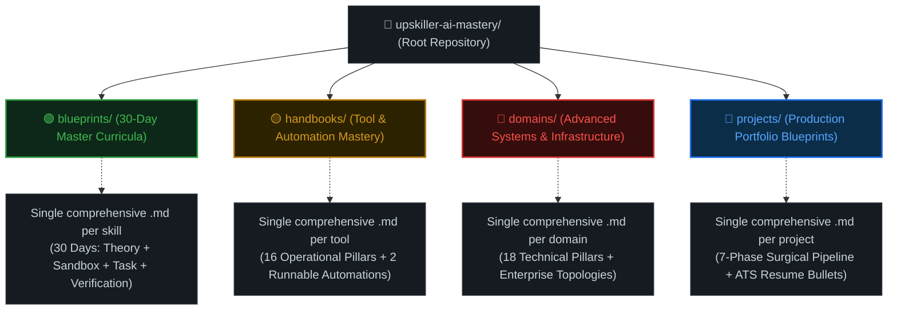
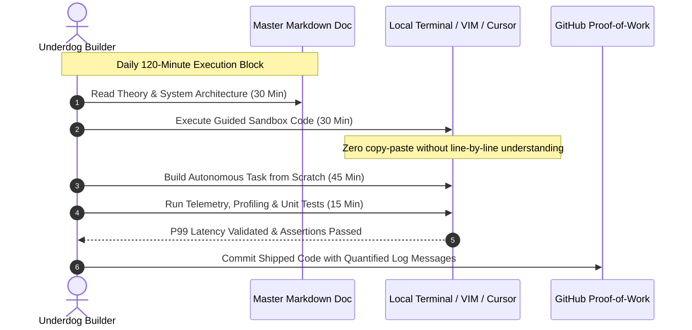

# 🚀 Upskiller: AI Era Mastery (2026 Production Edition)

> *The open-source curriculum bridging the gap between legacy university education and elite AI systems engineering.*

[](https://opensource.org/licenses/MIT)
[](https://github.com/)
[](https://github.com/)
[](https://github.com/)
[](https://github.com/)
[](https://github.com/)

---

### ⚡ The Underdog Builder's Manifesto

> **"B.Tech degrees are paper; shipped production systems are leverage. Your college tier does not determine your intelligence, your trajectory, or your market value. In the 2026 AI era, a motivated builder with internet access, an open-source terminal, and extreme discipline can out-architect entire enterprise teams. Execute daily. Build the engines. Become irreplaceable."**

---

## 1. The Core Philosophy & The "Tier-Democratization" Mission

### The Brutal Reality of Legacy Engineering Education
The global tech hiring landscape has undergone a seismic paradigm shift. While top-tier enterprise teams, frontier AI labs, and high-growth scaleups are aggressively deploying autonomous multi-agent swarms, low-latency speculative decoding engines, hybrid vector-graph retrieval pipelines, and distributed fine-tuning harnesses, traditional higher education remains trapped in a time capsule.

In most Tier-2, Tier-3, and regional engineering colleges:
* Syllabi are **5 to 8 years behind** the frontier.
* Students spend hundreds of hours memorizing academic syntax, writing manual sorting algorithms on paper, or building trivial CRUD applications using outdated frameworks.
* Academic evaluations reward rote memorization over systems architecture, fault tolerance, distributed concurrency, and deterministic state orchestration.

The inevitable result? Hundreds of thousands of ambitious engineering graduates enter the market annually with obsolete credentials, competing for low-leverage service-sector roles, completely unprepared for modern AI engineering compensation brackets ($120,000–$200,000+).

```
Legacy College Track:
[Rote Theory] ──> [Toy CRUD App] ──> [Paper Degree] ──> [$4k-$8k Service Job Trap]

The Upskiller Track:
[Systems Core] ──> [Deterministic AI Engines] ──> [Shipped Open Source] ──> [$120k-$200k+ Global Leverage]
```

### The Upskiller Solution
**Upskiller** exists to dismantle this structural pedigree asymmetry. We operate on **radical meritocracy**: code either executes within latency and budget constraints, or it fails. Compilers and runtime environments do not inspect your university pedigree.

This repository hosts a curated collection of **150+ comprehensive, production-grade technical curricula**. Every document is an end-to-end master document designed to transition an underdog builder into a world-class AI Systems Engineer. No hand-waving abstractions. No toy tutorials. Pure, battle-tested, production-ready engineering.

### The 80/20 Paradigm of AI Systems Engineering
Modern AI engineering is fundamentally **systems engineering**, not prompt guessing. We enforce strict adherence to the 80/20 production rule:

| Legacy Academic Paradigm (Obsolete) | The Upskiller Production Paradigm (2026 Standard) |
| :--- | :--- |
| Writing toy prompts inside a web UI | Orchestrating deterministic state graphs with **LangGraph** & cyclic loops |
| In-memory naive vector cosine matching | High-throughput HNSW index tuning in **Qdrant** & **pgvector** with scalar quantization |
| Blind trust in probabilistic LLM outputs | Strict **Pydantic V2** runtime schema validation and automated schema retry gates |
| Academic complexity analysis ($O(n^2)$ on paper) | Real-world **P99 latency budgets**, TTFT (Time-To-First-Token) & token cost telemetry |
| Monolithic toy scripts without tests | Containerized, asynchronous **FastAPI + Next.js 15** distributed microservices |

---

## 2. Repository Architecture & The 4 Modular Categories

To eliminate navigation fatigue and cognitive overload, the repository enforces a **Strict Flat 4-Folder Architecture**. There are **zero nested subfolders**, **zero fragmented directories**, and **zero auxiliary script clutter**. Every topic is completely encapsulated within a single, exhaustive Markdown document.

### Repository Structural Flow



---

### Category Deep Dives & Internal Document Standards

#### 🟢 Category 1: 30-Day Master Blueprints (`/blueprints/`)
* **Core Focus:** Deep, individual technological mastery (e.g., LangGraph, C++ for AI, PGVector, Qdrant, Bedrock, CrewAI).
* **Target Outcome:** Developing muscle memory and deep systems intuition over a structured 30-day continuum.
* **Internal Document Standard:** Every single `.md` file inside `/blueprints/` is strictly composed of:
  1. **5 Strategic Career Pillars:** Industry market demand, real-world compensation benchmarks ($120k–$200k+), core architectural taxonomy, production anti-patterns to avoid, and the ultimate technical capstone specification.
  2. **Strict 30-Day Daily Execution Engine:** Days 1 through 30 structured with a mandatory **120-minute daily split**:
     * `[00:00 - 00:30]` **Theory & Architecture:** Deep conceptual mechanics, memory layouts, network boundaries, and state transitions.
     * `[00:30 - 01:00]` **Guided Sandbox:** Raw, copy-pasteable, error-handled code blocks running against strict runtime environments.
     * `[01:00 - 01:45]` **Autonomous Production Task:** Real-world challenges without training wheels (e.g., handling connection pooling drops, managing memory limits).
     * `[01:45 - 02:00]` **Verification & Telemetry:** Concrete terminal commands, assertion tests, and expected output logs to objectively verify success.
  3. **End-to-End Production Capstone:** Fully realized code implementing a zero-mock, enterprise-grade architecture.

#### 🟡 Category 2: Tool Mastery Handbooks (`/handbooks/`)
* **Core Focus:** Modern, high-leverage developer tooling, agentic IDEs, and workflow infrastructure (e.g., Cursor IDE, Claude Code CLI, Model Context Protocol (MCP), n8n, Vapi AI).
* **Target Outcome:** Multiplying individual developer velocity by 10x using bleeding-edge agentic workflows.
* **Internal Document Standard:** Every single `.md` file inside `/handbooks/` is structured across:
  * **16 Technical & Operational Pillars:** Context window degradation management, headless CLI automation, AST-level code edits, MCP server-client topologies, token conservation protocols, prompt injection defense, and multi-file mutation strategies.
  * **2 Fully Runnable Automation Blueprints:** Complete, copy-pasteable configuration files, pipeline definitions, or orchestrator scripts ready for immediate local or cloud deployment.

#### 🔴 Category 3: Advanced Domain & Infrastructure Handbooks (`/domains/`)
* **Core Focus:** Low-level, high-concurrency systems engineering and infrastructure scale (e.g., Local LLM Quantization, vLLM/Triton Inference Serving, Multimodal ColPali RAG, Distributed LoRA Training, Million-User AI System Design).
* **Target Outcome:** Transforming applied programmers into low-level AI Infrastructure Engineers capable of managing multi-GPU clusters and high-throughput inference backends.
* **Internal Document Standard:** Every single `.md` file inside `/domains/` contains:
  * **18 Technical Pillars:** Mathematical foundations (quantization scaling factors, tensor parallelism math, attention KV cache memory bounds), memory hierarchy optimization (SRAM vs. HBM), kernel-level operations, failure recovery topologies, and continuous evaluation loops.
  * **Zero-Abstraction Systems Blueprints:** Real hardware configuration profiles, Dockerfiles, Kubernetes manifests, and stress-testing harness scripts (Locust/k6).

#### 🔵 Category 4: Project Building Blueprints (`/projects/`)
* **Core Focus:** End-to-end, portfolio-grade capstone applications designed to outshine 99% of applicant resumes.
* **Target Outcome:** Provable proof-of-work that stands up to grueling technical grilling by Staff AI Engineers and Hiring Managers.
* **Internal Document Standard:** Every single `.md` file inside `/projects/` implements a strict **7-Phase Surgical Pipeline**:
  1. **Phase 1: Environment & Secrets Setup:** Explicit environment variables, API configurations, and isolated runtime definitions.
  2. **Phase 2: Core AI Engine Architecture:** Deterministic state machines, retrieval engines, or model pipelines written in clean, typed Python.
  3. **Phase 3: Business Logic & Orchestration:** Middleware, session control, error recovery cascades, and validation boundaries.
  4. **Phase 4: High-Performance Backend (FastAPI):** Asynchronous API routes, WebSockets for streaming responses, connection pooling, and structured error responses.
  5. **Phase 5: Modern Frontend Interface (Next.js 15):** React Server Components, Tailwind CSS, real-world SSE (Server-Sent Events) streaming consumers, and resilient state stores.
  6. **Phase 6: Observability, Telemetry & Logging:** OpenTelemetry spans, Langfuse/Tracetest integration, latency tracing, and token cost calculation.
  7. **Phase 7: Containerization & Cloud Deployment:** Complete `docker-compose.yml`, multi-stage Dockerfiles, healthcheck probes, and deployment manifests.
  * **Plus:** Pre-written, high-impact **ATS Resume Action Bullets** quantified with business impact and latency metrics.

---

## 3. The Strict Single-File Architecture & Portal Integration

This repository rejects common open-source repository anti-patterns. We do not scatter a 30-day course across 30 separate folders, 30 isolated markdown files, and 60 disconnected helper scripts. 

```
❌ The Anti-Pattern (4,500+ Fragmented Files):
repo/
└── blueprints/
    └── langgraph/
        ├── day-01/
        │   ├── README.md
        │   └── script.py
        ├── day-02/
        │   ├── README.md
        │   └── script.py
        └── ... (4,500 nested files. Impossible to navigate, search, or maintain)

✅ The Upskiller Pattern (Flat Single-File Architecture):
repo/
└── blueprints/
    └── langgraph-multi-agent-systems.md (All 30 days in one complete, searchable master doc)
```

### Strategic Architectural Advantages

1. **Zero Folder Sprawl:** Eliminating nested subdirectories prevents the creation of thousands of redundant files. Maintenance remains trivial, and links never rot.
2. **Deterministic Web Portal Redirection:** The Upskiller Web Portal UI utilizes a direct 1:1 functional binding to this repository. When an engineering student clicks **"Access Document"** on any portal card, the web portal generates a direct GitHub raw/blob URL:
   ```text
   https://github.com/<org>/upskiller-ai-mastery/blob/main/<category>/<topic-slug>.md
   ```
   No routing redirection logic, no broken relative assets, and zero API query complexity.
3. **Single-Scroll Developer Ergonomics:** Builders can open a single master document, hit `Ctrl+F` (or `Cmd+F`), and instantly search across theoretical concepts, sandbox code, and capstone implementations across all 30 days without switching tabs or context. It enables seamless offline reading, printing to PDF, or loading into local LLM context windows.

---

## 4. Complete Repository Directory Tree

The following tree represents the exact, flat organizational structure of the repository. Every topic lives as a standalone master document within its parent category.

```text
upskiller-ai-mastery/
├── README.md
├── blueprints/
│   ├── langgraph-multi-agent-systems.md
│   ├── cpp-high-performance-ai.md
│   ├── crewai-multi-agent-swarms.md
│   ├── llamaindex-agentic-rag.md
│   ├── langchain-tool-calling.md
│   ├── model-context-protocol-mcp.md
│   ├── postgresql-pgvector.md
│   ├── qdrant-vector-database.md
│   ├── pinecone-chromadb.md
│   ├── neo4j-graphrag.md
│   ├── advanced-rag-hyde-reranking.md
│   ├── aws-bedrock-architecture.md
│   ├── azure-openai-ai-search.md
│   ├── vertex-ai-gemini-studio.md
│   ├── anthropic-claude-tool-use.md
│   └── python-for-ai-automations.md
├── handbooks/
│   ├── cursor-ide-production-mastery.md
│   ├── claude-code-cli-automation.md
│   ├── mcp-model-context-protocol.md
│   ├── n8n-self-hosted-orchestration.md
│   ├── vapi-retell-ai-voice.md
│   ├── replit-agent-mastery.md
│   └── zapier-central-connectors.md
├── domains/
│   ├── local-ai-quantization-gguf.md
│   ├── mlops-vllm-triton-inference.md
│   ├── multimodal-rag-colpali.md
│   ├── distributed-fine-tuning-lora.md
│   └── ai-system-design-million-users.md
└── projects/
    ├── enterprise-multitenant-rag.md
    ├── autonomous-self-healing-coder.md
    ├── financial-market-analyst-swarm.md
    └── webrtc-voice-customer-agent.md
```

---

## 5. Daily Execution Protocol & Verification Standard

Enrolling in the Upskiller tracks requires a commitment to rigorous engineering execution. To extract maximum leverage from these master documents, builders must follow the **Standard Operating Procedure (SOP)**:



### The Iron Rules of Execution
1. **No Passive Reading:** Reading code without typing it and running it against a live Python/C++ interpreter yields zero cognitive retention. Build the system or do not bother.
2. **Validate Latency Budgets:** When an engine specifies a `<200ms` response threshold, run load tests with `wrk`, `k6`, or `locust`. Measure Time-To-First-Token (TTFT) and memory allocations.
3. **Commit Daily Proof-of-Work:** Push your daily code implementations to your public GitHub profile. Your commit history is an unfakeable record of technical capability.

---

## 6. How to Contribute & Expand the Curriculum

We welcome contributions from Principal Engineers, Staff Architects, Open-Source Maintainers, and aggressive builders. To maintain curriculum integrity, all pull requests must conform to the following standards:

* **Adhere to the Flat Architecture:** PRs creating subfolders or nested directories will be closed immediately. All additions to existing tracks must be incorporated directly into the respective `.md` master document.
* **Zero Placeholders:** Code blocks must be completely runnable. PRs containing `# TODO: implement later`, `# add your code here`, or mocked responses without explicit architectural justification will be rejected.
* **Production-Grade Tooling:** All Python code must leverage modern standards: Python 3.11+, Pydantic V2 for schema validation, strict type hinting, and asynchronous execution paradigms (`asyncio`).

---

## 7. License & Ecosystem

Distributed under the **MIT License**. You are free to fork, study, rewrite, and use these curricula to build production engines, train teams, or launch startups. Pedigree is optional; shipped production systems are non-negotiable.

**Architected with absolute precision for the global underdog builder community.**
