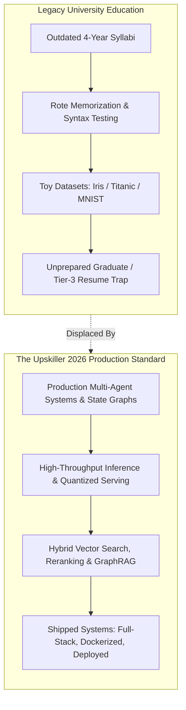
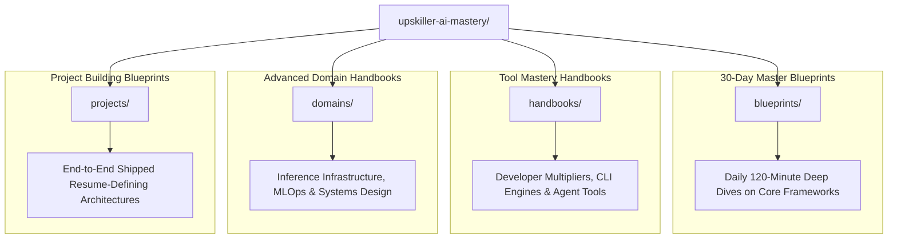
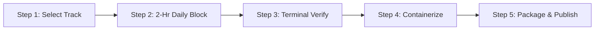

# 🚀 Upskiller: AI Era Mastery (2026 Production Edition)

> The open-source curriculum bridging the gap between legacy university education and elite AI systems engineering.

[](LICENSE)
[](blueprints/)
[](domains/)
[](projects/)
[](#the-underdog-builders-manifesto)
[](#1-the-core-philosophy--the-tier-democratization-mission)

---

### The Underdog Builder's Manifesto

> *"B.Tech degrees are paper; shipped production systems are leverage. Your college tier does not determine your intelligence, your trajectory, or your market value. In the 2026 AI era, a motivated builder with internet access, an open-source terminal, and extreme discipline can out-architect entire enterprise teams. Execute daily. Build the engines. Become irreplaceable."*

---

## 1. The Core Philosophy & The "Tier-Democratization" Mission

### The Brutal Reality of Tier-2 and Tier-3 Engineering
The global university system is structurally incapable of keeping pace with the velocity of Artificial Intelligence. Most undergraduate curricula in Tier-2 and Tier-3 engineering institutions are stranded five to eight years in the past. While university classrooms evaluate students on manual memory manipulation in obsolete language variants, rote memorization of textbook sorting algorithms, and outdated database schemas, top-tier global AI engineering organizations hire for an entirely different skill vector:

- Asynchronous multi-agent state machines with checkpointed persistence.
- Sub-millisecond vector indexing, sharding, and hybrid sparse/dense retrieval.
- Local model quantization (GGUF/AWQ/EXL2), speculative decoding, and vLLM inference serving.
- Model Context Protocol (MCP) server implementations and deterministic tool calling.
- Production observability, trace propagation, p99 latency management, and token economics.

This pedagogical failure creates an artificial moat. Elite tier institutions preserve their advantage through institutional access and peer networks, leaving brilliant, driven engineers in non-pedigree institutions trapped behind resume screeners and paper credentials.

### The Upskiller Solution
Upskiller breaks this paradigm. We treat elite AI engineering not as an academic secret, but as an open-source, reproducible trade. 

This repository houses an end-to-end, production-grade technical curriculum designed to transform self-taught developers and Tier-2/3 undergraduate engineering students into top-tier AI systems engineers targeting $120,000 to $200,000+ base compensation profiles. We eliminate theory-heavy lectures, superficial tutorials, and "toy" applications. Every single module in this repository is built directly against real-world engineering constraints.



### The 80/20 Rule of Practical Mastery
To thrive in the 2026 AI engineering market, you must focus on the 20% of core systems principles that deliver 80% of runtime leverage. We ignore academic trivia and obsess over:

1. **Deterministic State Systems**: Managing stochastic model outputs via robust state machines, circuit-breakers, typed schemas (Pydantic v2), and graph-based execution paths.
2. **Retrieval Mechanics**: Beyond naive cosine similarity—implementing hybrid dense/sparse indexing, Reciprocal Rank Fusion (RRF), Cross-Encoder reranking, and Late-Interaction architectures (ColPali).
3. **Inference Economics & Optimization**: KV-cache memory constraints, vLLM continuous batching, memory bandwidth saturation equations, and multi-tier edge-quantization.
4. **Architectural Determinism**: Building fault-tolerant applications using Model Context Protocol (MCP), streaming backends (FastAPI AsyncIO), and containerized microservices.

| Engineering Domain | The Legacy Tier-2/3 College Approach | The Upskiller 2026 Production Standard |
| :--- | :--- | :--- |
| **Model Programming** | Shallow scikit-learn fits, simple Linear Regressions | Multi-agent state machine graphs (LangGraph), structured outputs, tool calling |
| **Information Retrieval** | Relational SQL `LIKE '%query%'` queries | Hybrid Vector Retrieval (Qdrant/PGVector), HNSW indexing, Late-Interaction RAG |
| **System Architecture** | Monolithic, sync Python scripts with hardcoded keys | Async event-loops, token streaming via SSE, micro-service containerization |
| **Tool Orchestration** | Manual API requests via `requests.get()` | Model Context Protocol (MCP) clients/servers, automated self-healing loops |
| **Inference & Compute** | Relying purely on third-party SaaS dashboards | Self-hosted quantized inference via vLLM, TensorRT-LLM, Triton Server |
| **Portfolio Output** | Unhosted Jupyter Notebooks with static plots | Production Dockerized full-stack apps with OpenTelemetry observability |

---

## 2. Repository Architecture & The 4 Modular Categories

The Upskiller curriculum is strictly partitioned into four comprehensive learning vectors. Each vector targets an indispensable facet of the modern AI engineering lifecycle:



---

### 🟢 Category 1: 30-Day Master Blueprints (`/blueprints/`)
- **Directory Path**: `/blueprints/`
- **Technical Target**: Deep, programmatic mastery over foundational AI frameworks and storage engines (LangGraph, C++ for High-Performance AI, CrewAI, LlamaIndex, PGVector, Qdrant, Bedrock).
- **Internal Document Standard**: Every blueprint document represents an exhaustive, single-file 30-day curriculum structured into:
  - **The 5 Strategic Career Pillars**: Market Thesis, Deep Architectural Foundations, Real-World Enterprise Failure Modes, System Design Topology, and Compensation Multipliers.
  - **The 30-Day Execution Calendar**: 30 distinct daily units broken down into strict 120-minute time-boxed schedules:
    - `00:00 - 00:30`: Theory & Architecture Deconstruction.
    - `00:30 - 01:15`: Hands-on Interactive Sandbox Implementation.
    - `01:15 - 01:45`: Edge Case Failure Injection & Boundary Testing.
    - `01:45 - 02:00`: Terminal Output Verification & Commit Checkpoint.
  - **Production Capstone Blueprint**: Full architecture schemas, typed implementations, integration test suites, and Docker deployment configurations.

---

### 🟡 Category 2: Tool Mastery Handbooks (`/handbooks/`)
- **Directory Path**: `/handbooks/`
- **Technical Target**: Mastering modern developer productivity platforms, AI developer environments, headless agent systems, and workflow engines (Cursor IDE, Claude Code CLI, MCP, n8n, Vapi AI, Replit Agent, Zapier Central).
- **Internal Document Standard**: Every handbook contains **16 Technical & Operational Pillars**, including:
  - Context Window Allocation and Token Optimization.
  - Rule Generation (`.cursorrules`, system-level behavioral constraints).
  - Headless Execution, Terminal Automation, and Script Piping.
  - Model Context Protocol (MCP) tool integration and schema exposure.
  - Failure mitigation for agentic infinite execution loops.
  - Two production-ready, fully runnable end-to-end automation blueprints.

---

### 🔴 Category 3: Advanced Domain & Infrastructure Handbooks (`/domains/`)
- **Directory Path**: `/domains/`
- **Technical Target**: Industrial-grade machine learning infrastructure, model compression, low-latency distributed serving, and multi-tenant systems design (Local Quantization, vLLM / Triton Serving, Multimodal ColPali, Distributed LoRA/QLoRA Fine-Tuning, System Design for 1M+ Users).
- **Internal Document Standard**: Built for senior and staff-level engineering expectations across **18 Technical Pillars**:
  - Mathematical modeling of memory bandwidth, FLOP budgets, and KV-cache constraints.
  - GPU memory profiling and tensor parallel layout design.
  - High-throughput asynchronous serving engines and dynamic request batching.
  - Distributed data pipelines, pipeline parallelism, and parameter-efficient adapters.
  - Resilient infrastructure architectures with automated fallback and circuit breakers.

---

### 🔵 Category 4: Project Building Blueprints (`/projects/`)
- **Directory Path**: `/projects/`
- **Technical Target**: End-to-end, multi-tier, resume-defining portfolio architectures designed to bypass standard HR screens and immediately prove technical competence to Principal Engineers.
- **Internal Document Standard**: Built strictly using the **7-Phase Surgical Pipeline**:
  - **Phase 1: Environment Isolation & Deterministic Dependencies** (UV, Docker, Python 3.11+, typed package locks).
  - **Phase 2: Core AI Engine & Multi-Agent State Machine Architecture** (LangGraph/Custom Graph Engines).
  - **Phase 3: Core Domain Business Logic & Dynamic Tool Routing** (Pydantic validation, schema isolation).
  - **Phase 4: Production FastAPI Asynchronous REST & SSE Streaming Backend** (AsyncIO, streaming endpoints).
  - **Phase 5: Next.js 15 App Router Frontend** (Server Actions, React Server Components, optimistic UI).
  - **Phase 6: Observability, Distributed Tracing & Circuit Breaking** (OpenTelemetry, Langfuse, Prometheus metrics).
  - **Phase 7: Multi-Stage Docker Containerization & Production Deployment** (Clean Dockerfiles, docker-compose).
  - **The Resume Dominance Package**: Pre-written, mathematically quantified bullet points tailored for ATS parsing and executive technical review.

---

## 3. The Strict Single-File Architecture & Portal Integration

The Upskiller repository adheres to a strict **Flat 4-Folder Architecture**. You will never see nested sub-packages, modular split directories (`day-01/`, `day-02/`), auxiliary run scripts, or fragmented assets in this repository.

```
                              UPSKILLER ARCHITECTURAL TOPOLOGY
                              
 [Upskiller Web Portal] ──── Direct Raw GitHub Link ────► [Standalone Master Document]
   (Interactive UI)                                           (Everything in One File)
          │                                                               │
          ├── Browse Blueprints  ────────────────────────► /blueprints/topic-slug.md
          ├── Browse Handbooks   ────────────────────────► /handbooks/topic-slug.md
          ├── Browse Domains     ────────────────────────► /domains/topic-slug.md
          └── Browse Projects    ────────────────────────► /projects/topic-slug.md
```

### Why We Enforce a Single-File Monolithic Structure

1. **Zero Folder Sprawl**: Traditional multi-day educational repositories create hundreds of subfolders, scattered markdown files, broken internal links, and impossible navigation. Covering 150+ curricula across 30 days would result in over 4,500 folders. By keeping each topic inside a single, comprehensive master document, the repository remains completely clean, readable, and lightning-fast to clone and navigate.
2. **Direct Web Portal Integration**: The Upskiller Student Web Portal maps directly to this repository. When an engineer clicks **"Access Document"** on any portal card, the portal routes directly to the raw, single-file Markdown document on GitHub:
   ```
   https://github.com/<org>/upskiller-ai-mastery/blob/main/blueprints/langgraph-multi-agent-systems.md
   ```
   No routing friction, no deep folder crawling, and zero broken links.
3. **Single-Scroll Cognitive Immersion**: Learning should not be fragmented across dozens of micro-tabs. Having an entire 30-day curriculum or complex engineering system in a single document enables full-text indexing via `Ctrl+F`, seamless local offline reading via Obsidian or VS Code, and uninterrupted, deep-work focus.

---

## 4. Complete Repository Directory Tree

```text
upskiller-ai-mastery/
├── README.md
├── blueprints/
│   ├── langgraph-multi-agent-systems.md
│   ├── cpp-high-performance-ai.md
│   ├── crewai-multi-agent-swarms.md
│   ├── llamaindex-agentic-rag.md
│   ├── langchain-tool-calling.md
│   ├── model-context-protocol-mcp.md
│   ├── postgresql-pgvector.md
│   ├── qdrant-vector-database.md
│   ├── pinecone-chromadb.md
│   ├── neo4j-graphrag.md
│   ├── advanced-rag-hyde-reranking.md
│   ├── aws-bedrock-architecture.md
│   ├── azure-openai-ai-search.md
│   ├── vertex-ai-gemini-studio.md
│   ├── anthropic-claude-tool-use.md
│   └── python-for-ai-automations.md
├── handbooks/
│   ├── cursor-ide-production-mastery.md
│   ├── claude-code-cli-automation.md
│   ├── mcp-model-context-protocol.md
│   ├── n8n-self-hosted-orchestration.md
│   ├── vapi-retell-ai-voice.md
│   ├── replit-agent-mastery.md
│   └── zapier-central-connectors.md
├── domains/
│   ├── local-ai-quantization-gguf.md
│   ├── mlops-vllm-triton-inference.md
│   ├── multimodal-rag-colpali.md
│   ├── distributed-fine-tuning-lora.md
│   └── ai-system-design-million-users.md
└── projects/
    ├── enterprise-multitenant-rag.md
    ├── autonomous-self-healing-coder.md
    ├── financial-market-analyst-swarm.md
    └── webrtc-voice-customer-agent.md
```

---

## 5. How to Execute This Repository (The 5-Step Student Protocol)

Execution is the only differentiator. Follow this deterministic five-step protocol to navigate through the materials, build your leverage, and produce a verifiable, job-ready engineering portfolio.



### Step 1: Select Your Strategic Track
Do not attempt to read the entire repository simultaneously. Pick one foundational technical blueprint and pair it with one modern developer tooling handbook.
- *Recommended Pairing A (Agent Systems Engineering)*:
  - **Core Blueprint**: `/blueprints/langgraph-multi-agent-systems.md`
  - **Tool Handbook**: `/handbooks/claude-code-cli-automation.md`
- *Recommended Pairing B (High-Performance Vector Retrieval & Infrastructure)*:
  - **Core Blueprint**: `/blueprints/qdrant-vector-database.md`
  - **Domain Handbook**: `/domains/mlops-vllm-triton-inference.md`

### Step 2: The Strict 2-Hour Daily Block
Treat this engineering block with extreme discipline. Disable all notifications. Enter a deep-work state and enforce the four-stage time-box:

```mermaid
gantt
    title Daily 120-Minute Deep Work Protocol
    dateFormat mm
    axisFormat %M min
    
    section Deep Work
    Theory & Architectural Deconstruction    :active, t1, 00, 30m
    Interactive Sandbox Implementation       :crit, t2, after t1, 45m
    Failure Injection & Boundary Testing     :t3, after t2, 30m
    Terminal Output Verification & Commit    :done, t4, after t3, 15m
```



1. **Minutes 00–30 (Theory & Architecture Deconstruction)**: Read the day's structural concepts. Analyze the Mermaid flowcharts and data models. Understand *why* the design patterns exist before touching the keyboard.
2. **Minutes 30–75 (Interactive Sandbox Implementation)**: Write the production code manually inside your local development environment. Never copy and paste mindlessly. Build the state graphs, declare Pydantic schemas, write database migrations, and handle asynchronous events.
3. **Minutes 75–105 (Failure Injection & Boundary Testing)**: Force the system to fail. Inject malformed JSON, cut off external API keys, test database connection drops, simulate rate-limit saturation, and monitor runtime behavior.
4. **Minutes 105–120 (Terminal Output Verification & Commit)**: Run unit assertions, verify type compliance via `mypy` or `tsc`, format code via `ruff` or `biome`, and push your working code to your public GitHub profile with an atomic commit message.

### Step 3: Verify Output
Theory without terminal execution is zero-leverage. Every single day's work must terminate with explicit verification.

```bash
# Example: Daily Verification Sequence for LangGraph Agents
$ ruff check . --fix
$ mypy --strict src/
$ pytest tests/unit/test_graph_state.py -v --capture=no
$ python -m src.engine.verify_state_persistence
```

If your terminal throws an unhandled exception, your day is not complete. Debug it, isolate the fault, resolve the race condition, and make the test suite green.

### Step 4: Build & Containerize the Production Capstone
At the end of your curriculum document, you will build the Flagship Capstone Project. Do not leave your application running merely in a local virtual environment:
- Write optimized, multi-stage `Dockerfile` manifests.
- Structure an end-to-end `docker-compose.yml` spinning up the application backend, vector storage engines, Redis caches, and observability backends.
- Benchmark system performance using load testing tools (e.g., Locust or k6) to prove your throughput and p99 latency boundaries under load.

### Step 5: Package the Portfolio for Maximum Leverage
Package your shipped systems so their value is immediately obvious to any engineering director:
1. **Record a 90-Second Loom Architecture Teardown**: Walk through your code, highlight the state machine graph, show the distributed traces, and demonstrate real-time containerized streaming. Skip slide decks; show running code.
2. **Publish the Verified Repository**: Write a clean, professional project `README.md` detailing the system design topology, setup steps, architectural tradeoffs, and performance metrics.
3. **Publish a High-Signal Technical Writeup**: Write an in-depth, technical case study on LinkedIn or X dissecting failure modes, token optimizations, and latency profiles. Tag the framework maintainers.

---

## 6. Open Source Contribution & Quality Standards

We welcome contributions from engineers committed to elevating open-source technical education. However, because this repository directly powers production student portals and career paths, we enforce rigorous quality gates.

```
                              CONTRIBUTION LIFECYCLE
                              
  [Feature Proposal / Issue] ──► [Fork Repository] ──► [Implement Single .md]
                                                              │
  [Review by Maintainers]   ◄── [Verify Standards] ◄── [Check Strict Checklist]
           │
           ▼
    [Merge to Main]
```

### The Strict Formatting Checklist for Contributors

Before opening a Pull Request, confirm that your document meets every architectural requirement:

- [ ] **Strict Flat Location**: Placed strictly in one of the 4 root folders: `/blueprints/`, `/handbooks/`, `/domains/`, or `/projects/`.
- [ ] **Zero Directory Sprawl**: Absolutely no nested subdirectories, companion script folders, or auxiliary files. Everything must live inside a single, comprehensive `.md` file.
- [ ] **Native Mermaid.js Diagrams**: All architectural flows, state machines, and sequence calls must be rendered with native, linted `mermaid` code blocks. No ASCII box drawings.
- [ ] **Strict GFM Tables**: All matrices, schedules, and structural breakdowns must use clean GitHub-Flavored Markdown tables.
- [ ] **120-Minute Daily Breakdown**: Blueprint documents must follow the 4-phase daily split (`00:00-00:30`, `00:30-01:15`, `01:15-01:45`, `01:45-02:00`).
- [ ] **Executable Code Standards**: Python code must target Python 3.11+, use modern type hints (`typing` / Pydantic v2), and feature complete async execution patterns. No pseudo-code.
- [ ] **ATS Resume Block Inclusion**: Project blueprints must include quantified, impact-driven resume action bullets.

### Contribution Workflow

```bash
# 1. Clone your fork
git clone https://github.com/<your-username>/upskiller-ai-mastery.git
cd upskiller-ai-mastery

# 2. Create a clean feature branch
git checkout -b feature/add-vllm-inference-handbook

# 3. Author your standalone master document
# Ensure strict compliance with the Flat 4-Folder architecture
$EDITOR domains/mlops-vllm-triton-inference.md

# 4. Validate Markdown, Mermaid rendering, and code syntax
# Check that internal links, tables, and formatting render cleanly

# 5. Commit and push
git commit -m "feat(domains): add vllm triton inference master handbook"
git push origin feature/add-vllm-inference-handbook
```

---

## 7. The Closing Seal

> ### The Unforgiving Metric of the 2026 AI Era
>
> The software industry is experiencing a profound generational reset. The era of securing high-leverage software engineering roles through superficial framework tutorials, shallow bootcamps, and institutional prestige alone is officially over. 
>
> The market does not care which university stamped your degree. The market does not care how many hours you spent watching lecture videos. The market only cares about one undeniable truth: **Can you build, orchestrate, optimize, and ship resilient production AI systems that perform under load?**
>
> That ability cannot be faked. It is forged in the terminal—through thousands of lines of typed code, hundreds of hours of boundary testing, rigorous architecture reviews, and relentless discipline.
>
> Stop asking for permission. Stop waiting for your university syllabus to update. Open the terminal, clone the repository, select your blueprint, and start shipping.
>
> **The future belongs to the builders.**

---

<div align="center">

**[Upskiller](https://github.com/)** • *Democratizing Elite AI Systems Engineering for Every Underdog Builder.*

Distributed under the MIT License. Built for the next generation of AI architects.

</div>
