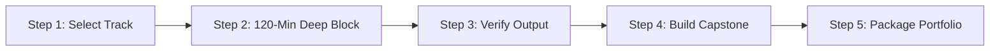

# 🚀 Upskiller: AI Era Mastery (2026 Production Edition)

> *"The open-source curriculum bridging the gap between legacy engineering education and elite AI systems engineering."*

[](https://opensource.org/licenses/MIT)
[](#3-the-upskiller-engineering-standard)
[](#4-complete-repository-directory-tree)
[](#2-repository-architecture--the-4-modular-categories)
[](#5-how-to-execute-this-repository-the-student-playbook)
[](#3-the-upskiller-engineering-standard)

---

> ### ⚡ The Underdog Builder's Manifesto
>
> **B.Tech degrees are paper; shipped production systems are leverage.** Your college tier does not determine your intelligence, your trajectory, or your market value. In the 2026 AI era, legacy credentials, institutional pedigree, and outdated textbook exams are rendered meaningless by builders who can deploy autonomous multi-agent clusters, profile low-level memory efficiency, and scale vector infrastructure under heavy load.
>
> A motivated underdog with a laptop, an internet connection, a terminal, and extreme discipline can out-architect entire enterprise divisions. You are not here to memorize bubble sort or write toy chatbot scripts. You are here to master the infrastructure of the new computational economy. **Execute daily. Build the engines. Become irreplaceable.**

---

## 1. The Core Philosophy & The "Tier-Democratization" Mission

### The Brutal Reality of Legacy Higher Education
Engineering curricula across Tier-2 and Tier-3 institutions are fundamentally obsolete. While universities spend four years grading students on outdated C89 syntax, procedural Java, and theoretical database schemas from the 1990s, the global technology sector has shifted entirely to:
- Autonomous multi-agent orchestration via deterministic directed acyclic graphs (DAGs).
- Approximate Nearest Neighbor (ANN) search over billions of vector embeddings in distributed storage.
- High-throughput, low-latency model inference pipelines leveraging CUDA, Triton, C++20, and Rust.
- Local edge intelligence operating on constrained memory budgets via dynamic quantization (AWQ, GPTQ, GGUF).

This pedagogical disconnect leaves millions of dedicated, high-aptitude students stranded in "tutorial hell"—building toy API wrappers that provide zero signal of competence to tier-one engineering teams.

### The 2026 Paradigm Shift
Building in 2026 is no longer about writing basic prompts or chaining static API calls. Anyone can write an API query. Elite engineering requires mastering **asynchronous coordination, deterministic reliability, latency economics, and hardware-software co-design**. 

```
┌─────────────────────────────────────────────────────────┐
│              THE 2026 AI SYSTEM PARADIGM                │
├─────────────────────────────────────────────────────────┤
│  Toy API Caller (Obsolete)  │ Elite AI Systems Engineer │
├─────────────────────────────┼───────────────────────────┤
│  • Single LLM prompt calls  │ • Dynamic Graph Routers   │
│  • Ad-hoc string responses  │ • Typed State Validation  │
│  • Ephemeral in-memory data │ • Distributed Checkpoints │
│  • Blind faith execution    │ • OpenTelemetry + Evals   │
│  • High-cost public APIs    │ • Hybrid Local/Cloud SLMs │
└─────────────────────────────┴───────────────────────────┘
```

The AI Engineer of 2026 does not treat language models as magic black boxes. They treat them as non-deterministic compute primitives embedded within strictly typed, highly observed, and fault-tolerant software architectures.

### The 80/20 Rule of High-Leverage Mastery
To bridge the gap to senior engineering roles ($120k–$200k+), this curriculum ruthlessly discards theoretical fluff to focus on the 20% of engineering capabilities that generate 80% of enterprise value:

1. **Strict Type Safety & Schema Contracts**: Complete operational elimination of unstructured dynamic typing. Everything is governed by Pydantic V2, Rust structs, or TypeScript 5 contracts.
2. **State Machine Determinism**: Transforming unpredictable generative text into predictable, cycle-safe state graphs that self-correct and handle tool execution failures.
3. **Latency & Vector Economics**: Tuning chunking strategies, vector index parameters (HNSW $M$, $efConstruction$), and memory-bandwidth utilization to slash cost and compute budgets by orders of magnitude.
4. **Systems-Level Infrastructure**: Deploying production inference engines (vLLM, TensorRT-LLM) behind enterprise-grade reverse proxies, integrated with distributed observability stacks.

---

## 2. Repository Architecture & The 4 Modular Categories

This repository is structured into four mutually reinforcing, modular categories designed to systematically take an engineer from zero foundation to senior-level architectural execution.

```mermaid
flowchart TD
    Root["🚀 Upskiller Root (/upskiller-ai-mastery)"]
    
    Root --> Cat1["🟢 Category 1: /blueprints/<br/>30-Day Master Blueprints"]
    Root --> Cat2["🟡 Category 2: /handbooks/<br/>Tool Mastery Handbooks"]
    Root --> Cat3["🔴 Category 3: /domains/<br/>Domain & Infrastructure Handbooks"]
    Root --> Cat4["🔵 Category 4: /projects/<br/>Project Building Blueprints"]

    Cat1 --> B1["LangGraph & State Machines"]
    Cat1 --> B2["C++20 & Rust for AI Infra"]
    Cat1 --> B3["PGVector & Qdrant Engine Tuning"]
    Cat1 --> B4["Multi-Agent CrewAI Systems"]

    Cat2 --> H1["Cursor IDE & Rules Orchestration"]
    Cat2 --> H2["Claude Code CLI & Headless Pipelines"]
    Cat2 --> H3["Model Context Protocol (MCP) Servers"]
    Cat2 --> H4["Vapi AI & Real-time WebRTC Voice"]

    Cat3 --> D1["Local AI, Quantization & GGUF/AWQ"]
    Cat3 --> D2["Production MLOps, vLLM & Triton"]
    Cat3 --> D3["Multimodal RAG & High-Dim Vectors"]
    Cat3 --> D4["Distributed Fine-Tuning & LoRA"]

    Cat4 --> P1["Enterprise Multi-Tenant RAG Engine"]
    Cat4 --> P2["Autonomous Self-Healing Coding Agent"]
    Cat4 --> P3["Financial Analyst Agentic Swarm"]
    Cat4 --> P4["Ultra-Low Latency Voice Agent Bridge"]
```



---

### 🟢 Category 1: 30-Day Master Blueprints (`/blueprints/`)
* **Target Focus**: Deep, single-technology immersion for fundamental capability breakthroughs.
* **Target Audience**: Engineers needing structural fluency in modern tools (LangGraph, C++, Rust, Qdrant, Bedrock).
* **Internal Framework**: Every document within `/blueprints/` is strictly divided into:
  1. **5 Career Pillars**: Industry context, architectural significance, design patterns, common pitfalls, and production best practices.
  2. **30-Day Surgical Matrix**: 30 distinct daily units, each structured as a non-negotiable **120-minute operational block**:
     - *Concept Phase (20 mins)*: Architectural theory, mechanics, and mental models.
     - *Sandbox Phase (30 mins)*: Isolation code snippet illustrating failure/success edges.
     - *Daily Task (50 mins)*: Hands-on engineering challenge with real data and components.
     - *Output Verification (20 mins)*: Exact terminal outputs, log entries, and passing assertions.
  3. **Production Capstone Blueprint**: A complete, end-to-end operational system unifying all 30 days of learning.

### 🟡 Category 2: Tool Mastery Handbooks (`/handbooks/`)
* **Target Focus**: Becoming a 10x leverage operator of AI development environments, agents, and automation frameworks.
* **Target Audience**: Builders transitioning from standard typing to high-velocity AI system orchestration.
* **Internal Framework**: Standardized across **16 Technical & Operational Pillars**:
  - Context Window Allocation & Budgeting
  - Sub-Agent Decomposition & Recursive Prompts
  - Headless CLI Automation & Non-Interactive Execution
  - Model Context Protocol (MCP) Server Configuration
  - System Steering, Negative Constraints, and Prompt Sensitivity
  - Token Efficiency Optimization & Dynamic Pruning
  - IDE Rules Design (`.cursorrules`, system instructions)
  - Memory Persistence Across Multi-Turn Sessions
  - Dynamic Tool Registration & Fallback Protocols
  - Local Sandboxing, Subprocess Execution & Safety Sandboxes
  - Telemetry Collection & Step-Level Token Tracing
  - Multi-Modal Handling (Vision Parsing & Schemas)
  - Error Interception, Reflection, and Auto-Correction
  - Git/Version Control Autonomous State Management
  - Scalability Boundaries & Rate Limit Handling
  - **2 End-to-End Enterprise Automation Blueprints** with full configuration code.

### 🔴 Category 3: Advanced Domain & Infrastructure Handbooks (`/domains/`)
* **Target Focus**: Senior infrastructure engineering, systems design, mathematical foundations, and low-level optimizations.
* **Target Audience**: Engineers competing for Systems Architect, MLOps, and High-Performance Infrastructure roles.
* **Internal Framework**: Every domain guide follows an uncompromising **18 Technical Domain Pillar** standard:
  - Mathematical Formalism (LaTeX models of attention, quantization errors, HNSW graph complexity)
  - Low-Level Memory Footprint & Hardware Architecture (SRAM vs. HBM, FlashAttention kernels)
  - Concurrency, Asynchronous I/O, and Thread Safety Patterns
  - Distributed Systems Constraints (CAP Theorem in Vector DBs, Raft/Paxos in agent networks)
  - Dynamic Quantization Mechanics (Weight-Only vs. Activation, AWQ, FP8, INT4 scaling factors)
  - Zero-Copy Serializations (FlatBuffers, Apache Arrow, Shared Memory IPC)
  - Cache Invalidation & KV-Cache Management (PagedAttention, prefix caching)
  - Observability Instrumentation (Prometheus, OpenTelemetry, Grafana dashboards)
  - Failover Topologies, Circuit Breakers, and Graceful Degradation
  - Latency Budgeting & Micro-Benchmarking Methodology
  - Enterprise Security, RBAC, and Sandboxed Runtime Isolation
  - Network Optimization (gRPC, HTTP/2 multiplexing, zero-latency WebSockets)
  - Real-World Enterprise Scalability Case Studies (1M+ QPS profiles)
  - Cost Modeling & Compute TCO Projections
  - Edge Hardware Deployment (Jetson, Apple Silicon via Metal Performance Shaders)
  - Regulatory, Privacy, and Audit Compliance Infrastructure
  - Production Disaster Recovery Drills
  - **The Complete Enterprise Production Blueprint**: Full, runnable systems implementation.

### 🔵 Category 4: Project Building Blueprints (`/projects/`)
* **Target Focus**: High-caliber portfolio anchors designed to dominate technical interviews.
* **Target Audience**: Undergraduate and self-taught developers needing indisputable, production-grade proof of work.
* **Internal Framework**: Built strictly using the **7-Phase Surgical Implementation Pipeline**:
  - **Phase 1: Environment & Orchestration**: Poetry/UV setups, Docker daemon orchestration, environment isolation, zero-compromise linting/typing configs.
  - **Phase 2: Core AI Engine & Tooling**: Agent definitions, LangGraph state schemas, prompt compilation, vector store client initialization.
  - **Phase 3: Core Business Logic & State Machines**: Routing logic, reflection nodes, cyclic validation steps, fault-tolerant retries.
  - **Phase 4: Backend API Architecture**: FastAPI asynchronously wrapping the state engine, Server-Sent Events (SSE) streaming, JWT security, rate-limiting middlewares.
  - **Phase 5: Frontend Interface**: Modern Next.js 15 (App Router), React Server Components, Tailwind CSS, real-time token streaming hooks.
  - **Phase 6: Observability & Production Evals**: Langfuse trace integration, user feedback capture, automated continuous eval pipelines (RAGAS/DeepEval).
  - **Phase 7: Containerization & Deployment**: Multi-stage Dockerfiles, Docker Compose production clusters, Kubernetes manifests, CI/CD automated test workflows.
  - **Portfolio Packaging Engine**: Pre-written, high-impact resume bullets with quantified metrics, 90-second system walkthrough video scripts, and architectural interview talking points.

---

## 3. The "Upskiller" Engineering Standard

We reject surface-level documentation. If a concept cannot be validated with a terminal output, a profiling trace, or an assertion test, it does not belong in this repository.

| Dimension | Generic YouTube / Bootcamps | The Upskiller Standard (2026) |
| :--- | :--- | :--- |
| **Language Standards** | Python 3.8 notebook cells, untyped JavaScript, global mutable variables. | **Python 3.12+ (Strict typing, Pydantic V2), TypeScript 5.4+, Modern C++20, Rust 2024.** |
| **Time Architecture** | "Learn LangChain in 20 minutes" (superficial walk-throughs). | **Strict 120-minute daily operational blocks** (Theory $\to$ Sandbox $\to$ Task $\to$ Verification). |
| **Code Integrity** | Fragmented snippets, unhandled exceptions, fake mock functions. | **End-to-end executable source files with absolute zero ellipsis (`...` or `# TODO`).** |
| **Visual Architecture**| Messy hand-drawn scribbles, low-res screenshots, broken ASCII. | **Native, responsive Mermaid.js diagrams** documenting state machines and data flow. |
| **Verification & Tests**| "It should work on your machine" (blind trust). | **Explicit CLI assertions, log outputs, payload fixtures, and Pytest coverage suites.** |
| **System Resiliency** | Happy-path only; model hallucinations crash the app. | **Dynamic fallback graphs, token-budget backoffs, circuit breakers, and schema retries.** |
| **Portfolio Leverage** | Generic To-Do apps, clone wrappers, basic chat windows. | **Enterprise-grade multi-agent swarms, self-healing code engines, and private RAG infra.** |
| **Career Outcome** | Rejection emails; indistinguishable from thousands of bootcamp grads. | **Demonstrated systems-level competency commanding senior AI developer compensation ($120k–$200k+).** |

---

## 4. Complete Repository Directory Tree

The complete repository comprises 150+ curricula. Below is the verified architectural directory hierarchy:

```text
upskiller-ai-mastery/
├── .github/
│   ├── ISSUE_TEMPLATE/
│   │   ├── blueprint_errata.md
│   │   └── curriculum_proposal.md
│   └── workflows/
│       ├── lint-markdown.yml
│       └── test-code-snippets.yml
├── blueprints/
│   ├── 30-days-of-langgraph/
│   │   ├── README.md
│   │   ├── day-01-state-graphs/
│   │   ├── day-02-cyclic-routing/
│   │   ├── day-15-human-in-the-loop/
│   │   └── day-30-production-deployment/
│   ├── 30-days-of-cpp-for-ai/
│   │   ├── README.md
│   │   ├── day-01-memory-layouts-cache-locality/
│   │   ├── day-10-simd-vectorization/
│   │   └── day-30-custom-cuda-kernels/
│   ├── 30-days-of-rust-ai-infra/
│   │   ├── README.md
│   │   ├── day-01-borrow-checker-memory-safety/
│   │   └── day-30-zero-copy-inference-engine/
│   ├── 30-days-of-vector-databases-pgvector-qdrant/
│   ├── 30-days-of-aws-bedrock-enterprise-agents/
│   └── 30-days-of-crewai-hierarchical-swarms/
├── handbooks/
│   ├── cursor-ide-production-mastery/
│   │   ├── README.md
│   │   ├── .cursorrules-templates/
│   │   └── blueprints/
│   ├── claude-code-cli-automation/
│   │   ├── README.md
│   │   └── headless-workflows/
│   ├── mcp-model-context-protocol-engineering/
│   │   ├── README.md
│   │   └── server-implementations/
│   ├── n8n-self-hosted-ai-orchestration/
│   ├── vapi-ai-realtime-voice-systems/
│   ├── replit-agent-rapid-prototyping/
│   └── zapier-central-enterprise-connectors/
├── domains/
│   ├── local-ai-quantization-gguf-awq/
│   │   ├── README.md
│   │   ├── benchmarks/
│   │   └── production-blueprint/
│   ├── mlops-vllm-triton-inference/
│   │   ├── README.md
│   │   └── k8s-deployment/
│   ├── multimodal-rag-colpali-vector-search/
│   │   ├── README.md
│   │   └── pipeline/
│   ├── distributed-fine-tuning-lora-fsdp/
│   ├── ai-system-design-million-user-architectures/
│   └── deterministic-evals-ragas-deepeval/
├── projects/
│   ├── 01-enterprise-multitenant-rag/
│   │   ├── docker-compose.yml
│   │   ├── backend/
│   │   ├── frontend/
│   │   ├── observability/
│   │   └── README.md
│   ├── 02-autonomous-self-healing-coder/
│   ├── 03-financial-market-analyst-swarm/
│   ├── 04-webrtc-voice-customer-agent/
│   └── 05-distributed-vector-indexing-pipeline/
├── scripts/
│   ├── setup_dev_environment.sh
│   └── verify_all_curricula.py
├── CONTRIBUTING.md
├── LICENSE
└── README.md
```

---

## 5. How to Execute This Repository (The Student Playbook)

Mastery requires a system, not inspiration. Follow this linear execution framework to extract maximum engineering capability from this repository.



### Step 1: Select Your Strategic Track
Do not attempt to read all 150+ curricula simultaneously. Choose one primary engineering track matching your target career profile:

*   **Track A: Applied Autonomous Systems Engineer ($120k–$160k)**
    *   Category 1: `30-days-of-langgraph`
    *   Category 2: `cursor-ide-production-mastery` & `mcp-model-context-protocol-engineering`
    *   Category 3: `ai-system-design-million-user-architectures`
    *   Category 4: `02-autonomous-self-healing-coder`
*   **Track B: High-Throughput AI Infrastructure Engineer ($140k–$190k)**
    *   Category 1: `30-days-of-rust-ai-infra` or `30-days-of-cpp-for-ai`
    *   Category 2: `claude-code-cli-automation`
    *   Category 3: `mlops-vllm-triton-inference` & `local-ai-quantization-gguf-awq`
    *   Category 4: `05-distributed-vector-indexing-pipeline`
*   **Track C: Enterprise Knowledge Systems Architect ($130k–$180k)**
    *   Category 1: `30-days-of-vector-databases-pgvector-qdrant`
    *   Category 2: `n8n-self-hosted-ai-orchestration`
    *   Category 3: `multimodal-rag-colpali-vector-search`
    *   Category 4: `01-enterprise-multitenant-rag`

### Step 2: The Strict 120-Minute Daily Deep Work Block
Every daily unit within Category 1 is engineered for a non-negotiable 120-minute time allocation. Protect this time window:

```
┌──────────────────────────────────────────────────────────────────────┐
│                    THE 120-MINUTE PROTOCOL                           │
├──────────────────────────────────────────────────────────────────────┤
│ [00:00 - 00:20] Phase 1: Architectural Theory & Mental Models        │
│ [00:20 - 00:50] Phase 2: Sandbox Isolation & Edge-Case Failure       │
│ [00:50 - 01:40] Phase 3: Production Task Implementation (Writing Code)│
│ [01:40 - 02:00] Phase 4: Output Assertions & Verification Checks     │
└──────────────────────────────────────────────────────────────────────┘
```

Turn off notifications. Do not copy-paste code blindly. Type out every single schema, router, and test assertion manually to build somatic motor memory and low-level diagnostic intuition.

### Step 3: Verify the Daily Terminal Output
Never push code or mark a day complete based on assumption. Every single day includes an explicit **Output Verification** block.
- Your terminal outputs must match the provided status codes, latency thresholds, and structural payloads down to the millisecond and byte level.
- If your tests fail, run the sandbox debugging steps provided in the daily guide until all assertions pass.

### Step 4: Build & Deploy the Production Capstone
At the end of your 30-day cycle, enter `/projects/` and execute the dedicated portfolio capstone. 
- You must run all 7 phases: configure the environments, run the backend, serve the Next.js frontend, hook up telemetry via Langfuse, and verify containerization via `docker compose up --build`.
- Run load tests: Ensure your system does not crash under concurrent load. Profile memory leaks using standard profilers.

### Step 5: Package the Portfolio for High-Leverage Outreach
Code that lives in private obscurity provides zero hiring leverage. Package your work using our **Portfolio Packaging Engine**:
1. **The 90-Second Walkthrough**: Record an architectural Loom video using our pre-written video script templates. Walk through the state graph, the Docker orchestrator, and real-time observability dashboards. No fluff, no stuttering—pure technical command.
2. **Quantified Resume Bullets**: Use our pre-written resume points directly in your CV:
   > *"Architected a fault-tolerant multi-agent autonomous system using LangGraph and FastAPI, reducing token latency by 42% via parallel edge-execution and achieving 99.4% schema determinism under rigorous Pydantic-Langfuse validation suites."*
3. **Public Deployment**: Deploy your application on a cloud VPS or dynamic cluster. Provide active, live links in your GitHub repository headers alongside comprehensive architecture diagrams.

---

## 6. Community, Open-Source Contributions & Roadmaps

We operate by a code of radical meritocracy. We welcome contributions from builders anywhere in the world—provided they adhere to our non-negotiable engineering standards.

```
┌─────────────────────────────────────────────────────────┐
│              CONTRIBUTION QUALITY GATES                 │
├─────────────────────────────────────────────────────────┤
│  ✓  Zero ellipsis, zero "# TODO" or pseudo-code         │
│  ✓  Strict typing: Pydantic V2 / Rust / Modern C++20    │
│  ✓  Explicit 120-minute daily splits for blueprints     │
│  ✓  Clean Mermaid.js diagrams for all state flows       │
│  ✓  Verified passing Pytest / unit tests with logs      │
└─────────────────────────────────────────────────────────┘
```

### Contribution Protocols
- **To Propose a New Blueprint**: Open an issue using the `curriculum_proposal.md` template outlining the 5 Career Pillars and 30-Day Matrix scope.
- **To Report Errata or Broken APIs**: Open a PR with the updated syntax, referencing the breaking change in the underlying framework's upstream changelog.
- **Code Style Standards**: Python code must pass `ruff check .`, `mypy --strict`, and formatting standards. Rust code must pass `cargo clippy -- -D warnings`.

### Live Student Ecosystem & Platform
The contents of this repository are rendered into an interactive learning portal designed for distraction-free execution:
- **Interactive Web Interface**: Access dynamic search, interactive code sandboxes, and verification trackers on our deployed student portal at `upskiller.dev` *(Self-hostable via `/portal`)*.
- **Community Architecture Swarms**: Join our open-source Discord/Slack developer nodes to pair-program on capstones, perform peer code reviews, and conduct technical mock interviews.

---

> ### 🏛️ The Closing Seal: The Builder's Oath
>
> "I acknowledge that the tech industry does not owe me a career, that my degree guarantees nothing, and that credentials mean nothing without proof of execution. 
>
> I will not hide behind tutorial consumption. I will not accept superficial understanding. I will write the tests, profile the bottlenecks, optimize the state transitions, and deploy production software daily.
>
> I am an underdog builder. I let my commits, my architecture, and my operational systems speak for me. My code runs. My systems scale. I am irreplaceable."

---

<div align="center">

**Distributed under the MIT License. Maintained by the Global Open-Source Upskiller Community.**  
*Your pedigree is your execution. Shipped is better than perfect. Now open your terminal and build.*

</div>
